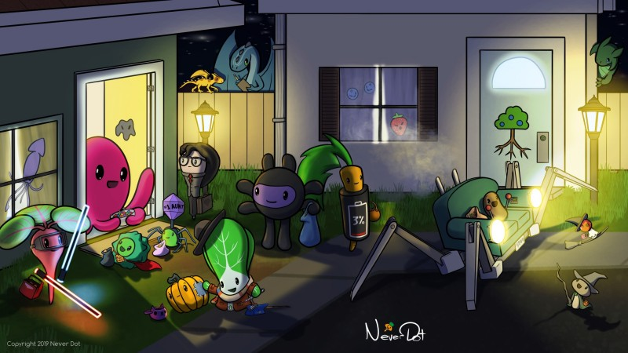

### 

### Could you tell us something about yourself?

My real world name is Andy Statia, but I go by Never Dot in the digital space. I live and grew up in Canada, for which I'm very grateful. Being in a temperate zone country, I get to experience the wild fluctuations between the seasons, which I've always found has really stimulated my imagination. Being able to directly experience frozen wastelands, verdant forests, and dying cities all without going anywhere has given me lots of ideas for my worlds.

I've always had a keen interest in both computers, drawing, and design. This meant spending my nights after school doodling and designing entire worlds then later learning to program on the family computer so I could bring those worlds to life through video games. This continued on throughout my school years and I explored my artistic side through the creation of game art and world design. I later went to the University of Waterloo and graduated with a bachelor's of mathematics. Since then, I've been working in the computing field, but always working to build up my creative side through digital art and web design.

### Do you paint professionally, as a hobby artist, or both?

For most of my life it was just a hobby, but in February 2016, I decided to try to turn professional and dedicated myself to starting a new company called Never Dot, which would be where my professional work would be created. Since then, I've strived to improve my art and learn professional skills.

### What genre(s) do you work in?

I could easily be accused of having attention deficit disorder, because I have a hard time sticking to one genre. My current work is evidence of that, as I've tried to combine fantasy, science fiction, modern day life, and pretty much any other genre that I can rationalise into my world. Sticking to a single genre has always seemed unnecessarily restrictive and mashing together very different genres has always been a point of interest for me, to discover how they react to each other and work together (or not). My primary preference is creature design.

In my children's books and comics, you can find spaceship flying dinosaurs with ray guns right alongside common vegetable folk running their shops and buying groceries (which is hopefully not just themselves). A turtle family deals with mobile phones and family issues while my main character, an octopus, has fiddled with magic to fix his computer as dragons try to steal his Halloween candy. I'm going to work pirates into this world next, most likely.

### Whose work inspires you most -- who are your role models as an artist?

When I was just starting out professionally, I was sorely lacking in connection to the artistic community, which I still feel to be the case. But in the few years hence, I've discovered [Li Chen of Exocomics](http://www.takerisksbehappy.com/li-chen-exocomics/) who I consider to be my gold standard for what I'm trying to achieve. The quality of her artwork and the level of cuteness she brings forth in everything she does is exactly what I want to achieve in my work. If I'm ever able to match her art, I would consider my artistic life's goal to have been met.

However, on the opposite end of the spectrum is [Ross Tran](https://www.rossdraws.com/), [Asia Ladowska](https://www.artstation.com/ladowska), and [Laura Brouwers](https://artsideoflife.com/cyarine-laura-brouwers/) (Cyarine). These people have shown me it's possible to create incredible work through practice, time, and experience. Drawing humans is my greatest fear, but I need that skill set to be able to tell the visual stories I want to tell, so these are my role models for that pursuit.

Lastly, I should note Randall Munroe of [XKCD](https://xkcd.com), who shows all of us that you don't need to be a great artist to be interesting and worth paying attention to.

### How and when did you get to try digital painting for the first time?

While I had been "digitally painting" in MS Paint from a very young age, I suspect my pixel art of the time isn't what you're interested in. For a more professional level of digital painting, I would say it was during my first co-op work term at university. It was my first period of time earning meaningful income and the first thing I set out to purchase was a drawing tablet. Since I'm quite bad with money, I opted for the largest tablet I could find, which was the Wacom ArtZ II 12x12 tablet. It was big, square, and threw off the aspect ratio on my drawing for a couple years before I clued in that I should be limiting the drawing area to correct for that. I later migrated to the Intuos line of tablets and used some Bamboo tablets at work (as I'd long since gotten used to a stylus). I am now on my second Cintiq for day-to-day work.

### What makes you choose digital over traditional painting?

The inability to undo is probably the biggest reason to go with digital over traditional. I only traditionally painted in a university course and since I was already digitally painting at the time, I found that the inability to control layers, adjust effects, and such in physical media was frustrating.

I've never lived the traditional painting life, so digital has always been my first choice. However, I recognise that experiencing traditional painting methods has benefits that would help inform my digital painting techniques.

### How did you find out about Krita?

I had been using Fractal Design's Painter (now Corel's) for many years, over a decade, and while I depended on it immensely, it was also somewhat buggy and the numerous upgrades I'd purchased were always introducing more problems than solutions for me. As such, I was pushed to find an alternative. I looked into Sai and Clip Studio Paint as being well received in the community. I was avoiding Photoshop both due to the subscription requirement and the fact it wasn't directly targeted at natural media painting. Krita came up in my research as being a free painting tool. I checked out numerous YouTube reviews and comparisons, and being free let me try it out directly.

### What was your first impression?

My first experiences with the program were that it was very smooth and easy to figure out. Coming from a Painter background, I was looking to recreate my workspace in Krita and ensure it had the same capabilities. Exploring Krita's brushes was probably what got me hooked, as I'd found a large sponge brush that gave the effect of fog or mist. This was something I'd never effectively created in Painter and I was immediately entranced by the simple effect it produced. After I got the keyboard shortcuts figured out (or reconfigured) and tools identified, I was settled and able to get work created in Krita. Initially, I used it for effects, creating the main work in Painter. But in time I was creating entire pieces in Krita.

### What do you love about Krita?

The large sponge brush, which I believe comes from David Revoy's brush pack, was the first thing that really captured my interest. Such a brush can of course be created in other programs, but brushes are the heart and soul of these programs, so that got me hooked.

I found the reference docker to be extremely useful. Having a little docked panel on the side that automatically colour picked when I clicked on it, allowed independent panning and zooming, was probably the most useful tool I'd used in quite a long time. Since I had a lot of different characters to paint that needed consistent colouring, I would just load an unshaded picture of them to use as a palette, since I could then know which red was the body red vs. the sock red. Normal colour palettes aren't as quick to find desired colours. Sadly, this tool was removed some versions ago and replaced with something a bit less useful.

A tool that sort of existed in Painter, using vector shapes as guides, has proven much better in Krita. The guides tool, which allows for parallel lines, ellipses, perspective drawing, etc. is extremely intuitive and useful. Particularly the vanishing point guide. Other programs attempt to display a 3D grid and provide complex controls to position it. Krita just gives you the vanishing point and two control points for each edge, which is easy to align to your sketch. For ellipses, the ghosted circles showing before I start drawing is fantastic. I've sometimes used this preview with the drawing constraints turned off just to help line things up.

### What do you think needs improvement in Krita? Is there anything that really annoys you?

A generally known gap in Krita's toolkit is text support. I discovered right away it wasn't even basically functional, so I use Illustrator to do all my text layout for Krita. Having easy to use text boxes would be great.

Working with vectors is somewhat more cumbersome in Krita than other applications. In most other applications, each shape is its own layer, which makes it easy to locate them, manipulate them, and create them, as it doesn't require creating a special layer to manage them.

A persistent bug that impacts all my work is the "unable to pan after using something in the interface". This typically happens after renaming a layer and then trying to pan immediately after with the spacebar. Instead of panning, nothing happens, and I wind up drawing a harsh line through my artwork, which I hopefully notice and undo immediately. This interrupts my workflow several times per drawing session.

As noted earlier, I haven't found the new reference image tool to be particularly usable. A reference image should be visible and stationary while drawing. I'm often panning and zooming while working, but if the reference image gets panned or zoomed off screen, it becomes useless. I also frequently need to just have a zoomed in portion of the reference image up, so I can refine details of it, which the old docker did perfectly, since it allows for sizing that window area and zooming within it independently.

More natural media brushes is always welcome, particularly from the base install. This is one area where I sometimes look back at Painter for, as it had such a wealth of natural media brushes. Recreating them myself isn't always possible (i.e. doesn't produce good results).

### What sets Krita apart from the other tools that you use?

Being free is an extremely impressive feature for this product. While that doesn't relate to features, the fact that a tool of this level of capability is free is amazing. It has successfully replaced a $500 professional tool without sacrificing much of anything.

Something Krita excels at for me is being able to handle very large canvases without crashing or slowing down. This was a point of concern for me with Painter and I was amazed that Krita was able to continue running at full speed at progressively larger canvas sizes. While I do still learn about its limits, I'm able to push it farther than what I used to have.

### If you had to pick one favourite of all your work done in Krita so far, what would it be, and why?

I've done a lot of different pieces over the last three years for Never Dot, many I'm very proud of, many that I cringe at. But one of the more exciting pieces I did recently was for last Halloween, which features a lot of my characters packed into a tight scene. Highly detailed scenes have always interested me, because you can see something new time and time again when you come back to it. Playing with lighting effects is also something I quite enjoy and this one takes advantage of it a lot. I previously noted that I have a hard time sticking to one genre and if anything highlights that, it's this scene with sci-fi, fantasy, modern day, dragons, and steampunk marching around.

### What techniques and brushes did you use in it?

My work is mostly cartoon art and painted backgrounds. I created my own pen brush, as none of the ones in Krita were quite the same as what I was used to. It's a simple solid brush with hard edges.

I use the hard light layer mode for shading, using the inherit alpha feature to limit the shadows to the foreground character. This feature has saved me immense amounts of time.

Another extremely useful capability is filling line art into a different paint layer. This saves hours of my time.

### Where can people see more of your work?

I put almost all of my work up on my website and various social media accounts. You can find my comics, drawing practice, and links to my children's books on my website at: [https://neverdot.com](https://neverdot.com)

You can also look me up on Instagram ([@neverdotworld](https://www.instagram.com/neverdotworld/)), Twitter ([@neverdot](https://twitter.com/neverdot)), and Reddit ([/u/NeverDot](https://www.reddit.com/user/NeverDot)). I've also got a YouTube channel where you can see the real me! Find that at [https://youtube.com/neverdot](https://youtube.com/neverdot).

I've self-published four children's books featuring my world which are fully illustrated with my work. The first book used Painter and the next three were completely done in Krita! You can get those on Amazon, Indigo, and other book websites. Check out my website details on the books!

### Anything else you'd like to share?

Krita being open-source is a huge victory for both the open-source movement and digital artists. Anyone with a computer now has access to a fully capable drawing solution that compromises on nothing (well, maybe text support). If my professional Never Dot work becomes highly successful, I'll definitely be looking to financially support the Krita development team to ensure future generations of artists are able to benefit from such a polished art tool. Thank you Krita team! Your dedication to the project shows and everyone using Krita is thankful for having you working behind the scenes.
