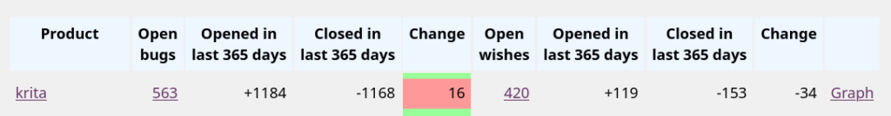
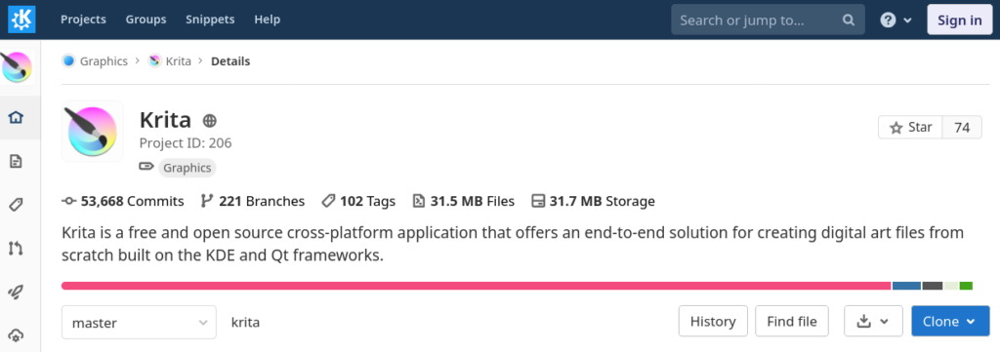
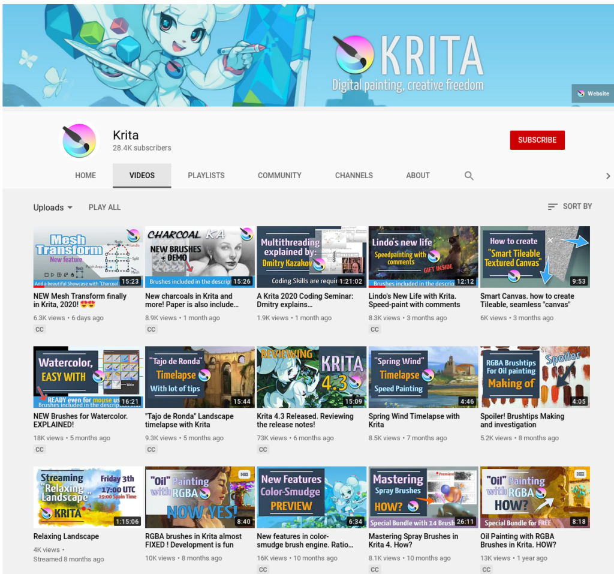
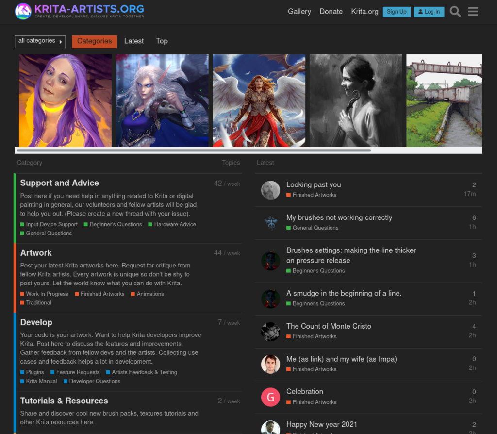

The last day of the year... So, let's look back a bit. First off: none of the Krita developers has died this year. It feels strange to write that, but it might reassure some of our readers. Some of us have had some extended periods of down time, or have been less productive, both because of the effect of the different pandemic measures all over the world, and because it was at times really hard to stay motivated and find the energy for coding. That shouldn't come as a surprise to anyone. It feels surreal to think we actually had a real, physical development sprint -- in February.

### Releases

So, what did we do? In the first place, we made four releases: [Krita 4.2.9](/item/krita-4-2-9-released/), [4.3.0](/item/krita-4-3-0-released/), [4.4.0](/item/krita-4-4-0-released/) and [4.4.1](/item/krita-4-4-1-released/), and now we're working on [4.4.2](/item/second-beta-for-krita-4-4-2/). Krita came to ChromeOS and Android, too!

https://youtu.be/VTlh2KhkOM4

With these releases came improved brush outlines while painting, new features for the color smudge brush, watercolor brush presets, new filters, extended scripting support, the snapshot docker, a magnetic selection tool, new fill layers, new features for the pixel brush engine, mesh gradients, mesh transforms, improvements to the gradients -- and much, much more, as well as hundreds of bug fixes.

### Bugs

Still, [bugzilla is a disaster area](https://valdyas.org/fading/hacking/krita-hacking/nightmares-and-bugs/). We get too many bug reports that are actually user support requests, but apart from that, it's a never ending stream of things that need to be cleaned up. Check the link if you want to read about the nightmares...

### Code

And we coded... A _lot_. Over all the branches, there were 5486 commits in 2020. Apart from the new features that ended up in releases, we also worked on supporting MyPaint brushes, making the appimages updatable, a new plugin for recording your painting process, storyboarding, a ton of new features and updates for animations and a lot of work on a project that we have been working on for three years now: the resource system rewrite.

You can test all of that in the nightly builds for Windows, Linux and macOS: [KDE's binary factory](https://binary-factory.kde.org/) certainly has been the single most important thing for improving our development process! Though the move to gitlab also did wonders for our productivity.

The resource rewrite project still isn't done, though pretty much everything is in place. It is taking a lot of work to convert all the places where resources (like brushes, gradients, presets) are used to the new system. And as a project, it turns out it's simply too _large_. We decided to change too many things in one big refactoring and, frankly, it's motivation-sapping especially in a year that's already hard on everyone. And yes, we also mentioned that [already last year](/item/krita-in-2019-and-2020/). The 2020 February sprint was intended to be a kick-off for a concerted attack on the resource system with four people working on until it was done, but then came March...

We will have to finish this next year, so we can release Krita 5.0 and can start spending time on fun things like the text tool, machine learning based image scaling, dithered and HDR gradients and other fun and fancy features.

We also had Four Google Summer of Code: Sharaf Zaman with Mesh Gradients, Amyspark with the SeExpr-based scriptable fill layers, Saurabh Kumar with storyboarding and Ashwin Daikata with the MyPaint brush engine. The first two are already released, the other two projects have been merged to master and will be in Krita 5.0.

### Community

Compared to 2019, we have almost twice the number of downloads **4,856,435** downloads compared to **2,346,618** in 2019 -- and that's just from our download page.

We started sponsoring Ramon Miranda to publish regular videos on [Krita's youtube channel](https://www.youtube.com/channel/UCkIccKaHDGA8lYVmUerLhag). The goal is to make a dozen videos a year:

And in addition to videos, Ramon has created resources like brush presets and templates, [all freely downloadable](https://files.kde.org/krita/extras/)!

Maybe the biggest success of the year was the way Raghukamath's [krita-artists.org](https://krita-artists.org) initiative has taken off. Fifty-thousand posts now, hundreds of active users and really interesting discussions about Krita's user interface, about writing plugins in Python, about art -- and importantly, it's finally a place where people support each other.

### 

### Money

We are working on a new development fund, modeled on Blender's. We're actually reusing the same code Blender uses for their dev fund website. This should go live in 2021. It's almost done, there's some styling needed, and some work on a campaign to tell the world about it. Since we usually prepare campaigns like kickstarter by getting together physically and thrashing it out over the kitchen table in Krita's Deventer HQ, we're a bit at a disadvantage here.

Donations have held up strongly all through 2020, bringing in enough to sponsor our lead developer, Dmitry and fund ongoing work on the manual: €45,672.41 euros (2019 was €29,715.20). The other sponsored developers have been paid through income generated through the Windows Store and Steam. All in all, there are now nine people sponsored to work on Krita, in areas like animation, Android/ChromeOS, writing the manual, fixing bugs, working on the builds and build systems and coding up new features. Nobody is getting rich, but it's a good feeling to work on an application that is being used by three to four _million_ people every month.

### And next...

We have to release Krita 5.0 as soon as possible, and for that we need to finish the resource system rewrite. That will be the absolute focus for the first months of 2021, which means that a 4.4.3 release will have to wait, if there will be one at all.

There will a release of Krita for Apple's M1 laptops: though Apple probably will go on making life difficult for developers.

We will launch the new Developer Fund and maybe get Krita in the macOS app store (not the iPadOS store). Though right now, the team is about as large as Krita's project maintainer can manage...

And [Qt 6 has been released](https://www.qt.io/blog/qt-6.0-released). The changes to the way Qt [handles GPU acceleration will make it a real challenge to port Krita to Qt6](https://valdyas.org/fading/hacking/krita-hacking/krita-opengl-and-qt/), not to mention all the other changes and [deprecations](https://lists.qt-project.org/pipermail/development/2020-April/039278.html), making it unlikely we'll have a Qt 6-based release ready in 2021. We'll have to work on, though, which will eat into the time we have for creating features and fixing bugs users actually _care_ about.

And maybe? Maybe there will be a real life contributors get-together again! Hope springs eternal. See you all in 2021!
