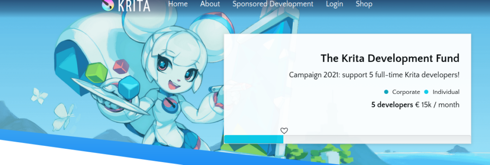

Today, the Krita team releases the first beta for Krita 5.0. Krita 5.0 is a major release, with a lot of new features and a lot of changes.

\[caption id="attachment\_12343" align="aligncenter" width="1024"\] The new splash screen, by Tyson Tan\[/caption\]

First some **warnings**:

- Krita 5 has a completely new resource system. Krita no longer loads all brushes, patterns, gradients and so on start-up, but caches the information during the first run. Krita 5 will be slower starting on the first run, quicker on subsequent runs.
- The way Krita 5 keeps a version history for resources that are edited by the user is not compatible with Krita 4. After using Krita 5, going back to Krita 4 might cause Krita 4 to show duplicate resources.
- Krita 5 can no longer load vector layers created in Krita 3 and older.
- Krita files (.kra) and krita brush preset files (.kpp) created with Krita 5.0 are **not** guaranteed to be compatible with Krita 4!
- Krita 5.0 fixed [an issue with text size in documents](https://krita.org/en/krita-5-0-release-notes/#text_size_dpi_issue_fix). However, opening files created with earlier versions of Krita may require [changing a setting](https://docs.krita.org/en/reference_manual/preferences/general_settings.html#miscellaneous) to get the originally expected text size.
- Known issue with this beta: If you run a G'Mic filter, Krita's settings are temporary reset to default: the settings will be the customized once again after restarting Krita.

Now, what's in it? [The answer is a lot](https://krita.org/en/krita-5-0-release-notes/)! Check out the full [release notes](https://krita.org/en/krita-5-0-release-notes/) for all the detail, but here's short list of highlights:

- The new resource system that we have worked on for five years
- Gradient dithering and wide-gamut gradients
- Performance improvements, thanks to the LittleCMS fastfloat plugin
- The all-new MyPaint brush engine
- A completely rewritten color smudge brush engine
- A redesigned animation timeline docker
- Clone frames for animation
- Updated animation curves docker
- Transform mask animation
- The new storyboarding feature
- Refreshed icons and UI polish
- Support for HEIF, AVIF, WebP file formats
- Improved TIFF support
- A new painting recorder
- A new 2-point perspective assistant and a limit area feature for assistants
- In-stack transform tool preview
- Paste into a layer instead of pasting the clip as a new layer
- G'Mic for macOS

And a host of smaller improvements, smaller features and lots of performance improvements!

We intend to release the final version in September, but that is _not_ a hard promise! We will continue fixing issues that come in from testing the beta and the nightly builds so we can release a solid Krita 5. Please consider supporting Krita's development through the [development fund](https://fund.krita.org/):

## Download

### Windows

If you're using the portable zip files, just open the zip file in Explorer and drag the folder somewhere convenient, then double-click on the krita icon in the folder. This will not impact an installed version of Krita, though it will share your settings and custom resources with your regular installed version of Krita. For reporting crashes, also get the debug symbols folder.

Note that from this release on we are not making 32 bits Windows builds anymore.

- 64 bits Windows Installer: [krita-x64-5.0.0-beta1-setup.exe](https://download.kde.org/unstable/krita/5.0.0-beta1/krita-x64-5.0.0-beta1-setup.exe)
- Portable 64 bits Windows: [krita-x64-5.0.0-beta1.zip](https://download.kde.org/unstable/krita/5.0.0-beta1/krita-x64-5.0.0-beta1.zip)
- [Debug symbols. (Unpack in the Krita installation folder)](https://download.kde.org/unstable/krita/5.0.0-beta1/krita-x64-5.0.0-beta1-dbg.zip)

### Linux

- 64 bits Linux: [krita-5.0.0-beta1-x86\_64.appimage](https://download.kde.org/unstable/krita/5.0.0-beta1/krita-5.0.0-beta1-x86_64.appimage)

The separate gmic-qt appimage is no longer needed.

(If, for some reason, Firefox thinks it needs to load this as text: to download, right-click on the link.)

### macOS

Note: if you use macOS Sierra or High Sierra, please [check this video](https://www.youtube.com/watch?v=3py0kgq95Hk) to learn how to enable starting developer-signed binaries, instead of just Apple Store binaries.

- macOS disk image: [krita-5.0.0-beta1.dmg](https://download.kde.org/unstable/krita/5.0.0-beta1/krita-5.0.0-beta1.dmg)

### Android

This time, the Android releases are made from the release tarball, so there are translations. We consider Krita on ChromeOS and Android still **_beta_**. There are many things that don't work and other things that are impossible without a real keyboard.

- [64 bits Intel CPU APK](https://download.kde.org/unstable/krita/5.0.0-beta1/krita-x86_64-5.0.0-beta1-release-signed.apk)
- [32 bits Intel CPU APK](https://download.kde.org/unstable/krita/5.0.0-beta1/krita-x86-5.0.0-beta1-release-signed.apk)
- [64 bits Arm CPU APK](https://download.kde.org/unstable/krita/5.0.0-beta1/krita-arm64-v8a-5.0.0-beta1-release-signed.apk)
- [32 bits Arm CPU APK](https://download.kde.org/unstable/krita/5.0.0-beta1/krita-armeabi-v7a-5.0.0-beta1-release-signed.apk)

### Source code

- [krita-5.0.0-beta1.tar.gz](https://download.kde.org/unstable/krita/5.0.0-beta1/krita-5.0.0-beta1.tar.gz)
- [krita-5.0.0-beta1.tar.xz](https://download.kde.org/unstable/krita/5.0.0-beta1/krita-5.0.0-beta1.tar.xz)

### md5sum

For all downloads:

- [md5sum.txt](https://download.kde.org/unstable/krita/5.0.0-beta1/md5sum.txt)

### Key

The Linux appimage and the source .tar.gz and .tar.xz tarballs are signed. You can retrieve the public key [here](https://files.kde.org/krita/4DA79EDA231C852B). The signatures are [here](https://download.kde.org/unstable/krita/5.0.0-beta1/) (filenames ending in .sig).

## Support Krita

Krita is a free and open source project. Please consider supporting the project with [donations](https://fund.krita.org) or by [buying training videos!](https://krita.org/en/shop/) With your support, we can keep the core team working on Krita full-time.
