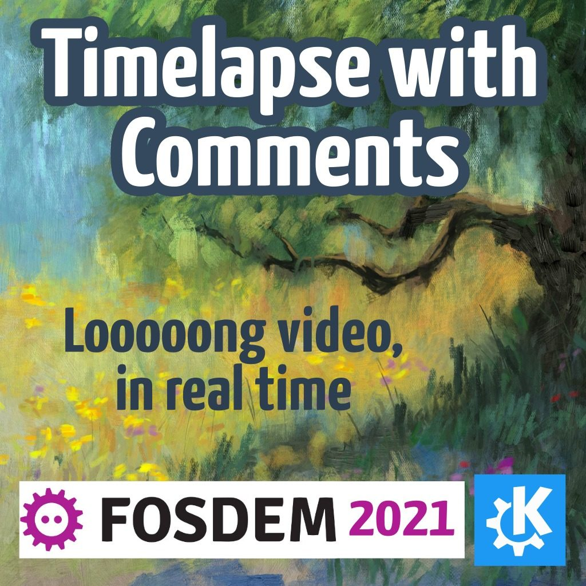

Ramon Miranda was preset at virtual Fosdem 2021 in the KDE booth to demonstrate Krita. Here's a timelapse of the event, with comments! If you want to know more about the free and open source software community where Krita came into existence, watch it!



