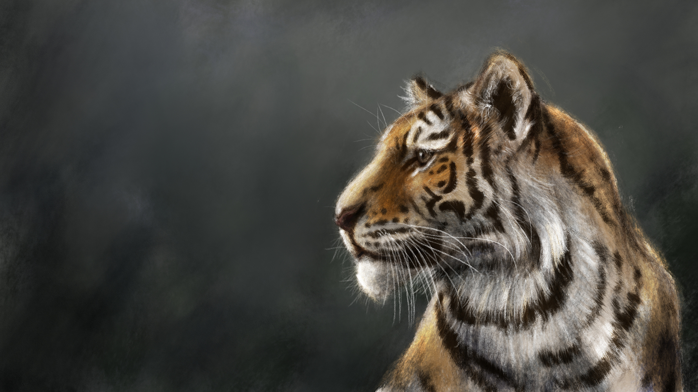
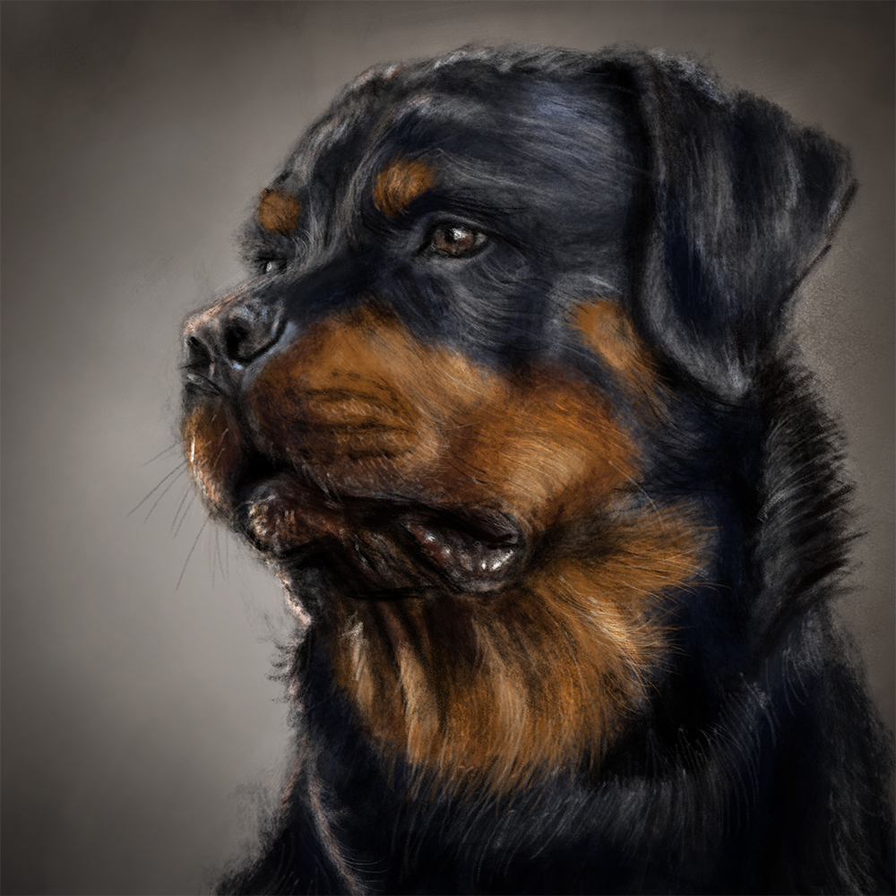
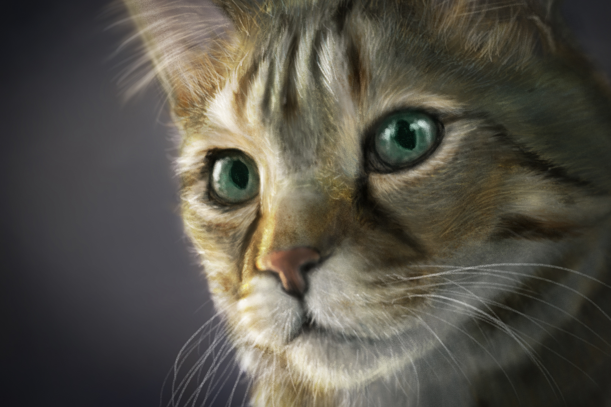
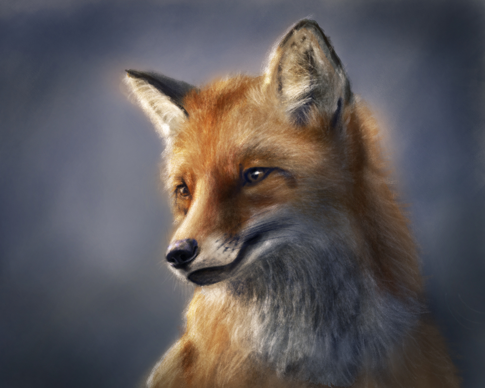
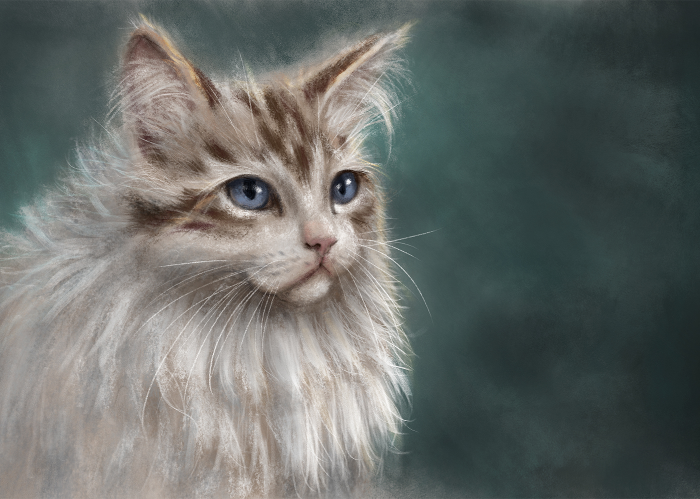
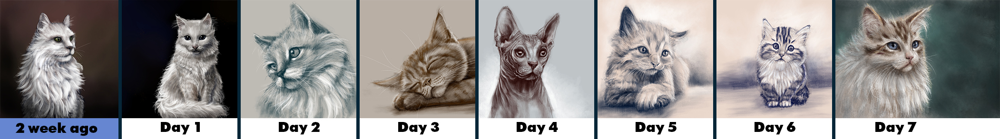

### Could you tell us something about yourself?

My full name is Mohammad-Ali Bahabadi, but I sign with my shortened version of my name, Ali Bahabadi. I was born in 1983 in Iran. I got a master's degree in art conservation but I have been working as graphic designer for several years.

### Do you paint professionally, as a hobby artist, or both?

At the moment, I am practicing painting just to increase my artistic abilities. But I am still young enough to become a professional painter. And I think this is a fascinating job.

### What genre(s) do you work in?

In the first place, I want to master realistic portraits of animals. I have always been interested in animals.

### Whose work inspires you most -- who are your role models as an artist?

Michelangelo and Da Vinci have always inspired me. Especially Michelangelo. I also find it astonishing how Rembrandt used light in his works. I have also been influenced by a lesser-known Iranian painter named [Mohammad Siah Qalam](https://en.wikipedia.org/wiki/Siyah_Qalam), who lived in the 14th and 15th centuries. He has strange paintings of imaginary creatures that are very impressive compared to other paintings of his time.

[Aaron Blaise](https://www.artstation.com/aaronblaiseart)'s paintings also assure me that animals are good subjects for making art.

And a great image-maker that recently I came to know about, [Heinrich Kley](https://en.wikipedia.org/wiki/Heinrich_Kley). No doubt that he will change my approach to painting. Of course, photographers like [Ansel Adams](https://www.anseladams.com/), [Nick Brandt](https://www.nickbrandt.com/), and [Henri Cartier-Bresson](https://en.wikipedia.org/wiki/Henri_Cartier-Bresson) have always inspired me. I have been photographing for many years and even professionally for several years.

All of these are great artists and have had a profound impact on me, but none of them are really my role models.

### How and when did you get to try digital painting for the first time?

For the first time, 7 or 8 years ago when I bought a new Wacom graphic tablet. But I really was not very successful at the time. Perhaps I was expecting magic from the digital painting. And since then, except for what I used to draw and to paint on my Android tablet for fun or on a trip, I hadn't taken digital painting seriously. Until my birthday this year, July 25th, 2021, when I made a serious decision to paint digitally. In other words, I'm still very new.

### What makes you choose digital over traditional painting?

With more speed and possibilities, I can make fundamental changes in my painting at any stage of my work. Also, I paint digitally because of ease of sharing, being cheaper and, of course, I think it would be more favorable for the environment.

### How did you find out about Krita?

I was already familiar with Krita when I was looking for an alternative to Photoshop. I think I even have an old version of Krita on my laptop. And when I decided to take digital painting seriously, my first choice was Krita.

### What was your first impression?

Krita had a very pleasant user interface. On the other hand, because I was proficient in Photoshop, I could easily understand the user interface and saw that I could use the same shortcuts. In less than an hour, I felt that, yes, this software was really made for digital painting, and I really felt comfortable with it.

### What do you love about Krita?

I really like Krita. But when I first realized I could hold down the Shift key and draw my pen on the tablet and see that its size changes, I fell in love with Krita.

### What do you think needs improvement in Krita? Is there anything that really annoys you?

If the selection tools and text tools improve, I may no longer need Photoshop.

### What sets Krita apart from the other tools that you use?

Krita is free and easily accessible. This is great. But I think focusing on digital painting makes it fantastic.

### If you had to pick one favourite of all your work done in Krita so far, what would it be, and why?

Maybe this cat.

Two weeks before I drew this cat, I had drawn a cat which I think was awful. The next week I drew another cat and left it half-finished, and I drew another cat and tried to hide its flaws under its fur. But it was not good either. So I decided to draw only cats every day for at least a week. And after a week I drew this and I was almost satisfied with it (please see my progress in drawing this cat in the photos below). 

And here's a timelapse: 

<iframe title="YouTube video player" src="https://www.youtube.com/embed/HVhsjZRgk3Y" width="560" height="315" frameborder="0" allowfullscreen="allowfullscreen"></iframe>

### What techniques and brushes did you use in it?

I tried different brushes. But I feel more comfortable with those brushes that mimic pencils and charcoal. But I also try to use the other brushes if necessary.

### Where can people see more of your work?

This is my website address: [bahabadi.com](https://www.bahabadi.com)

I am also available on [YouTube](https://www.youtube.com/channel/UCHv_hNLkxqlcY20MwVyayfw), [Instagram](https://www.instagram.com/ali.bahabadi) and [Facebook](https://www.facebook.com/bahabadi/).

### Anything else you'd like to share?

I am new to digital painting, but I think that digital painting has made it easier for me to paint, and in a short time it has made me a better artist. Although this change might be small, I can easily feel it myself. Almost every day I paint a new painting, which I believe it is not so easy be achieved in the traditional way. I need to thank everyone who contributed to the development of Krita. I have had the possibility of digital painting for many years. I had both a good graphic tablet and the most expensive graphic software available to me. But I think there was something in Krita that encouraged me to paint every day. Krita has a friendly spirit that accompanies me in painting.
