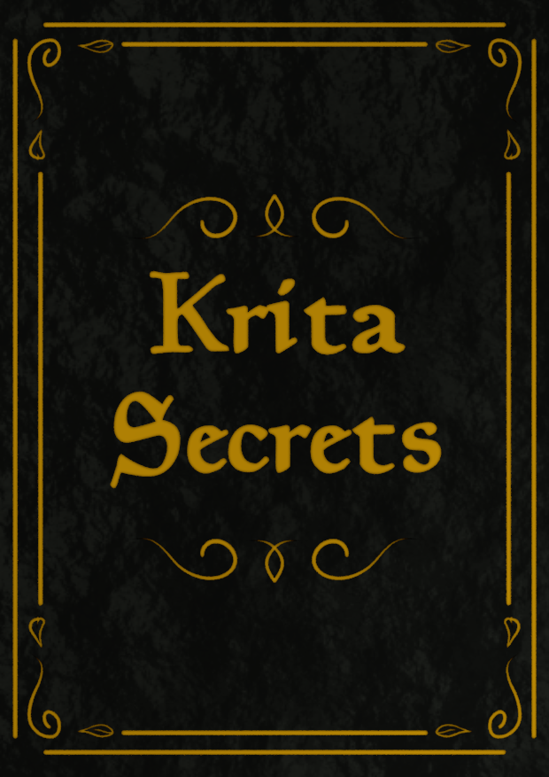

"Krita Secrets" is a book that aims to deliver as short tutorials as possible. Each tutorial covers one specific action with its result. The tutorials range from how to do little tricks, like draw Parallel Lines, to complex tools such as Gradient Mesh. By September 22, 2021 the book contains 60 tutorials and it keeps growing.

[]("Krita Secrets" is a book that aims to deliver as short tutorials as possible. Each tutorial covers one specific action with the result. The tutorials range from how to do little tricks like draw Parallel Lines to complex tools like Gradient Mesh. By September 22, 2021 the book contains 60 tutorials and keeps growing. The intent is to create such a book that contains a lot of short tutorials that aim to solve one single problem. So the person does not spend a lot of time on reading through a lot of pages online and watching video after video while figuring things out. Hopefully with help of this book artists would spend more time creating than digging online to figure out how things should be done. The author of this book is an independent individual who focuses on making templates, assets, software and online materials for artists, indie game developers and small studios. The autor practices drawing himself which does a good job for understanding what artists actually need. You can learn more about the book and where to get it here: https://www.yetanotherpainter.com/krita-secrets/ The book comes in two editions. Free sample, so that the artists can see if the book fits their needs. And a paid version that contains all the tutorials including free sample. )The intent is to create a compendium of short tutorials that each aim to solve one single problem. This way people will not have to spend a lot of time reading through pages online, or watching video after video, while figuring things out. Hopefully with the help of this book artists would spend more time creating than searching online for instructions.

The author of this book is an independent individual who focuses on making templates, assets, software and online materials for artists, indie game developers and small studios. The author is an artist himself, which is helpful to his understanding of what artists actually need.

You can learn more about the book and where to get it here: [https://www.yetanotherpainter.com/krita-secrets/](https://www.yetanotherpainter.com/krita-secrets/)

The book comes in two editions: free sample, so the artists can see if the book fits their needs. And a paid version that contains all the tutorials including the free sample. If you buy the book, you will get all updates!
