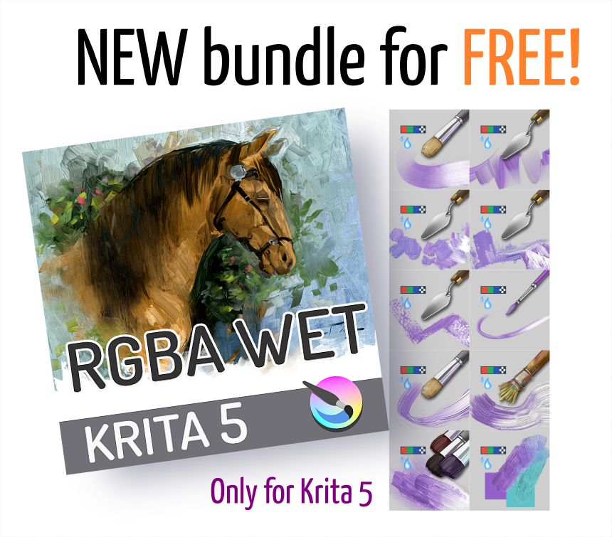
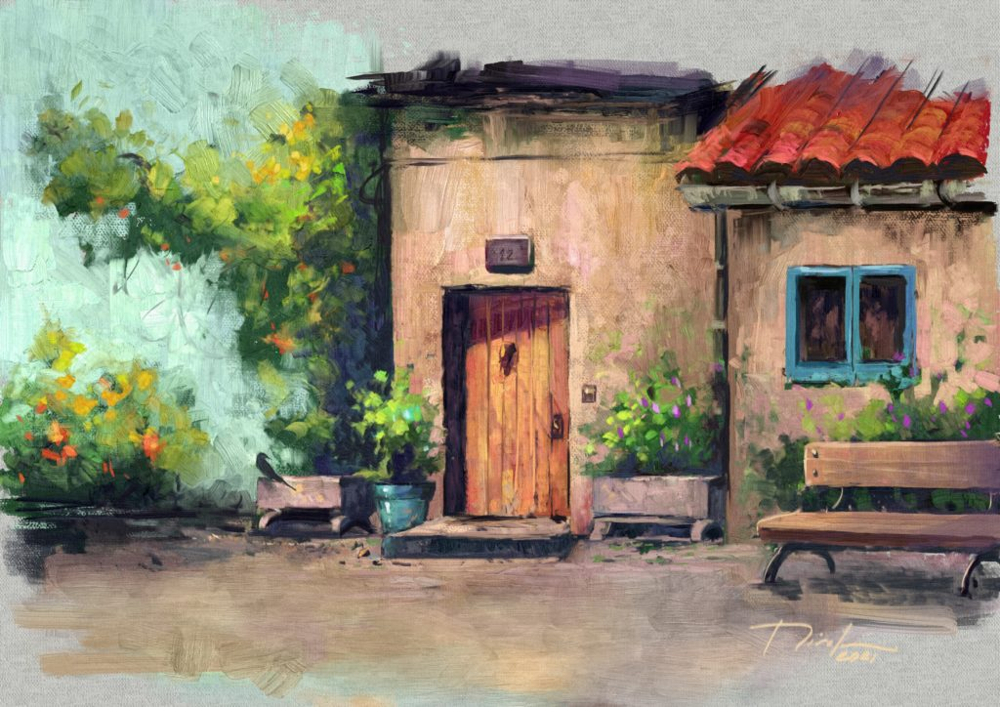

Check out Ramon's latest video, showing off Krita 5's awesome new brush capabilities.



Ramon has created another bundle of impasto brush presets to go with this video. To use the brushes, [download the latest version of Krita](/download): Krita Plus. Take care, this is still beta software!

Download the bundle:

And have as much fun painting as Ramon had:

