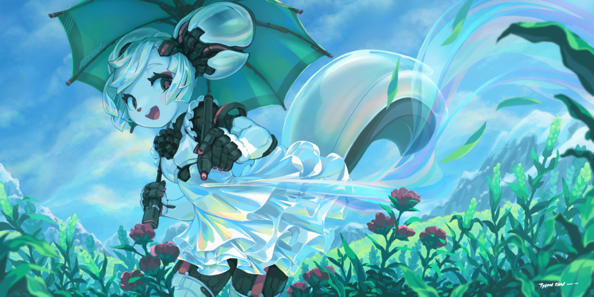

Today we're releasing the third beta for Krita 5. There are a lot of fixes compared to beta 2. We're aiming to release Krita 5 before Christmas, and are beginning to feel a bit confident about that.

Of course, the nightly stable builds already have a number of fixes compared to this beta release...

The new splash screen, by Tyson Tan

 Krita is a free and open source project. Please consider supporting the project with [donations](https://fund.krita.org) or by [buying training videos!](/shop/) With your support, we can keep the core team working on Krita full-time.

These are the most important fixes since Beta 2:

- Resources can no longer be assigned the speciall All and All Untagged tags. [BUG:446148](https://bugs.kde.org/show_bug.cgi?id=446148)
- Alpha-mask PNG brush tips work correctly again. [BUG:445691](https://bugs.kde.org/show_bug.cgi?id=445691)
- Android: creating a 16 bits integer image no longer crashes. [BUG:445179](https://bugs.kde.org/show_bug.cgi?id=445179)
- Thumbnail for MYB mypaint brushes in a bundle now are loaded.
- Fix a performance issue in the magnetic selection tool.
- The recorder no longer goes in an infinite loop if the selected colorspace is not supported by the recorder.
- Drag and drop of remote images and copy/paste of images from Chrome is fixed. [BUG:446029](https://bugs.kde.org/show_bug.cgi?id=446029)
- Cancelling pasting is fixed. [BUG:438426](https://bugs.kde.org/show_bug.cgi?id=438426)
- Tyson Tan provided many disambiguations for user-visible text, which helps improve translations.
- A crash that happened when opening the popup palette, closing the image then creating a new image was fixed. [BUG:443402](https://bugs.kde.org/show_bug.cgi?id=443402)
- Paste at Cursor now positions the clip correctly. [BUG:446120](https://bugs.kde.org/show_bug.cgi?id=446120)
- The outline of brushes with a non-standard number of spikes is now correct. [BUG:445927](https://bugs.kde.org/show_bug.cgi?id=445927)
- Disable sub-pixel translation in the transform tool. [BUG:445714](https://bugs.kde.org/show_bug.cgi?id=445714)
- Fix saving palette on quitting Krita. [BUG:444309](https://bugs.kde.org/show_bug.cgi?id=444309)
- Fix de-duplication of resources on import. [BUG:445367](https://bugs.kde.org/show_bug.cgi?id=445367)
- A crash when using the text brush was fixed. [BUG:443308](https://bugs.kde.org/show_bug.cgi?id=443308)
- The handling of pattern files of types other than gimp patterns was fixed. [BUG:443151](https://bugs.kde.org/show_bug.cgi?id=443151)
- Resource libraries are now sorted in alphabetical order in the bundle manager. Patch by Reinold Rojas.
- Handling of really broken .kra files was improved. [BUG:443559](https://bugs.kde.org/show_bug.cgi?id=443559)
- Performance of textured brushes was improved.
- Renaming brush presets and SeExpr presets was fixed. [BUG:445048](https://bugs.kde.org/show_bug.cgi?id=445048)
- Fix saving MyPaint brush presets after modification. [BUG:445281](https://bugs.kde.org/show_bug.cgi?id=445281),  [BUG:445282](https://bugs.kde.org/show_bug.cgi?id=445282)
- Improve the styling of the tagging widget. [BUG:445625](https://bugs.kde.org/show_bug.cgi?id=445625)
- Fix a crash when trying to add or move layers too quickly. [BUG:445831](https://bugs.kde.org/show_bug.cgi?id=445831), [BUG:444516](https://bugs.kde.org/show_bug.cgi?id=444516)
- Fix a crash in the transform tool. [BUG:441826](https://bugs.kde.org/show_bug.cgi?id=441826)
- Fix the text tool not updating the font size correctly.
- Fix the initialization of the random generator for non-brush tools. [BUG:445775](https://bugs.kde.org/show_bug.cgi?id=445775)
- Fix tilt rotation when the canvas is rotated and the stabilizer is active. [BUG:436618](https://bugs.kde.org/show_bug.cgi?id=436618)
- Make the mesh gradient respond to the first invocation. [BUG:445617](https://bugs.kde.org/show_bug.cgi?id=445617)
- Make mesh gradient handles consistent with the mesh transform tool handles. [BUG:442201](https://bugs.kde.org/show_bug.cgi?id=442201)
- Fix canceling saving an edited gradient.
- Fix loading palettes of types other than GPL and KPL.
- Fix an assert when opening an SVG document.
- Make it possible to actually change between different resource folder locations.
- Make it possible to overwrite existing workspace definitions. [BUG:444975](https://bugs.kde.org/show_bug.cgi?id=444975)
- Fix a crash when warning the user when there is a problem saving a resource. [BUG:445581](https://bugs.kde.org/show_bug.cgi?id=445581)
- Update the Intel GPU driver version detection.
- Fix artifacts in the freehand selection tool in polygonal mode. [BUG:441569](https://bugs.kde.org/show_bug.cgi?id=441565)
- Fix issues with layer styles not be able to retrieve resources such as patterns or gradients. [BUG:443621](https://bugs.kde.org/show_bug.cgi?id=443621)
- Blacklist line tool to make it work while recorder is active.
- Make the line tool's preview faster. [BUG:411768](https://bugs.kde.org/show_bug.cgi?id=411768)
- Fix the flickering in the line tool's preview.
- Make it possible to save mypaint brush presets to resource bundles.
- Fix issues creating a new image from the clipboard. [BUG:443111](https://bugs.kde.org/show_bug.cgi?id=443111)
- Do not select control handles when using the Edit Shapes Tool rectangular selection option. [BUG:434535](https://bugs.kde.org/show_bug.cgi?id=434535)
- Fix updates when undoing pasting multiple layers.
- Fix adding a new file layer.
- Fix issues with testing the speed sensor in the scratch pad. [BUG:425124](https://bugs.kde.org/show_bug.cgi?id=425124)
- Fix issues with retrieving the pattern in the pattern fill layer generator.
- Fix artifacts in the color smudge lightness mode.
- Improve font style selection, enabling the proper styles to be selected. [BUG:425312](https://bugs.kde.org/show_bug.cgi?id=425312)
- Report to the user when a bundle fails to save. [BUG:439110](https://bugs.kde.org/show_bug.cgi?id=439110)
- Improve importing bundles. [BUG:445336](https://bugs.kde.org/show_bug.cgi?id=445336)
- Improve handling layer styles.
- Remove the vertical shift-drag to resize the current brush feature. [BUG:442544](https://bugs.kde.org/show_bug.cgi?id=442544)
- Improve handling and editing palettes.
- Fix a crash in the freehand selection tool.
- Fix issues with embedding palettes and other resources in a .KRA document.
- Fix a crash when working with gamut masks.
- Animation: fix caching bug when scrubbing from cached to uncached frame. [BUG:445265](https://bugs.kde.org/show_bug.cgi?id=445265)
- Fix some crashes when Krita is built with optional dependencies missing. [BUG:445276](https://bugs.kde.org/show_bug.cgi?id=445276)
- On database creation, add tags only after all storages have been added, so all resources that can be tagged by default are tagged.
- In the scale and resize image dialogs, set the focus on the first field instead of the OK button. [BUG:445250](https://bugs.kde.org/show_bug.cgi?id=445250), [BUG:444806](https://bugs.kde.org/show_bug.cgi?id=444806)
- Android: write document state info in mdiArea title.
- Fix issues creating, saving and updating SeExpr scripts.
- Fix issues creating, saving and updating workspaces. [BUG:444980](https://bugs.kde.org/show_bug.cgi?id=444980)
- Android: Fix crash in file handling on Android 11.
- Fix a crash when exporting an image with EXIV data. [BUG:444256](https://bugs.kde.org/show_bug.cgi?id=444256)
- Android: fix problems with the Android Back Button.
- Fix a crash when selecting a new color after a document has been closed. [BUG:444308](https://bugs.kde.org/show_bug.cgi?id=444308)
- Android: Fix closing the popup palette with a keyboard shortcut. [BUG:443631](https://bugs.kde.org/show_bug.cgi?id=443631)
- Improve color drag & drop on the canvas
- Fix update issues in KoDualColorButton. [BUG:442861](https://bugs.kde.org/show_bug.cgi?id=442861)
- Fix a possible crash on closing a document. [BUG:444613](https://bugs.kde.org/show_bug.cgi?id=444613)
- Improve the welcome page.
- Improve the preset history docker so the correct row is selected. Patch by Mike Will.
- Fix exporting a recorder session.
- Improve discrete canvas rotation. Patch by Reinold Rojas. [BUG:429637](https://bugs.kde.org/show_bug.cgi?id=429637)
- Animation: Improve the usability of navigating keyframes. [BUG:444310](https://bugs.kde.org/show_bug.cgi?id=444310)
- Animation: Fix a Windows-specific issue with the autokey blank causing artefacts. [BUG:441588](https://bugs.kde.org/show_bug.cgi?id=441588)
- Refine tablet right click popup palette behavior. [BUG:441899](https://bugs.kde.org/show_bug.cgi?id=441899)
- Fix saving the current session to the right location. [BUG:443652](https://bugs.kde.org/show_bug.cgi?id=443652)
- Fix the translation context of the layer group menu. [BUG:444238](https://bugs.kde.org/show_bug.cgi?id=444238)
- Make it possible to select and deselect ABR files in the brush tip tab of the preset editor.
- Fix handling jpeg2000 images.
- Fix a problem where editing text makes the color selector select the wrong color. [BUG:443793](https://bugs.kde.org/show_bug.cgi?id=443793)
- Android: fix hiding the popup palette when using Samsung Air Actions. [BUG:443600](https://bugs.kde.org/show_bug.cgi?id=443600)
- Make Krita 5 and Krita 4 session files compatible.
- Android: fix a memory leak in the Android Window Manager.
- Do not make the toolbars immovable after configuring a toolbar. [BUG:441808](https://bugs.kde.org/show_bug.cgi?id=441808)
- Change Lod in Move Tool to 'true' by default.
- Set Crop Tool to have Grow checked by default.
- Change autosave to be every 7 minutes.
- Change the default DPI when importing a PDF to 300.
- Make the layer docker narrower.
- Update SeExpr with upstream patches.
- OpenGL: support LoD on OpenGL ES 2.
- ANGLE: support 10 and 12-bit HDR.
- OpenGL ES: support float and half textures.
- OpenColorIO: use Natron's workaround for parsing LUTs on localized systems. [BUG:407921](https://bugs.kde.org/show_bug.cgi?id=407921)
- OpenColorIO: support VFX Platform CY2021 and newer. [BUG:435474](https://bugs.kde.org/show_bug.cgi?id=435474)
- Improve the SeExpr user interface and parser.
- Halve the minimum width of recorder's status bar item.
- Fixed default scrollwheel behavior on timeline to be consistent. [BUG:443852](https://bugs.kde.org/show_bug.cgi?id=443852)
- StoryboardDocker: Added more protection from duplicate names in storyboard docker.
- The storyboard export functionality has been improved.
- Fix crash during animation export. [BUG:442578](https://bugs.kde.org/show_bug.cgi?id=442578)
- Fix updates of the brush editor when the preset is changed externally. [BUG:443579](https://bugs.kde.org/show_bug.cgi?id=443579)
- Fix the textured smudge brush causing square artifacts when drawing on a transparency mask. [BUG:](https://bugs.kde.org/show_bug.cgi?id=443422)443422
- Fix performance issues with textured brushes.

We will continue fixing issues that come in from testing the beta and the nightly builds so we can release a solid Krita 5. Please consider supporting Krita's development through the [development fund](https://fund.krita.org/):

## Download

### Windows

If you're using the portable zip files, just open the zip file in Explorer and drag the folder somewhere convenient, then double-click on the krita icon in the folder. This will not impact an installed version of Krita, though it will share your settings and custom resources with your regular installed version of Krita. For reporting crashes, also get the debug symbols folder.

Note that we are not making 32 bits Windows builds anymore.

- 64 bits Windows Installer: [krita-x64-5.0.0-beta3-setup.exe](https://download.kde.org/unstable/krita/5.0.0-beta3/krita-x64-5.0.0-beta3-setup.exe)
- Portable 64 bits Windows: [krita-x64-5.0.0-beta3.zip](https://download.kde.org/unstable/krita/5.0.0-beta3/krita-x64-5.0.0-beta3.zip)
- [Debug symbols. (Unpack in the Krita installation folder)](https://download.kde.org/unstable/krita/5.0.0-beta3/krita-x64-5.0.0-beta3-dbg.zip)

### Linux

- 64 bits Linux: [krita-5.0.0-beta3-x86\_64.appimage](https://download.kde.org/unstable/krita/5.0.0-beta3/krita-5.0.0-beta3-x86_64.appimage)

The separate gmic-qt appimage is no longer needed.

(If, for some reason, Firefox thinks it needs to load this as text: to download, right-click on the link.)

### macOS

The macOS build is unfortunately broken. We are working on a fix.

### Android

The Android releases are made from the release tarball, so there are translations. We consider Krita on ChromeOS and Android still **_beta_**. There are many things that don't work and other things that are impossible without a real keyboard.

- [64 bits Intel CPU APK](https://download.kde.org/unstable/krita/5.0.0-beta3/krita-x86_64-5.0.0-beta3-release-signed.apk)
- [32 bits Intel CPU APK](https://download.kde.org/unstable/krita/5.0.0-beta3/krita-x86-5.0.0-beta3-release-signed.apk)
- [64 bits Arm CPU APK](https://download.kde.org/unstable/krita/5.0.0-beta3/krita-arm64-v8a-5.0.0-beta3-release-signed.apk)
- [32 bits Arm CPU APK](https://download.kde.org/unstable/krita/5.0.0-beta3/krita-armeabi-v7a-5.0.0-beta3-release-signed.apk)

### Source code

- [krita-5.0.0-beta3.tar.gz](https://download.kde.org/unstable/krita/5.0.0-beta3/krita-5.0.0-beta3.tar.gz)
- [krita-5.0.0-beta3.tar.xz](https://download.kde.org/unstable/krita/5.0.0-beta3/krita-5.0.0-beta3.tar.xz)

### md5sum

For all downloads:

- [md5sum.txt](https://download.kde.org/unstable/krita/5.0.0-beta3/md5sum.txt)

### Key

The Linux appimage and the source .tar.gz and .tar.xz tarballs are signed. You can retrieve the public key [here](https://files.kde.org/krita/4DA79EDA231C852B). The signatures are [here](https://download.kde.org/unstable/krita/5.0.0-beta3/) (filenames ending in .sig).

## Support Krita

Krita is a free and open source project. Please consider supporting the project with [donations](https://fund.krita.org) or by [buying training videos!](/shop/) With your support, we can keep the core team working on Krita full-time.
