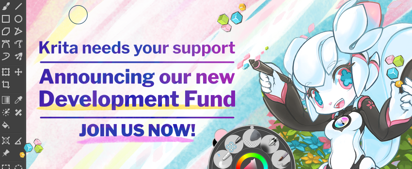

This the third development update during our development fund campaign. The development fund is necessary to make sure core Krita development can continue no matter what, so if you use Krita and can manage, please [join the development fund](https://fund.krita.org)!

Here is a fun article on how Carl Schwan adapted the fund.blender.org codebase for Krita: [https://carlschwan.eu/2021/05/25/tech-report-of-fund.krita.org/](https://carlschwan.eu/2021/05/25/tech-report-of-fund.krita.org/).

Ramon discusses the new resource system this time. It's not a terribly glittering subject, but it's really important and pretty much the reason we're calling Krita 5, Krita 5. We've been working on it for _years_, with the main developers involved being Halla and Agata. It makes working with resources a lot less glitchy and it also means Krita starts a lot faster, since we're not loading all brushes, brush presets, patterns and so on on start-up. And the from-the-ground up redesign gives us a solid basis for further extensions and improvements.

https://youtu.be/Hjc575p9kOU

Now for what we've been doing in the past week. This weeks super exciting development is by sponsored developer Agata. She is working on something we're calling "local assistants" now.  Until now, an assistant would cover the whole Krita image. With this change, you can limit an assistant to any rectangle. The feature should land soon enough to be in Krita 5. Here's a video made by David Revoy to show off:

\[video width="1920" height="1080" mp4="https://krita.org/wp-content/uploads/2021/05/local\_assistants.mp4"\]\[/video\]

Now, let's go for the rest...

- A lot of people collaborated on finding and closing bugs, but Dmitry closed 28 bugs on his own! In total, more than fifty bugs got resolved. Dmitry's main focus this week was fixing bugs in the transform tool, as well as making [rotate and shear use the anchor point properly](https://invent.kde.org/graphics/krita/-/merge_requests/860).
- Sharaf was sponsored to fix bugs on Android, but he also fixed bugs in Krita's vector functionality.
- Alvin Wong once again is working on implementing [fractional scaling in Krita's version of Qt](https://invent.kde.org/graphics/krita/-/merge_requests/853). If this works out better than the previous attempt, we'll finally have support for 150% display scaling on Windows.
- Emmet and Eoin were sponsored to fix bugs in the animation system.
- Amyspark was sponsored to work figuring out how to integrate the latest version of sip and PyQt, the cornerstones for our scripting support, in Krita's build system. After a couple of false tries, this now works. Which is good, because otherwise we would have to move to the Microsoft msvc compiler, which currently has some killer bugs for Krita. [Though work is going on with that, too](https://invent.kde.org/graphics/krita/-/merge_requests/776). And Amyspark added g'mic and the news widget to Krita's Android builds. Though g'mic might be too memory intensive to be used on Android after all..
- Wolthera was sponsored to work on fixing issues with the colorspace used when importing a video as frames into Krita.
- Halla was sponsored to work on the new resource system. She also fixed a number of bugs -- and did the [Huion Competition winners announcement](https://krita.org/en/item/huion-and-krita-competition-winners/). Huion now has the full list of winners as well.
- Deif Lou is working on [improving the gradient editors](https://invent.kde.org/graphics/krita/-/merge_requests/857). It's still work in progress, so unlikely to make it for Krita 5, for which the feature freeze is June 1st.

So, if you like what we’re doing, [join the development fund](https://fund.krita.org)!

