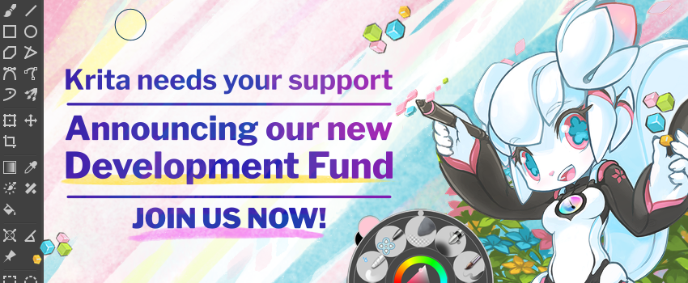

This month, we're campaigning for our brand-new Development Fund! Based on Blender's development fund code, we now have an updated donation system where everyone can manage their own subscriptions.

**Join the campaign and become a member on [fund.krita.org](https://fund.krita.org)**

### 

### Krita: created by the community

Krita has always been free and open source software. Hundreds of people have contributed to Krita, all sharing the ideal of making a great digital painting application for millions of users all over the world. The Krita Foundation funds work done on all aspects of Krita, but is completely dependent on donations. Sales in the various app stores also fund Krita, but not though the Krita Foundation -- but the Krita Foundation owns the trademark, and it's the developers working on Krita who decide on Krita's long-term goals.

### Goal: support Krita's open development in the long term

We have already had two recurring subscription funds, one through PayPal, one through Mollie. In total, there are about two hundred dev fund subscriptions currently. That's enough to support only one developer and one part-time documentation writer!

The Dev Fund goal is to support all of Krita's core development, so we won't be dependent on app stores for that anymore.

- Support developers to work on Krita's core codebase
- Work on special projects
- Support work like bug triaging and fixing, patch review, documentation

### Krita 5

Right now, we're working on Krita 5. It will be a big release, with a new smudge brush engine, rewritten resource management, vastly expanded animation support and much, much more. We plan to release Krita 5 in August. During this campaign we'll give you regular updates about the cool stuff you can see is happening for Krita 5.

### Targets

Currently, the Dev Fund has 200 subscribers. Together with one-time donations, we get about 4000 euros per month -- sometimes a bit more, sometimes a bit less.

Allowing continuity is the primary goal of the Krita Development Fund.

With 25,000 euros a month, we could support all current core developers without depending on the income from the app stores.
