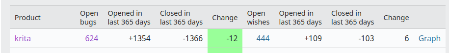

A bit later than planned... Our overview of last year and a look forward to this year! We're all still alive and working hard -- sometimes a bit too hard. We kept the same core team this year, but we also had a lot of contributions from volunteers. Over a hundred people made all in all over ten thousand contributions to Krita, the website, the manual and the translations.

We also launched the [Krita Dev Fund](https://fund.krita.org/), based on Blender's funding website code. We are really pleased with the community response to this initiative, but we're not yet at a point where we won't need the income from the various app stores. We launched Krita on the Epic app store, and we've made our first submission to the Apple MacOS store. (note: NOT the iPadOS store!)

### Releases

\[video width="1920" height="1080" mp4="https://krita.org/wp-content/uploads/2021/12/Video-for-store\_final-30fps.mp4"\]\[/video\]

Last year, 2021, was, of course the [year of the Krita 5 release](https://krita.org/en/item/krita-5-0-released/)! We also released from Krita 4.4.2 all the way through to Krita 4.4.8, so it was a busy year. With the release of 4.4.5 we said we wouldn't do another 4.4 release, but we did...

The list of new features for Krita 5 is [huge](https://krita.org/en/krita-5-0-release-notes/). But even the 4.4 releases brought new features, like mesh gradients, mesh transformation, new fill layer types and new brush presets.

### Bugs

Last year we ended up with 16 bugs more than we started the year with, this year we're twelve bugs to the good. Weirdly enough, last year we only had 563 open bugs, so something is weird. In any case, we worked through about 200 more bugs than last year. In other words, there was a [lot of churn](https://valdyas.org/fading/hacking/krita-hacking/nightmares-and-bugs/)!

### Code

We also had three Google Summer of Code students participating in Google's abbreviated program for students. This year, everyone can apply, even if you're not a student anymore. [Santosh, Tanmay and Sachin](https://krita.org/en/item/kritas-google-summer-of-code-students/): thanks for your hard work!

We finished the huge resource system rewrite that we started in 2015. It's certain that now that is out in the wild we will discover lots of things that need fixing, but then... That's always the case with code...

### Community

The number of downloads from the download page grew to **5,637,579**, almost a million more than in 2020, which was already a record year. That excludes all other places where people can get Krita, from Flatpak to Snap, from distributions to app stores to third-party download sites (but be careful with those!)

We also had a huge problem, that's since then hit other free software projects like inkscape and darktable: scammers mailed people behind a lot of youtube channels, related or unrelated to graphics software, about a possible collaboration with the Krita team. **This was, obviously, not us.** Some forensic work showed that they were trying to install ransomware on the victims' computers.

### And for this year...

I'm not expecting we're going to be able to have in-person developer meetings this year. But now that Krita 5.0 is out of the door, there will be time for some fun new things.

We haven't decided what yet, because we're notoriously bad at making roadmaps, plans or predictions...

But among the things we want to work on are the text shape, a new startup page, starting work on a mobile-friendly user interface, a new docker implementation, integration with 3d models, a rework of the tools system or the brush preset system, improved calligraphy or vectors in general , new tools for easy filling shapes, per-project resources and assets, -- maybe even a Krita cloud... And we're working on a proposal for making collaborative painting possible.

More news later!
