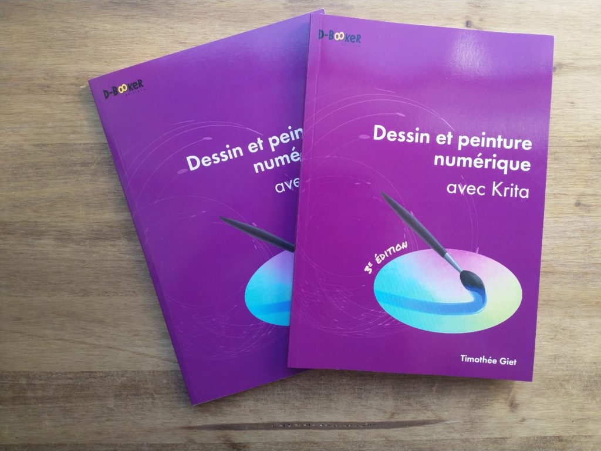

Yesterday, French publisher D-Booker released the 3rd edition of Timothée Giet’s book “Dessin et peinture numérique avec Krita”.

The first edition was written for Krita 2.9.11 in 2016. In this 3rd edition, Timothée has updated all the text and screenshots for the interface of Krita 5.0, and some parts have been entirely rewritten to make good use of new features in Krita 5.

And once again, D-Booker worked on updating and improving the French translation of Krita! Thanks again to D-Booker edition for their contribution.

You can order a print or digital version of the book from the D-Booker website: [https://www.d-booker.fr/krita-3e/711-dessin-et-peinture-numerique-avec-krita-3e.html](https://www.d-booker.fr/krita-3e/711-dessin-et-peinture-numerique-avec-krita-3e.html).
