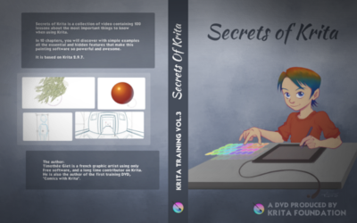

Mientras Timothee Giet está creando una nueva serie de videos instructivos que incluyen las nuevas funciones de animación, ¡Nosotros estamos haciendo ofertas!

**Descargas digitales**

_[Muses](https://krita.org/en/item/muses/)_, sigue siendo de los mejores introducciones a la pintura digital en general, enfocado en Krita, ahora esta disponible por solo €14,95!

**descarga Muses**

A solo **€14,95**, precio original €24,95 _[Secrets of Krita](https://krita.org/en/item/secrets-of-krita-the-third-krita-training-dvd/)_, instrucciones completas y bien estudiadas para sacar la mayor ventaja al usar Krita a solo €14,95!

**Descarga Secrets of Krita ** A solo **€14,95**, precio original €29,95

También se pueden comprar en nuestra tienda [gumroad](https://gumroad.com/krita#).

**DVD's**

Todavía ofrecemos DVD's, con una atractiva impresión y presentación los cuales se pueden ordenar en los siguientes enlaces  :

**Secrets of Krita - DVD** A solo **€14,95**, precio original €29,95, incluye el envío.

**Muses DVD** A solo **€14,95**, precio original €24,95, incluye envío.

**Tarjeta USB**

Mejor aún, puedes obtener los dos videos instructivos ademas de las versiones mas recientes de Krita para Windows, OSX y Linux en una vistosa tarjeta USB de el tamaño de una tarjeta de crédito con la imagen de "Kiki en primavera".

**Tarjeta** **USB** A solo **€24,95**, precio original €39,95, incluyendo envío.
