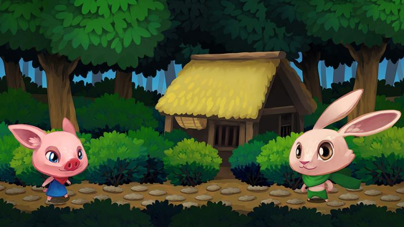

 

Nathan ha lanzado su nuevo curso llamado "Make Professional Painterly Game Art with Krita", es el primer curso de este tipo creado en torno a Krita.

Algunos de los aspectos mas destacados son el mostrar como hacer de manera profesional y refinada "Sprites" para juegos de video, como crear personajes, paisajes de fondo e inclusive una interfaz a nivel básico, así una organización mas inteligente de métodos y procedimientos que se pueden rehusar constantemente en tu rutina de trabajo.

Existen tres versiones, la basica diseñada para proporcionar una excelente introducción, así como la "pro" y "premium" las cuales proporcionan los fundamentos para mejorar tu arte en general, ser mas eficiente al usar Krita, demás te ayudará a la creación de un esquema de un juego de video el cual puedes usar como parte de tu portafolio.

El siguiente enlace contiene toda la información, nótese que tanto el curso como la pagina en el enlace están en inglés. [https://gumroad.com/l/krita-game-art-tutorial-1](https://gumroad.com/l/krita-game-art-tutorial-1)
