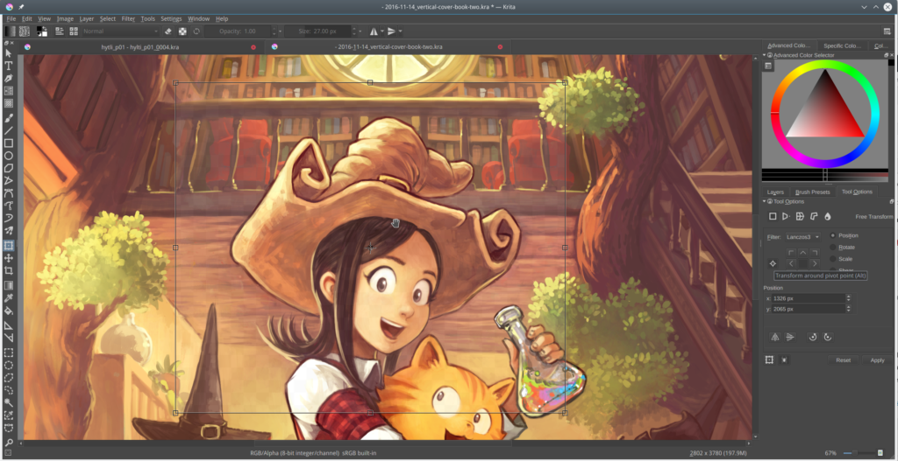

La versión de Krita 3.1.3 ha sido lanzada, una gran cantidad de errores de código han sido corregidos, inclusive se ha logrado incluir nuevas funciones. Durante todo el mes de abril, Dmitry y Boudewijn le dieron una pausa a la elaboración de los proyectos que han sido financiado mediante el Kickstarter para enfocarse en la estabilidad de éste lanzamiento, logrando una versión bastante solida. Se les hacen llegar las mas sinceras gratitudes a todos los usuarios que ayudaron en este lanzamiento, probando las versiones alfa y beta, así como a los traductores, ademas un agradecimiento especial para Alexey Samoilov por su trabajo restituyendo el repositorio Lime PPA de Ubuntu.

Transformación alrededor de un eje (Imagen por [David Revoy](https://peppercarrot.com))

Se ha incluido ademas una nueva version del adaptador (plugin) para el explorador de documentos de Windows, lo que hace posible el mostrar las imagenes en los documentos de tipo .kra y .ora. Se ha corregido el uso de la memoria así como el problema con los documentos .ora y la base de datos de Oracle; Gracias a Alvin Wong por éste trabajo.

### Nuevas Funciones

- Escala de imagen alrededor de un eje.
- Se ha implementado un menú contextual para la herramienta de selección de vectores (con cortar, copiar, pegar, ordenar objetos)
- Se ha incluido la opción de abrir Krita mas de una ves al mismo tiempo. (BUG 377199)

La lista completa de mas de 50 cambios (en inglés) [se puede ver aquí](https://krita.org/en/release-notes-for-3-1-3/).

#### Descargas

La pagina de KDE se ha actualizado, la cual ahora ofrece https.

#### Windows

En Windows, si se encuentran con cierres del programa inesperados, favor de seguir [las siguientes instrucciones](https://docs.krita.org/Dr._Mingw_debugger) (en ingles) para encontrar los errores y así poder entender por que suceden.

- 32 bits Windows: [krita-3.1.3-x86-setup.exe](https://download.kde.org/stable/krita/3.1.3/krita-3.1.3-x86-setup.exe)
- Portable 32 bits Windows: [krita-3.1.3-x86.zip](https://download.kde.org/stable/krita/3.1.3/krita-3.1.3-x86.zip)
- [Debug symbols. (Unpack in the Krita installation folder)](https://download.kde.org/stable/krita/3.1.3/krita-3.1.3-x86-dbg.zip)

- 64 bits Windows: [krita-3.1.3-x64-setup.exe](https://download.kde.org/stable/krita/3.1.3/krita-3.1.3-x64-setup.exe)
- Portable 64 bits Windows: [krita-3.1.3-x64.zip](https://download.kde.org/stable/krita/3.1.3/krita-3.1.3-x64.zip)
- [Debug symbols. (Unpack in the Krita installation folder)](https://download.kde.org/stable/krita/3.1.3/krita-3.1.3-x64-dbg.zip)

- Explorer Shell extension: [kritashellex-1.2.3.0-setup.exe](https://download.kde.org/stable/krita/kritashellex-1.2.3.0-setup.exe)

#### Linux

- 64 bits Linux: [krita-3.1.3-x86\_64.appimage](https://download.kde.org/stable/krita/3.1.3/krita-3.1.3-x86_64.appimage)

En Ubuntu puedes instalar el “snap” de ésta versión. Ademas puedes usar el repositorio [Krita Lime PPA](https://launchpad.net/~kritalime/+archive/ubuntu/ppa) en Ubuntu y sus derivados.

#### OSX

- OSX disk image: [krita-3.1.3.dmg](https://download.kde.org/stable/krita/3.1.3/krita-3.1.3.dmg)

### Código fuente

- Código fuente: [krita-3.1.3.tar.gz](https://download.kde.org/stable/krita/3.1.3/krita-3.1.3.tar.gz)

#### md5sums

Para todas las descargas:

- [md5sums.txt](https://download.kde.org/stable/krita/3.1.3/md5sums.txt)

#### Llave

El appimage y la fuente tarbal han sido firmadas, la llave pública se encuentra en el siguiente enlace: [0x58b9596c722ea3bd.asc](https://share.kde.org/index.php/s/fJ99V5mZvuyD0z8).

Las firmas están [aquí](http://download.kde.org/unstable/krita/3.1.3-beta.1).
