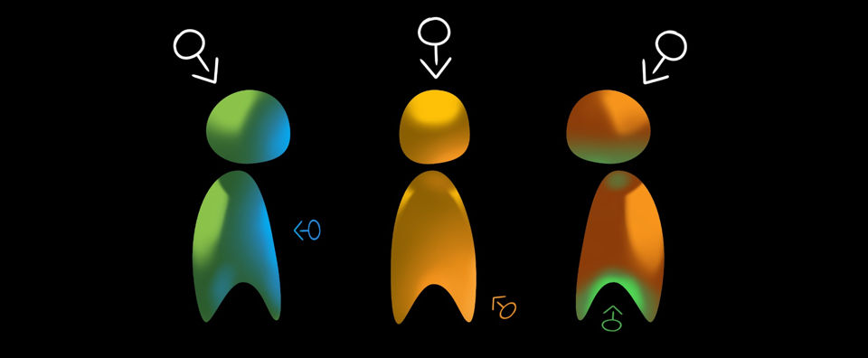
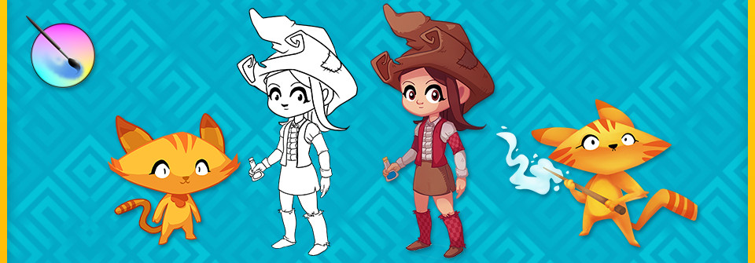

La segunda parte de el curso de arte para video juegos con Krita denominado "Make Cel Shaded Game Characters" ya está disponible. Contiene 14 ejercicios y un video que muestra los conceptos totalmente explicados, todo esto te ayudará a mejorar tus conocimientos en cuestiones de alumbramiento y sombra así como en la creación de personajes de juegos de video.

 

Ésta parte del curso está basada en el webcomic de David Revoy, Pepper and Carrot, el cual es elaborado completamente en Krita, lo cual hace que su uso sea el ejemplo perfecto para las lecciones presentadas. David usa la licencia CC-By 4.0 en su webcomic, permitiendo su uso con la mención apropiada.

Para mas información, visita la pagina del curso.

[https://gumroad.com/l/cartoon-game-art-krita-course](https://gumroad.com/l/cartoon-game-art-krita-course)

