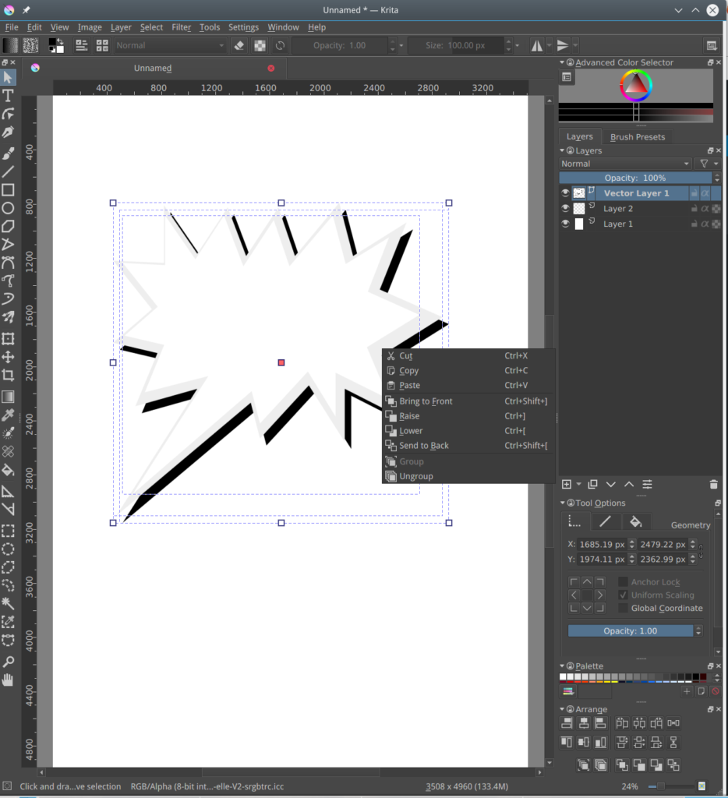
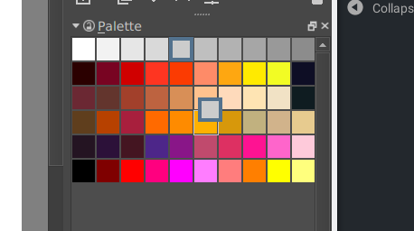
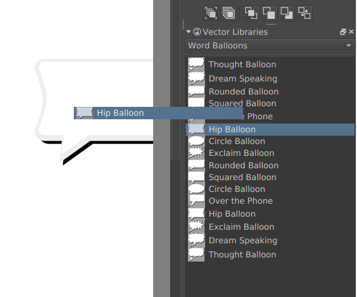

#### ¡Advertencia!

Ésta es una muestra bastante prematura de lo que será la versión 4.x de Krita, la intención es el de descubrir con tu ayuda, errores de código comunes que no hemos detectado en nuestros sistemas y así podremos continuar de manera mas eficaz. Ésta versión "pre-alfa" no es recomendada para ningún tipo de trabajo artístico, serio o especial, ya que se pueden perder o corromper documentos e imágenes, aun cuando hay usuarios que tienen la suerte de crear arte sin problemas con ésta versión, ésto no indica que el mismo resultado estará presente en todos los sistemas. Si has deseado poner a prueba la versión y encuentras errores de código, por favor de reportarlos en [bugs.kde.org!](https://bugs.kde.org)

**Éstos son los nuevos cambios en ésta versión:**

Uno de los cambios mas importantes y complicados, mas aun que el paso de la versión 2.9 a la 3.0 es el reemplazo completo de el sistema de imágenes de vector, pasando de el [Open Document Graphics](https://docs.oasis-open.org/office/v1.2/OpenDocument-v1.2.html) al formato [SVG](https://www.w3.org/TR/SVG/) para guardar la información de los vectores. Ésto hace de Krita un programa con mayor compatibilidad hacia otros programas tales como [inkscape](https://inkscape.org). Krita puede aun abrir y cargar documentos que ya han sido creados en ODG con vectores, pero solo tendrá la capacidad de guardar en SVG. **Nótese que una ves que Krita 4.0 guarda un documento ODG en SVG, éste no podrá ser usado en Krita 3.0, por lo que se recomienda duplicar los documentos a experimentar.**.

Se ha recreado la manera en que se interactuar con los vectores lo que debe facilitar su uso, esperamos los comentarios de nuestros usuarios al respecto, ya que se desea que el eso de los vectores sea tan productivo y satisfactorio como el resto de los componentes de Krita.

Otro cambio importante es el nuevo motor de pincel de aerógrafos "airbrush", desarrollado por Allen Marshall, motor que reemplaza completamente el anterior, ésto afectará todos los pinceles creados con el mismo, sin embargo el nuevo motor es mucho mejor.

Eugene Ingerman ha añadido un pincel de compostura "Healing Brush", el cual puede cubrir o completar partes de una imagen automáticamente, muy útil para la manipulación de fotografías entre otros.

https://youtu.be/jI87VzDtkPY

l nuevo sistema de guardado de archivos es mas seguro ya que avisa al usuario si el formato que se escoge producirá la perdida de información o componentes creados en Krita, tal como guardar en PNG o JPEG, perderá las capas, etc. Nótese que Guardar un archivo no es lo mismo que exportarlo, para mas información ver el manual.

El panel de las paletas de color ha sido mejorado por Wolthera van Hövell tot Westerflier, ahora te permite organizar las paletas en grupos de color, arrastrar y colocar colores y modificar los grupos con un doble clic.

También se ha creado un nuevo panel con símbolos en SVG que puedes añadir como figuras predefinidas, tales como diálogos para historietas, de hecho se ha incluido la serie creada por David para "Pepper and Carrot" la cual te dará bastantes opciones.

Todo esto ademas de muchos detalles por doquier los cuales puedes encontrar explorando la interfaz y las funciones, estamos trabajando también en la herramienta de texto, la cual está apenas en sus inicios, y próximamente en las versiones de prueba de Krita.

De igual manera ya tenemos la base de el adaptador de Python, el cual estamos poniendo a prueba, tenemos sin embargo un problema con el mismo, no hemos logrado encontrar la manera de juntar Python con sus módulos para lograr que estos funcionen. Ademas solo se ha logrado incorporar el adaptador en Krita para Linux, pero no así para Windows o OSX. **Si tienes experiencia y te gustaría ayudar con estos problemas, por favor contáctanos, ¡Gracias!**

\[caption id="attachment\_5377" align="alignnone" width="1003"\] The Scripter -- ad-hoc scripting in Krita, created by Eliakin Costa.\[/caption\]

#### Descargas

#### Windows

En Windows, si se encuentran con cierres del programa inesperados, favor de seguir [las siguientes instrucciones](https://docs.krita.org/Dr._Mingw_debugger) (en ingles) para encontrar los errores y así poder entender por que suceden.

Estas versiones de prueba solo están disponibles en 64 bits, windows portable zip files, Linux appimages y en OSX disk images.

- Portable 64 bits Windows: [krita-4.0.0-prealpha.1-x64.zip](https://download.kde.org/unstable/krita/4.0.0-prealpha/krita-4.0.0-prealpha.1-x64.zip)
- [Debug symbols. (Unpack in the Krita installation folder)](https://download.kde.org/unstable/krita/4.0.0-prealpha/krita-4.0.0-prealpha.1-x64-dbg.zip)
- Portable 32 bits Windows: [krita-4.0.0-prealpha-x86.zip](https://download.kde.org/unstable/krita/4.0.0-prealpha/krita-4.0.0-prealpha-x86.zip)
- [Debug symbols. (Unpack in the Krita installation folder)](https://download.kde.org/unstable/krita/4.0.0-prealpha/krita-4.0.0-prealpha-x86-dbg.zip)

#### Linux

- 64 bits Linux: [krita-4.0.0-prealpha-x86\_64.appimage](https://download.kde.org/unstable/krita/4.0.0-prealpha/krita-4.0.0-pre-alpha-x86_64.appimage)

#### OSX

- OSX disk image: [krita-4.0.0-pre-alpha.dmg](https://download.kde.org/unstable/krita/4.0.0-prealpha/krita-4.0.0-prealpha.dmg)

### Source code

- Source code: [krita-4.0.0-pre-alpha.tar.gz](https://download.kde.org/unstable/krita/4.0.0-prealpha/krita-4.0.0-prealpha.tar.gz)

#### md5sums

For all downloads:

- [md5sums.txt](https://download.kde.org/stable/krita/3.1.4/md5sums.txt)

#### Llave

El appimage y la fuente tarbal han sido firmadas, la llave pública se encuentra en el siguiente enlace: [0x58b9596c722ea3bd.asc](https://share.kde.org/index.php/s/fJ99V5mZvuyD0z8).

Las firmas están [aquí](http://download.kde.org/unstable/krita/3.1.3-beta.1).

#### También puedes apoyarnos

Krita es un programa no solo de código libre si no ademas está a disposición de manera gratuita, éste proyecto solo es posible gracias a las donaciones hechas por nuestros usuarios, por favor considera la posibilidad de ayudarnos con una [donación](https://krita.org/en/support-us/donations/) o comprando [videos instructivos o nuestro libro de arte Made With Krita](https://krita.org/es/item/krita-3-1-4/%22https://krita.org/en/support-us/shop), solo con tu ayuda podremos mantener a nuestro pequeño grupo desarrollando Krita en tiempo completo, ¡Gracias!
