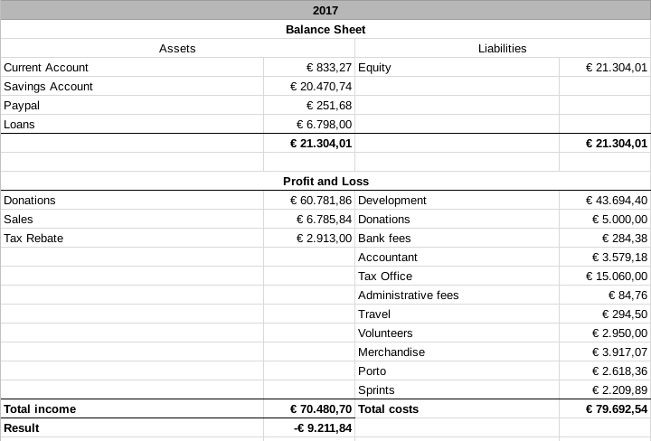

Durante la ultima [reunión](https://krita.org/es/item/maraton-de-desarrollo-reunion-de-krita-2018/) del equipo de Krita, se decidió el publicar nuestro reporte anual referente a los ingresos y gastos. Se hizo lo mismo en el [2015](https://krita.org/en/item/funding-krita/) y [2016](https://krita.org/en/item/funding-kritas-development/), pero el reporte del 2017 se ha retrasado dada las circunstancias. El año pasado fue [difícil](https://krita.org/es/item/gracias-por-tu-ayuda/), lo cual se demuestra claramente con el presupuesto final,  € 9.211,84 menos de los que había al comenzar.

Dados los problemas se tuvo que remover las ventas y cualquier trabajo considerado comercial de la Fundación de Krita. Sin embargo ya teníamos una "compañía" lista: Boudewijn Rempt Software, la cual fue creada durante el tiempo en que se termino el contrato con [KO GmbH](https://krita.org/en/item/krita-and-ko-gmbh/) y nuestro desarrollador necesitaba fondos para seguir trabajando en Krita, y por lo cual decidió hacer otros trabajos separados del proyecto. Ahora ésa misma compañía nos funciona para poder vender los libros de arte, DVD educativos y el resto de los productos, así como el servicio comercial de Krita, por lo que, el numero de "ventas" en el reporte solo incluye el primer cuatrimestre del 2017.

Definitivamente no hubiéramos logrado sobrevivir como proyecto si no fuese por la generosidad de dos individuos que sustentaron el trabajo de Dmitry y Boudewijn durante unos meses, aportación que tampoco aparece en éste reporte, ya que fue a manera personal y no mediante la Fundación de Krita. Finalmente, Boudewijn, después de haberse agotado totalmente con el negocio de consulta durante el 2016 ya no pudo seguir haciendo trabajos extra, por lo que por el resto del 2017, uso sus ahorros, mismos al igual no aparecen en el reporte, basta decir que si ponemos todas estas cifras excluidas, el costo del desarrollo seria prácticamente el doble.

Se requirió de prestamos a nombre de Boudewijn, los cuales han sido pagados totalmente en el 2018, cuando el ingreso de la tienda de Windows comenzó a figurar en las cifras. En el 2017 se hizo la producción del Libro de arte de Krita 2016, lo cual junto con los envíos del mismo fue bastante costoso. Aun tenemos bastantes piezas que no se han vendido. La parte declarada como "Donations", es cuando se donó a las personas que hicieron proyectos que aun que no fueron parte de nuestro desarrollo, Krita se benefició directamente de ellos. La parte "volunteers" representa el dinero dado bajo la ley de impuestos Holandesa a las personas que produjeron bastante trabajo voluntario en Krita.

En el 2018, nos hemos mantenido bastante bien, hemos hecho algunos proyectos muy interesantes pagados por y para Intel, como el mejorar el desempeño de Krita en varios de sus procesadores, hemos creado una mejor administración de las sesiones de las ventanas y recreado la herramienta de imágenes de referencia. Las ventas de la tienda de Windows pagan prácticamente el trabajo de tiempo completo de Boudewijn, fondos que son dirigidos directamente a Boudewijn Rempt Software (para prevenir conflictos fiscales). Ademas revivimos un promedio de 2000 euros mensualmente en [donaciones](https://krita.org/en/support-us/donations/) hechas a la Fundacion de Krita, lo cual paga el salario de tiempo completo Dmitry. Actualmente tenemos 87 subscriptores al [fondo de desarrollo](https://krita.org/en/support-us/monthly-subscription/), numero que afortunadamente continúa creciendo. Finalmente, tenemos planeado llevar a cabo un evento de recaudación de fondos en septiembre.
