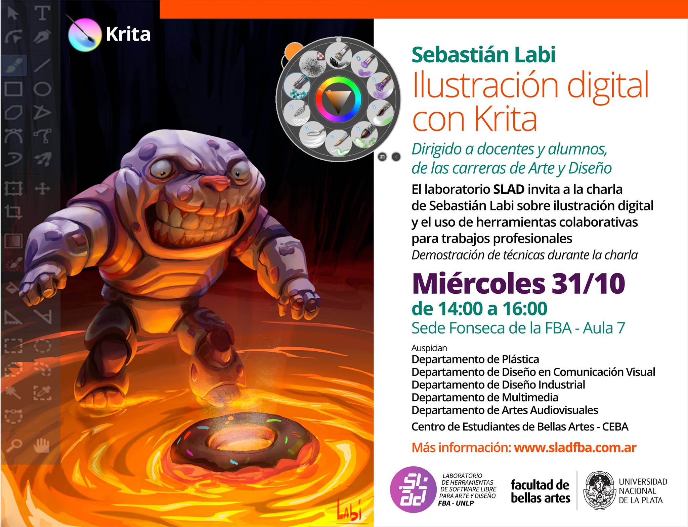

[Sebastian Labi](https://www.facebook.com/sebastianlabi/) ha sido invitado para presentar Krita en el [Laboratorio de herramientas de software libre de la Universidad de La Plata](http://sladfba.com.ar). Hablará sobre ilustración digital y usará Krita para dar una demostración de cómo usar Krita para el campo de la Ilustración Digital.

El SLAD- FBA (Software libre para Arte y diseño) es una nueva unidad de de investigación y formación en la Facultad de Bellas Artes que promueve el conocimiento y uso del software libre en la capacitación académica de la Universidad de La Plata.

El evento tendrá lugar el Miércoles 31 de Octubre a las 14:00.

* * *

[Sebastian Labi](https://www.facebook.com/sebastianlabi/) has been invited to present Krita in the [laboratory of Free Software tools of the Unversity of La Plata](http://sladfba.com.ar/).  He will talk about digital illustration and using Krita, as well as giving a hands-on demonstration of Krita. SLAD - FBA | Free Software for Art and Design is a new unit of research and training at the Faculty of Fine Arts which promotes knowledge and use of Free Software in the academic training of the University of La Plata.

SLAD is a new research and teaching group in the Faculty of Fine Art in La Plata University which wants to promote systemtatic and sustained knowledge on how Art and Open Source interacts in an academic setting.

The meeting will be on Wednesday October 31st at 14:00.

