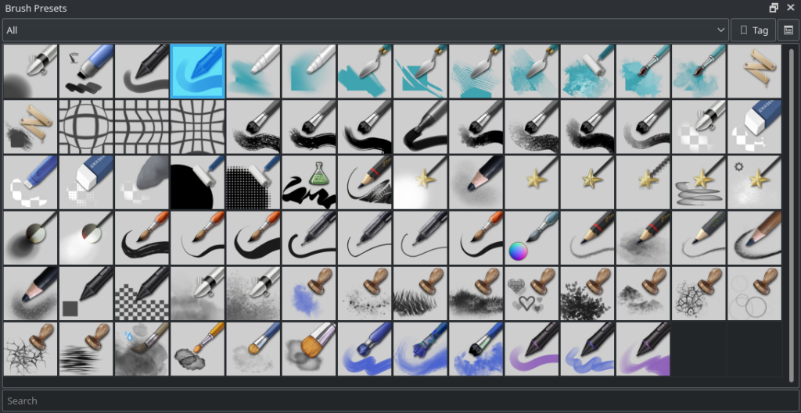

Durante las ultimas semanas, todo el empeño y esfuerzo de los desarrolladores se ha enfocado en el lanzamiento de la version 4 de Krita. Se han corregido alrededor de 150 errores de codigo, y a este punto, Krita 4 es lo suficientemente estable para ser usado regularmente. Existen aun muchos detalles que necesitan ser solucionados por lo que por las siguientes cuatro semanas se seguirá trabajando en hacer de ésta versión un producto bastante pulido.

Uno de los trabajos que se están realizando es la actualización del juego de pinceles originales de Krita, incluyendo las "puntas" de los mismos, estos últimos es la figura con la que el pincel pinta, la cual puede ser designada de manera independiente, los pinceles originales son los que vienen incluidos en el programa también conocidos como brochas, los cuales se pueden seleccionar en su propio panel en en la paleta emergente que aparece con un clic a la derecha en el lienzo.

 

El juego de pinceles previo no tiene problemas, pero ya esta un poco desactualizado, se basa en su mayoría en una versión ya pasada del de [David Revoy](https://www.davidrevoy.com), desde ese tiempo tanto el juego de David como Krita mismo se han actualizado, existen nuevas funciones y parámetros en los motores de pinceles, por lo que varios artistas están colaborando para la creación de un nuevo conjunto, mas especializado y con menos redundancia.

Dado que aun se está trabajando en el juego, se necesita de los comentarios y opiniones de los usuarios para cerciorarse que este grupo de pinceles será del agrado de la mayoría. Por lo que se pide que descarguen la versión de prueba mas reciente, dibujen y pinten y luego llenen el cuestionario que se encuentra en el siguiente enlanze.

[Encuesta para el juego de pinceles, (en INGLES)](https://goo.gl/forms/xRbDIZRnRX005ZOt2)

Ademas de los pinceles y la estabilidad, los usuarios de Linux notarán que las AppImage ahora contienen la posibilidad de programar con el controlador de Python para añadir nuevas funciones, así como el panel _Touch UI._ Nota: Las funciones del controlador de Python que vienen incluidas en Krita están desactivadas, para usarlas se necesitan activar en la ventana de configuraciones.

#### ¡Se busca ayuda!

Los desarrolladores tienen las manos llenas justo antes del lanzamiento, por lo que la creación de un video que muestre las novedades y nuevas funciones de Krita se está quedando atrás de los planes, se está buscando por colaboradores que puedan ayudar a la creación del mismo, se requiere buen entendimiento en ingles y por supuesto en la creación de videos. Si te interesa has contacto con los desarrolladores en el canal #krita en irc.freenode.net

#### Windows

En Windows, si se encuentran el cerrado del programa inesperadamente, favor de seguir [las siguientes instrucciones](https://docs.krita.org/Dr._Mingw_debugger) (en ingles) para encontrar los errores y así poder entender por que suceden.

- 64 bits Windows: [krita-nightly-x64-v4.0.0.51-325-g2126cec79f-setup.exe](https://download.kde.org/unstable/krita/4.0.0.52/krita-nightly-x64-v4.0.0.51-325-g2126cec79f-setup.exe)
- Portable 64 bits Windows: [krita-nightly-x64-v4.0.0.51-325-g2126cec79f.zip](https://download.kde.org/unstable/krita/4.0.0.52/krita-nightly-x64-v4.0.0.51-325-g2126cec79f.zip)
- [Debug symbols. (Unpack in the Krita installation folder)](https://download.kde.org/unstable/krita/4.0.0.52/krita-nightly-x64-v4.0.0.51-325-g2126cec79f-dbg.zip)

#### Linux

En Linux, el controlador Gmic-qt se necesita descargar de forma separada, una ves instalado se puede establecer en donde se localiza mediante la ventana de configuraciones de Krita. Krita requiere que la variable "XDG\_DATA\_DIRS" esté designada, la mayoría de las distribuciones de Linux lo hacen, pero en caso de que no lo sea, se puede enlazar de la siguiente forma, designa "XDG\_DATA\_DIRS" en "/usr/local/share/:/usr/share/". La siguiente versión disponible de Krita lo hará automáticamente.

- 64 bits Linux: [krita-4.0.0-beta1-b322ae6-x86\_64.appimage](https://download.kde.org/unstable/krita/4.0.0.52/krita-4.0.0-beta1-b322ae6-x86_64.appimage)
- AppImage: [gmic\_krita\_qt-x86\_64-2.2.0.appimage](https://download.kde.org/unstable/krita/4.0.0.52/gmic_krita_qt-x86_64-2.2.0.appimage)

(En ocasiones Firefox trata el enlace como texto, para descargar el paquete simplemente has un clic a la derecha en el mismo enlace.)

#### OSX/macOS

La versión mínima requerida de OSX/macOS es 10.11

- OSX disk image: [https://download.kde.org/unstable/krita/4.0.0.52/krita-4.0.0-g2126cec79f.dmg](https://download.kde.org/unstable/krita/4.0.0.52/krita-4.0.0-g2126cec79f.dmg)

Nota: El controlador de gmic-qt y de PDF no está disponible en OSX.

### md5sums

Para todas las descargas:

- [md5sums.txt](https://download.kde.org/unstable/krita/3.2.0-beta.1/md5sums.txt)

### Llave

El appimage y la fuente tarbal han sido firmadas, la llave pública se encuentra en el siguiente enlace: [0x58b9596c722ea3bd.asc](https://share.kde.org/index.php/s/fJ99V5mZvuyD0z8).

Las firmas están [aquí](http://download.kde.org/unstable/krita/3.1.3-beta.1).

### También puedes apoyarnos

Krita es un programa no solo de código libre si no ademas está a disposición de manera gratuita, éste proyecto solo es posible gracias a las donaciones hechas por nuestros usuarios, por favor considera la posibilidad de ayudarnos con una [donación](https://krita.org/en/support-us/donations/) o comprando [videos instructivos o nuestro libro de arte Made With Krita](https://krita.org/es/item/krita-3-2-0/%22https://krita.org/en/support-us/shop), solo con tu ayuda podremos mantener a nuestro pequeño grupo desarrollando Krita en tiempo completo, ¡Gracias!
