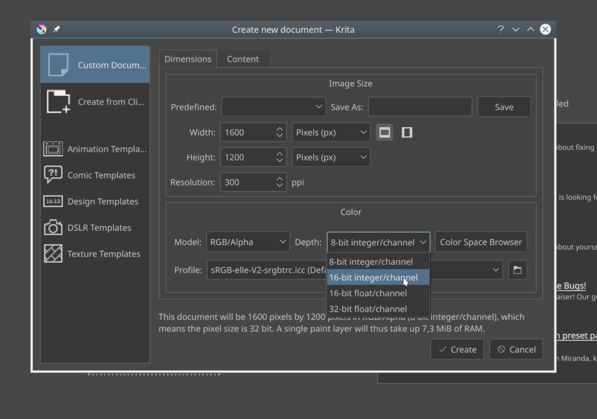

**[Ya vamos terminando la primera semana de nuestro evento](https://www.krita.org)**, y con casi **9000** euros listos para corregir los "bichos". Por lo que queremos darle un vistazo al numero de votos de cada área, y por supuesto ¡Compartir el conteo con ustedes!

En primer lugar tenemos **Papercuts**, (detalles aquí y allá que pueden mejorar Krita en general) con **84** votos. ¿Sera por que es la primera opción de la lista? ¿O por que nuestros usuarios nos están tratando de informar que Krita es generalmente estable pero que si se le"pule" un poco mas sería una gran diferencia? Si es esta segunda razón, nosotros estamos totalmente de acuerdo, de hecho el dia de ayer Boudewijn corrigió un error que de seguro molestaba a todos los usuarios que crean sus propios lienzos digitales: ¡[Ahora la profundida de los canales de color se muestran en orden](https://phabricator.kde.org/R37:b0b55278363391eeb96784fddba5a763ac09c05a)!

En segundo lugar, y para nuestra sorpresa está la **Animación** con 41 votos. Cuando añadimos esta función en Krita, nos sorprendió el entusiasmo y el afecto de nuestros usuarios hacia la función. De hecho hemos visto con nuestros propios ojos, durante el la reunión de desarrollo de Krita, cierto trabajo realizado con Krita para un programa animado de televisión bastante prometedor.

En tercer lugar, los problemas de los **Motores de pincel**, con **39** votos. Aun antes de decidir éste año la dirección que tomaríamos con la mejora de la estabilidad de Krita, ya habíamos planeado el añadir nuevas funciones a los pinceles. Para muestra, con el paquete de [Digital Atelier](https://krita.org/en/item/introducing-digital-atelier-a-painterly-brush-preset-pack-by-ramon-miranda-with-tutorial-videos/), se puede notar la cantidad de modificaciones que se ya pueden realizar, sin embargo, como lo muestra el conteo, entendemos el mensaje, que hay aun otros problemas con los pinceles que necesitan nuestra atención. Los motores de pincel (el código que hace que los pinceles trabajen) data desde el 2006/07, cuando se reconstruyo parte del código, con un gran avance gracias a la aportación de Lukáš Tvrdý al realizar su tesis basada en los motores de pincel. Tal vez necesitamos explorar a fondo que se puede lograr y componer, o posiblemente solo es algo simple a lo que no hemos podido discernir, de cualquier manera, ¡Es tiempo de encontrar la solución!

En cuarto lugar, problemas con las **Capas**, a **23** votos. Por ejemplo, el "parpadeo" visual de las capas cuando estas se actualizan después de una acción. Por lo pronto, Dmitry ya [corrigio uno de estos "bichos" durante el miercoles](https://phabricator.kde.org/R37:58b982cbb7bfa133bbb0bab5b163c24a9bb83d61).

Los **objetos de vectores** y **sus herramientas**, con **20** votos se colocan por lo pronto en quinto lugar, seguido por la función de **Texto** con **15** votos, **Estilos de capas** con **13** (lo curioso que solo hay 17 errores reportados para esta área), todos éstos suficientes para mostrar la voz de los usuarios y cuales son sus inquietudes al respecto, pero al parecer la prioridad de éstos últimos es bastante baja en comparación.

Los votos restantes se dividen entre el **Manejo de Colores**, **Atajos de teclado**, **de la tabletas digitales** y **stylus**. El **Organizador de recursos** y el **Etiquetado**, con **8** votos. Ya mostramos como se corrigió uno de los [errores con los atajos de teclado](https://krita.org/en/item/lets-take-this-bug-for-example/). ¡De hecho fueron [tres problemas resueltos](https://phabricator.kde.org/R37:36861ec3b2608893a5c624560e5d3302bda19c31)! y como también ya se ha mencionado, el organizador de recursos se ha estado reestructurando por lo que el trabajo en ello ya ha comenzado, posiblemente la razón por la que no ha recibido muchos votos.
