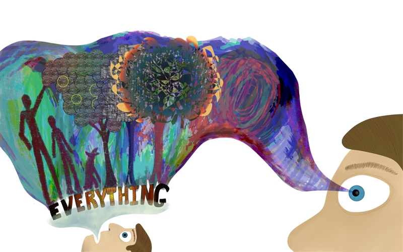
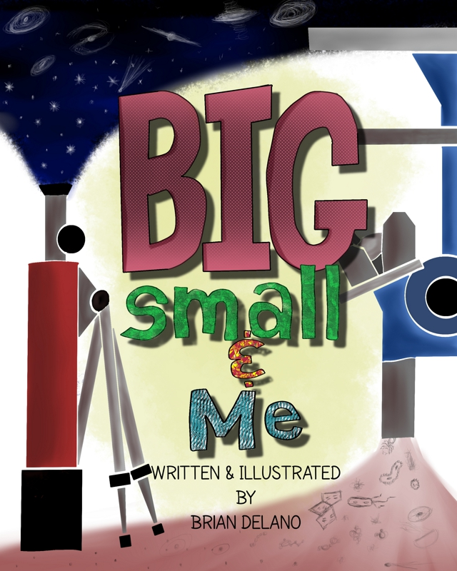

### 

### 自己紹介をおねがいできますか？

私はBrian Delanoです。テキサス州オースティンに住んでいるミュージシャンで、ライターで、未来主義者で、起業家でアーティストです。今あげたもののどれかに特に秀でているというわけではありませんが、自分のエゴにこうした職種名を投げつけて、どれが残って伸びるかを見ようとするアプローチをとっています。

### 絵を描くのは仕事としてですか、それとも趣味としてですか？

多かれ少なかれ趣味でのアーティストです。水彩画を何枚か売ったことはあり、町で作品を展示したこともありますが、今のところ私のアートキャリアの大部分は自分の耳と耳の間に存在する楽観的な推測として存在しています。

### どのようなジャンルの絵を描いていますか？

大抵、抽象画を描いています。ウェブコミックという形も試していますが、「やってみたいこと」リストでは新顔です。最近は、数年間アイデアを練った子供向けの本のシリーズのための絵をコツコツと描いています。

###  どのような作品に影響されていますか？アーティストとしてのロールモデルは？

アン・ドラヤンとカール・セーガン、 クレーグ&コニー・ミノーワ、 ダレン・ウォーターストン、サイ・トゥオンブリー、セオドア・スース・ガイゼル、ペンデルトン・ウォード、シェル・シルヴァスタインにその他多くのアーティストです。

### はじめてデジタルペイントを試したのはいつで、どのような感じでしたか？

デジタルアートにはじめて出会ったのは、90年代の半ばで、Kid Pixというプログラムでした。どこの学校のコンピュータ室にもこのプログラムがあって、びっくりするほど面白いと思いました。最近、この時代の自分が描いたデジタル絵の印刷を手に入れた(おそらく描いたのは8歳ごろだったはずです)のですが、今でも好きです。UFOがビームでビーチハウスを破壊する絵でした。

###  どうしてアナログな絵画技法よりデジタルを選んだのですか？

誤解して欲しくないのですが、アナログアートが、自分の中で一番です。ただ、デジタルとアナログの2つで、画材への投資や、必要な時間を比較すると、勝負になりません。何かの試作で、画面の中で物を移動させたり、色テーマや質感といったものを試すときには、デジタルがもちろんピッタリです。

### Kritaを見つけた経緯は？

デジタルアート向けのよく知られたソフトの代わりとなるオープンソースソフトを探していました。既にGIMPは使っていて、Photoshopと比べた機能にもかなり満足していたのですが、もっと画像編集よりデジタルペイントに向いたソフトを必要としていました。いろいろな言葉を組み合わせた検索でも、掲示板の斜め読みでも、Kritaが出てきました。

### 第一印象はどうでしたか？

正直に言えば、最初は、Kritaの提供するデフォルトブラシとそのカスタマイズについて、選択肢の多さに圧倒されてしまいました。数回の実験と、数個のビデオチュートリアル、それからマニュアルをある程度読んでようやく、Kritaでの製作アプローチに確信を持てました。

### Kritaのどこが好きですか？

コンセプトや方向性を思いついたら、どんなに突飛なものであっても、Kritaで作る方法があります。最近、独特な見た目の木を作ろうとして、「葉の部分を虹色のホイルのようにできたら…」と思いました。テクスチャの実験をしてみたら、ホイルとしていい感じに見えるデフォルトのテクスチャが見つかって、そのテクスチャの円を主要な色のブラシアウトラインで作り、レイヤーの不透明部分を選択し、下側のレイヤーを追加して、選択領域を虹色のグラデーションで塗りつぶして、ホイルの円のレイヤーの不透明度を下げれば、そうです！想像していたものがあっという間に(デジタルの)現実になったのです！

###  Kritaのどこを改善する必要があると思いますか？困っていることはありますか？

時々ですが、プログラムとPCに無理をさせると、Kritaが数秒間固まってしまうことがあります。新しいリリースのたびに、この問題の頻度は減っているので、開発が続けば問題ではなくなってしまうと確信しています。

### 他のツールと比べてKritaを特別にしているのはどんなことだと思いますか？

Kritaはアーティストのプログラムのように思います。プログラムができるアーティストによって作られたプログラムです。他の多くのツールは、よく理解できないアーティストの要望に応えようとしているものの、フォーカスグループによるデータを誤解しているプログラマによって作られたような感触があります。漠然とした説明に聞こえるかもしれませんが、他のプログラムを試してからKritaに来ると、私の言っていることがよくわかると思います。

### 今までKritaで描いた作品の中で一番のお気に入りを選ぶとしたらどれですか？

今は子供向けの本のイラストを描いています。この本は私が書いたもので、万物の大きさと、人間の体験との関係についてのものです。このシリーズを「BIG, small & ME」と呼んでいます。最初の本をこの秋に自分で出版してどうなるか見てみたいと思っています。私はガンの治療法を見つけたり、光速より速い何かを発明することはないかもしれませんが、もし、将来そうした偉業やさらにすごいことを成し遂げるような子供にインスピレーションを与えられたら、私の人生は成功といえると思います。

### どのようなテクニックとブラシを使いましたか？

鉛筆ブラシでのスケッチからはじめて、線画のために別のレイヤーを作ります。画面の要素をペン入れして分割してから、スケッチレイヤーをオフにして、線画レイヤーの中の形を選択してから、3つ目のレイヤーに塗りつぶしをします。こうして基本色を各要素につけたら、線画レイヤーをオフにして、質感テクスチャと詳細のための4つ目、5つ目のレイヤーを作ります。ページごとに違った部分や実験している時もありますが、これが私のKritaでの作業の基本です。

### あなたの作品をもっと見るには？

[artarys.com](http://artarys.com/ "artarys.com")には数枚の画像とブログがあります。このサイトに近いうちにさらに追加していこうと思っています。私が取り組んでいるプロジェクトはまだ初期段階なので、セルフプロモーションはこれから数か月のうちに増やしていくつもりです。今年の終わりまでにBIG, small &MEの印刷のためのKickstarterをやりたいと思っていますが、それまでは私の作品はartarys.comがFacebookページで公開されるはずです。

### 他に伝えたいことはありますか？

Kritaのような冒険的試みが、クリエイティビティの未来に対する希望を与えてくれます。デジタルアートの素晴らしいツールを作ることにひたむきな製作者たちが世界にいることに深く感謝しています。
