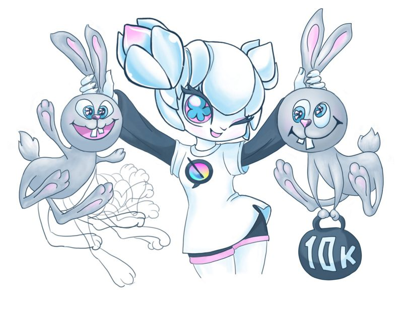
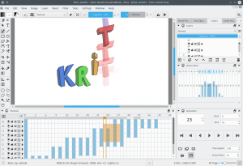

※ベータ版第2弾がリリースされています。[こちら](https://jp.krita.org/item/second-animation-beta/)をご覧ください。

本日は長らく待ち望まれていたアニメーション製作及びLoD機能をサポートするKritaのベータ版のリリースを発表できることを大変うれしく思います。これより[2015年Kickstarter](https://www.kickstarter.com/projects/krita/krita-free-paint-app-lets-make-it-faster-than-phot)の一番の目玉となる機能を皆さんの手でお試しいただけます！

このバージョンで新しくなったところはどこでしょう？見た目にはKritaはあまり変わっていないかもしれません。新しく**アニメーション**（Animation）、**タイムライン**（Timeline）、**前後フレームの表示**（Onion Skins）の3つのドッキングパネルが追加されてアニメーションフレームに関するすべてを制御できるようになり、またメニューの表示（V）からアクセスできる**高速表示モード（LOD）**（Instant Preview Mode。以前は詳細度（Level of Detail）と呼ばれていた機能です）により高解像度の巨大なキャンバス上でも快適にお絵かきできるようになりました。これらの機能を使用するためにはOpenGL 3.0以上をサポートするシステムが必要となります。

ですがこの見た目には小さい変化の影にはKritaのカーネルコードへの山の様な変更があります。我々はレンダリングのプロセスのほとんどをバックグラウンドで行えるようKritaのカーネルコードをほとんど書き換えるところまでいきました…そのためこのバージョンでは全てのアニメーションされるフレームとキャッシュレベルの表示は皆さんがKritaをアイドルにしている（例えば次はどこを書き込もうか考えたり、新たな素晴らしいブラシを選択していたりする）間に計算されるようになっています。これらの変更により、高解像度の画像と複数のレイヤーからなる複雑なフレームからなる連番画像のリアルタイムでの再生（フレームはバックグラウンドで再計算され、キャッシュからGPUに直接アップロードされます）を効率よく行うことが可能となったのです。

さて、では改めて、Krita 2.9アニメーションベータ版へようこそ！（バージョンの番号にご注意ください！最終リリースはKrita 3.0に基づくものとなりますが、このバージョンは2.9安定版から作られたものです。ですが**なお**ベータ版です。皆さんからのフィードバックをお待ちしております！）

Kritaを以前インストールしたことがある環境では、高速表示モードのメニューアイテムが表示メニューに現れないことがあります。この場合は、Kritaのリソースフォルダ(「設定>リソースを管理>リソースフォルダを開く」)にあるkrita.rc(注意：kritarcではありません)を削除してKritaを再起動してください。なおこの際に解凍したファイル内のshare/appsフォルダの中にあるkrita.rcファイルも同時に削除してしまうとアニメーションベータ版の方のKritaが起動しなくなってしまうので注意してください。この手順を行わなくてもShift＋Lのショートカットは利用可能です。

また、初めて今回Kritaをダウンロードした方で、ウィンドウが真っ黒になってしまう場合、Intelのグラフィックカードを利用しているならIntelのグラフィックドライバが持つOpenGLのバグである可能性があります。ドライバを最新のものにアップデートしてください。

#### Timothee Giet氏による動画チュートリアル

Kritaのアニメーション機能の紹介動画はこちらです（訳者注：UIはフランス語ですがボタンの配置でなんとなく察せると思います）

<iframe src="https://www.youtube.com/embed/rqYFsupj7qI" width="853" height="480" frameborder="0" allowfullscreen="allowfullscreen"></iframe>

#### Ubuntu版パッケージ：

Krita Limeレポジトリから入手できます。「krita-animation-testing」パッケージを選んで：

sudo add-apt-repository ppa:dimula73/krita
sudo apt-get update
sudo apt-get install krita-animation-testing krita-animation-testing-dbg

####  Windows版パッケージ：

32ビット版、64ビット版の2つのパッケージが使用可能です。

- [64ビットWindows版ZIPファイル](http://files.kde.org/krita/windows/krita_2.9.9.2ae_beta_x64.zip)
- [32ビットWindows版ZIPファイル](http://files.kde.org/krita/windows/krita_2.9.9.2ae_beta_x86.zip)

ZIPファイルをダウンロードして、例えばデスクトップに解凍するだけで動作します。もしかしたら「Visual Studio 2012 Runtime DLL is missing」という警告が出るかもしれません。その場合はなくなっているdllを[ここ](https://www.microsoft.com/en-us/download/details.aspx?id=30679)からダウンロードできます。このパッケージを試すにあたり、パッケージを入れる前に導入したKritaをアンインストールする必要はありませんよ！

#### Krita日本語化チームより：

現在日本語化ファイルの作業を進めています…現在コミットが完了し、恐らく次第3弾では翻訳がアップデートされます。ご期待ください…

※未確認ですがUIを日本語にしているとレイヤー及びタイムライン（Timeline）ドッキングパネルでアルファを相続（Inherit Alpha）及びアルファをロック（Alpha Locked）が操作できなくなる症状が報告されています。もしその症状が発生した場合はアプリケーションの言語を一時的にアメリカ英語に切り替えると操作できるようになります。（再起動の必要はなく、一時的に切り替えるだけで大丈夫です）

#### ユーザーマニュアル及びチュートリアル

- [アニメーション機能ユーザーマニュアル](https://userbase.kde.org/Krita/Manual/Animation)（※英語）暫定日本語版は[こちら](https://jp.krita.org/animation_tmp_jp/)
- [高速表示モードユーザーマニュアル](https://userbase.kde.org/Krita/Manual/BrushEngines/LODstrokes)（※英語）暫定日本語版は[こちら](https://jp.krita.org/instantpreview_tmp_jp/)
