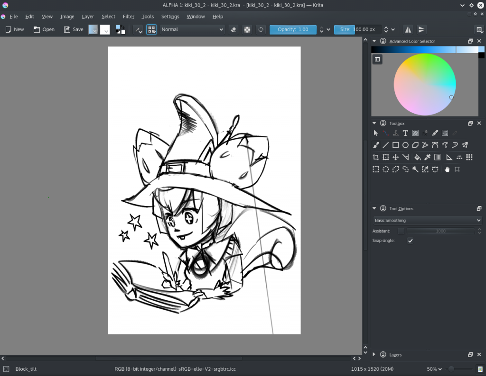

多くの事が進行中です！まず一番大事な話からです。KritaはCalligraのソースコードの一部ではなくなりました。ただしKrita 2.9の開発については引き続きCalligra内で行い、Krita2.9のバグ修正とパフォーマンス向上のリリースをまだ数回行う予定です。実際、Krita3.0が完成するまでKrita2.9の定期リリースは続く見込みです。

一方、Krita 3.0は [projects.kde.org/projects/krita](https://projects.kde.org/projects/krita)で開発されるようになります。ソースコードのクローン方法は以下です。:

git clone git://anongit.kde.org/krita

そしてプッシュの場合は以下です。

 git@git.kde.org:krita

次のステップとして、phabricator、reviewboard、リポビューワー、githubミラー、翻訳システムなどを設定するつもりです。

今現在、Krita 2.9.8のビルド作業を行っていて、リリースを月曜に行えればと思っています。少し遅れてしまったのは、Qt Worldサミットで時間を取られてしまったからです。

### Kickstarter

Kickstarterを行った機能のプログラミングは順調に進行しています。パフォーマンス向上のレベルオブディティール機能はほぼ完成して、Ubuntu Linuxユーザは既に[Krita Limeリポジトリのkrita-lod-unstableパッケージをインストールすることでテスト可能です。](https://launchpad.net/~dimula73/+archive/ubuntu/krita)Windowsのパッケージについても作業を行っています。Dmitryは今アニメーション機能の開発を行っています。JouniがGoogle Summer of Codeで行った作業のフォローアップです。大部分はユーザインタフェースの改良と洗練の作業で、それからパフォーマンス最適化のフェーズになると思われます。

### Qt5 移植

Krita 3.0、言い換えると、KritaのQt5移植版は、実際にドローイングとスケッチができるところまで来ました。Qt5の開発者、特にShawn RutledgeさんはQtのタブレットサポートの向上に素晴らしい作業をしています、ただ…XCBライブラリに修正が必要なことがあります。つまりLinuxでのタブレットの扱いがまだ完璧ではなく、またWindowsのテストもまだ多くは行われていません。移植によってリグレッションも、小さいバグも、表示の問題も、パフォーマンス問題も起きています…こうしたすべてをこれから数ヶ月修正していく必要があります！
