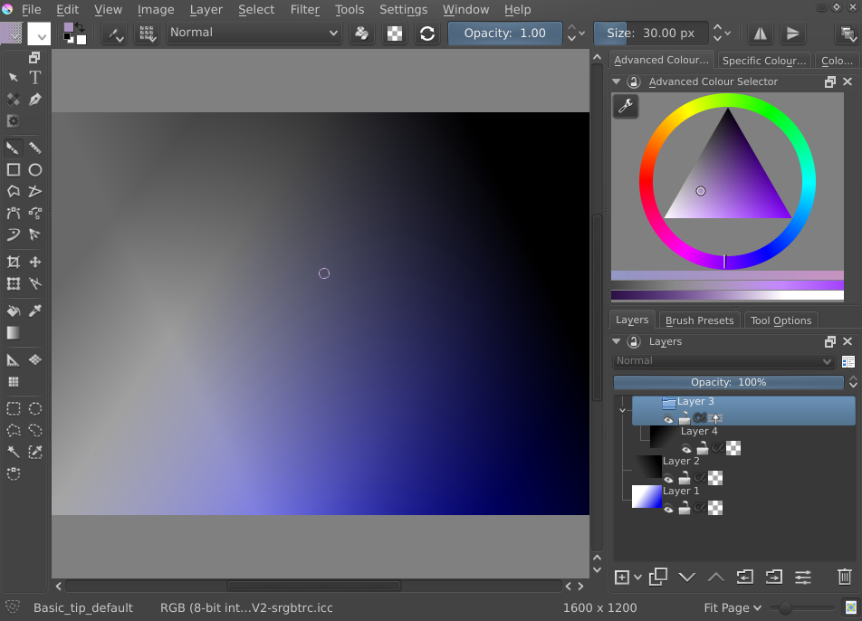

Kickstarterのキャンペーンの3分の2を超えて、あと残り8日になりました！できる限りのストレッチゴールを達成しましょう！paypal経由での寄付2121ユーロと、Kickstarterでの3000ユーロ近くの支援を合わせると、もうユーザが投票できるストレッチゴール目標も3つ以上になっています。その一方で、ストレッチゴールの選択機能のモディファイアの実装はほぼ完成し、次のテストビルドに含まれることになりそうです！

それと、Woltheraさんの更新された[ブラシパック](https://forum.kde.org/viewtopic.php?f=274&t=125125)もチェックしてみてください！ペン入れ、色塗り、フィルタ(新しいヒールブラシも！)、ウォッシュ、フロー法線マップ、doodleブラシ、実験的ブラシといったブラシパックがあり、SFXブラシパックには素晴らしいレースブラシもあります！

とても忙しい週になりました。クラッシュ時のファイル回復ダイアログがWindowsでは機能していなかった問題も修正し、新しいテストビルドを用意しました！

この2.9.4.6ビルドで何が新しくなったのでしょうか？特に興味深いのはPSD読み込み、書き出しサポートの向上だと思います。昨日の[インタビュー](https://krita.org/item/krita-comes-to-discworld/)(英語)で、KatarzynaさんはPSDをKritaでの作業フォーマットとして使っていることを知りました。まだ完全にPSDの使用をお勧めできるわけではありませんが、よくなっているはずです！

- Dmitryがグループレイヤーのパススルーモードを実装しました。注意：フィルタ、変形、透明マスクとパススルーモードは、まだ共存できません。ただ、PSDからのグループの読み込み、書き出しは機能するようになりました！
- PSDファイルからのレイヤースタイルの読み込みと保存の対応！
- PSDのColorBurn(焼き込みカラー)ブレンドモードをKritaでも正しく設定
- Lighter Color(カラー比較（明）)とDarker Color(カラー比較（暗）)ブレンドモードの追加とPSDからの読み込み
- Windowsで翻訳UIを使っている場合に起こるブラシストローク遅れの改善。多少改善しているはずですが、完全に遅れをなくすための作業は途中です
- カラーピッカーは現在選択した色と、直前の色を表示します
- レイヤースタイルとアルファ継承を同時に使えるように修正
- テンプレートを見つける時の問題を修正
- OpenGLキャンバスをクラッシュさせるoxygenスタイルの問題を修正
- レイヤーオプションを右クリックした時にもオプションが切り替わっていた挙動の修正(Victor Wåhlströmによるパッチ)
- サブウィンドウを閉じた時のウィンドウメニューの更新
- Tiffタグの解像度情報を正しく読み込むことで、最近のフォトショップで作られたJPGファイルを正しく読めるように修正。(Photoshopで保存するとJPG解像度がTFFタグを使ってexivメタデータとして保存されます…)
- 保存していない時も画像名をウィンドウメニューに表示
- 変形マスクにisolate layer(選択したレイヤーのみ表示)を適用した時のクラッシュの修正
- Linuxでのwebpサポート(Windowsでは未テスト)
- 新しい画像として貼りつけるショートカットの追加。Tiffanyによるパッチ！
- Windowsでの未保存画像に対するオートセーブ回復ダイアログが機能するように修正！
- 問題のあるドライバを使っている可能性のあるIntelユーザへの警告表示を追加。Kritaが正しく機能しているならOKをクリック、そうではない場合は、ドライバをアップデートしてください!

なお、2.9.4.2と2.9.4.3では以下の項目が修正されています:

- グラデーションつきのレイヤースタイルの読み込みと保存の修正
- PSDファイルの透明マスクの読み込みと保存の修正
- クリップボードの内容を新しい画像として貼りつける新しいショートカットCtrl-Shift-Nの追加
- カラーピッカーで、現在の選択色の表示を追加
- クローンブラシが常にアウトラインを表示するように修正。(注：Kritaではクローンはツールではなく、ブラシの一種です)
- ブラシカーソルとブラシアウトラインを別々に設定可能に変更
- 複雑なレイヤースタイルの.kra形式の保存と読み込みの修正

# Linux:

Users of Ubuntu and derivatives can use Krita Lime, as usual:

- [https://launchpad.net/~dimula73/+archive/ubuntu/krita](https://launchpad.net/~dimula73/+archive/ubuntu/krita)

OpenSUSEユーザはLeinirのOBSレポジトリを利用可能です。VcサポートのKritaのビルド(ペイント処理が高速)が含まれています。

- [http://download.opensuse.org/repositories/home:/leinir:/calligragemini/openSUSE\_13.1](http://download.opensuse.org/repositories/home:/leinir:/calligragemini/openSUSE_13.1)/
- [http://download.opensuse.org/repositories/home:/leinir:/calligragemini/openSUSE\_13.2](http://download.opensuse.org/repositories/home:/leinir:/calligragemini/openSUSE_13.1)/
- [http://download.opensuse.org/repositories/home:/leinir:/calligragemini/openSUSE\_Factory](http://download.opensuse.org/repositories/home:/leinir:/calligragemini/openSUSE_Factory)/

UbuntuとUbuntu派生のユーザは通常通りKrita Limeを使うことができます:

- [https://launchpad.net/~dimula73/+archive/ubuntu/krita](https://launchpad.net/~dimula73/+archive/ubuntu/krita)

# Windows:

Vista以降をサポートし、7以降の環境が推奨されます。XPはサポートされていません。もし64ビット版のWindowsを使用している場合は32ビット版のKritaを使用しないでください！ZIPファイルはインストールの必要がなくただ解凍するだけで使用できますが、MSIインストーラに付属しているVisual Studio C runtimeはZIP版には含まれていません。

32 bits Windows:

- [http://files.kde.org/krita/windows/krita\_x86\_2.9.4.6.msi](http://files.kde.org/krita/windows/krita_x86_2.9.4.6.msi)
- [http://files.kde.org/krita/windows/krita\_x86\_2.9.4.6.zip](http://files.kde.org/krita/windows/krita_x86_2.9.4.6.zip)

（このバージョンはG’MICが搭載されていません）

64 bits Windows:

- [http://files.kde.org/krita/windows/krita\_x64\_2.9.4.6.msi](http://files.kde.org/krita/windows/krita_x64_2.9.4.6.msi)
- [http://files.kde.org/krita/windows/krita\_x64\_2.9.4.6.zip](http://files.kde.org/krita/windows/krita_x64_2.9.4.6.zip)

(G’MICフィルターがうまく働かない場合があり、それによってKritaがクラッシュする場合もあります）

# OSX:

(OSX版のビルドは不安定で実験的なものであることをご了承ください。正しく機能しない部分があることが予想されます。ビルド上の問題が起きていないことを確かめるためと、KritaのOSX版の開発協力者を募集するためにビルドを行っています。)

- http://files.kde.org/krita/osx/krita-2.9.4.5.dmg
