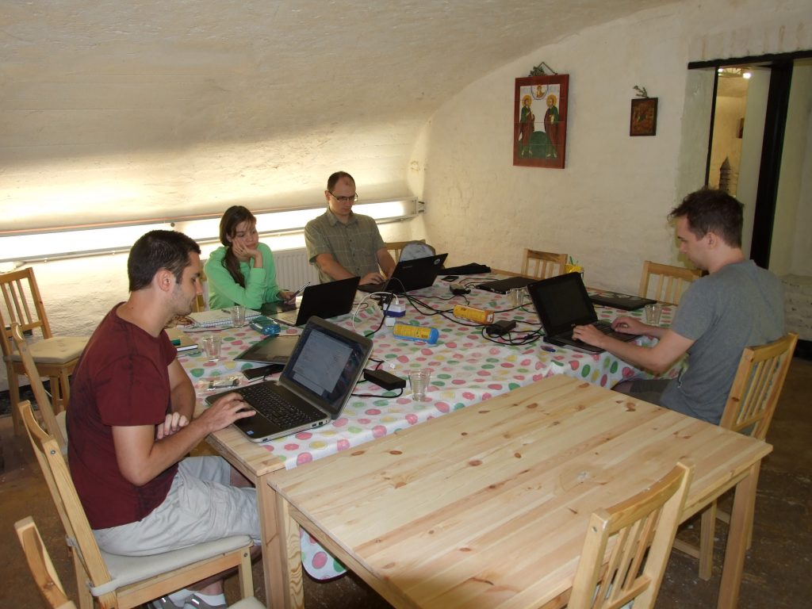
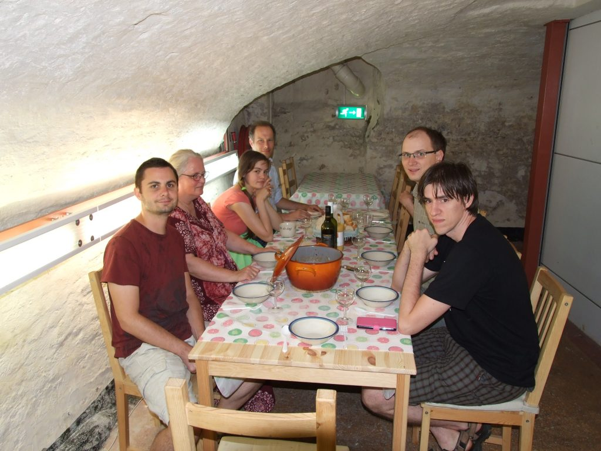

今週末、遂にオランダのデーフェンテルに世界中からアーティストや開発者、テスター、デザイナー、ドキュメントライターを集めて互いに学び合いこれからのKritaについて語り合う会合である2016 Krita Sprintが始まりました。前の大規模なKritaの会合が開かれたのは2014年で、今回我々は再び会合を行います！

今年のスプリントに集まる人のほとんどはボランティアです。DmitryのみがKritaの開発をフルタイム雇用で行っており、Boudwijnはパートタイム雇用での開発を行っています。実際に会って議論をし、食事を一緒に取るのもいいでしょう。

会合参加者は昨日8月25日にデーフェンテルに着き始めています。天候はこの夏初の熱帯日でした。我々は少なくとも涼しいと言える環境を求め、Boudwijnの自宅の12世紀に作られた地下室に移動しました。いつもはその地下室は正教会の喫茶室として使われていますが、今は開いています。ここには今回のスプリントの参加者分の十分なスペースと、テーブル、コーヒーカップとグラスがあります。インターネットを取り付けて即席の開発ルームの出来上がりです！

初日に我々が議論した話題のいくつかです：

- どのようにリリースの管理を行うか
- ODGベースのベクトル図形をSVGに移植する方法
- SVG2のどの部分が必要となるか―テキストは最も重要な点です
- アニメーションのワークフローの改善
- KritaからのSummer of Code参加者への最終評価

Krita 3.0.1には既にWolthera氏のSummer of Codeの最終成果が含まれることが決まっています―ソフトプルーフです！そして勿論、晩餐会が行われ、その後さらに開発に関する諸々が行われました！

明日はさらにこの他の人も加わる予定です。議題のいくつかは話が本当に動き出す明日まで取り置かれました。
