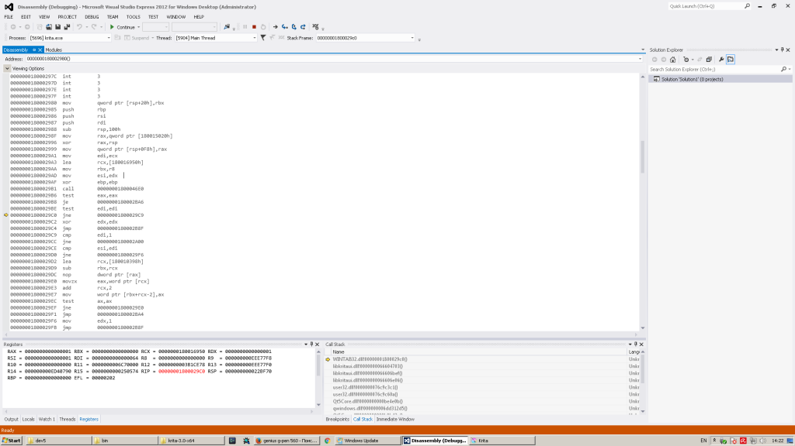

しばしばフリーソフトウェアの開発者たちは新機能を追加して数ピクセルのクレジットを得る名誉を受けることにしか興味がなく、バグの修正には興味がないと思われがちです。それは間違った見解です―そうだとしたら、我々は昨年数千のバグを直したりはしていないでしょう（まあそもそも我々がバグを生み出さなければよかっただろうと言われればその通りなのですが）ですがしばしばバグの修正がただただ楽しいということもあります。コードを探偵の様に念入りに調査し、おかしくなる原因のはずのもののメンタルモデルを見つけ出し、コードをいじって、自分が正しかったことを見出すのです。いやいや、皆さん一度はバグの修正にチャレンジしてみるべきです。KDEのbugzillaに行って、[クラッシュバグ](https://bugs.kde.org/buglist.cgi?bug_severity=crash&bug_status=UNCONFIRMED&bug_status=CONFIRMED&bug_status=ASSIGNED&bug_status=REOPENED&list_id=1361297&product=krita&query_format=advanced)からよさげなものを一つ選んでみましょう（クラッシュバグは最も楽に修正できるバグの一つです）

ですが特にキツい、長い間修正ができていないバグというものもあります。Krita 2.9.6から、ペンタブを使っているとKritaがクラッシュするという報告が繰り返し届いています。これは全てのペンタブで起こるわけではなく、Trust、Peritab、Adesso、Waltop、Aiptek、Genius等のペンタブで発生しているようです―Kritaが公式にサポートしているタブレットではこのクラッシュは発生しません。なぜならWacom、Huion、Yiynovaの3社は社からKritaへハードウェアを無償提供してくれているためです。

また、それらのペンタブは簡単に手に入れられないものです：それらのブランドはハードウェアをごく短期間にしか製造せず、ちょろい顧客を引っかけてドロンしてしまったのです。すなわち、それらのペンタブを我々はただ地元のコンピュータショップに言って買ってきたり、オンラインショップで購入して配達してもらったりということが不可能なのです。そしてこれらすべてのタブレットが共有している特徴、すなわち安さがゆえに、その購入者は裕福ではないだろうという推測が成り立ちます。もし多少裕福ならもっといいペンタブを買っているはずです。ですからこれらのユーザーは我々のプロジェクトに自分のペンタブを寄付する余裕がおそらくないはずなのです。

ハードウェアに関連するバグはハードウェアなしにはテストできません。ほぼ修正不可能なのです。まず我々は4つの「事実」を確認しました：

- このバグはKrita 2.9.6から見られるようになった―残念ながらこれはKritaがSurface Proのようなタブレットで動くようにするためペンタブのサポートのあちこちのコードを書きなおしていた時期であり、どの変更点がこのクラッシュに関係しているかをピンポイントで特定することは不可能でした。
- これらすべてのタブレットは座標の呼び出しを行った際同じ不審な数値を表示する
- 全てのクラッシュはタブレットの座標の呼び出しの後発生している
- 全てのクラッシュはWindowsでのみ発生している

さて、Windowsにおいては、ペンタブについての話をする際に「[Wintab](http://www.wacomeng.com/windows/docs/Wintab_v140.htm)」APIと言われるものを避けては通れません。ペンタブの製造元は、いやおそらくそれよりペンタブの製造元が使っているチップの製造元はこのAPIの実装をWintabドライバの形で書いているのです。

Wintabは化石みたいに古く、16ビットのWindows 3.0からあったものです。ねじ曲がり、非合理的で古臭い陳腐な代物です。システムにはたった一つのWintabドライバdllしかありませんから、Linuxの様にHuionをつないでテスト、Wacomをつないでテスト、Yiynovaをつないでテストということはできず、毎回ドライバをインストール・アンインストールする必要があるのです。

とにかく、先週我々は中古のTrustのタブレットが売りに出ているのを発見しました。このブランドのみに少なくとも6つの報告が上がっていたため、我々はこのペンタブを購入することにしました。我々はピカピカのWindows 10をインストールし、タブレット本体の製造は中止されていましたがドライバはまだ提供されていたのでそれも入れ、Kritaをインストールして、Kritaを起動し、ペンをペンタブに持っていってみると…何も起こりませんでした。クラッシュしなかったのです。そしてKritaは安っぽいブルブルの一応は筆圧の効いた線を描画しました。

ちくしょう、30ユーロをどぶに捨てただけでした。

次に、我々は古いGeniusのペンタブを買い、Windows 7をインストールしました。おっとビンゴです！クラッシュが発生しました。しかもタブレットのログに残っていたのと同じ不審な数値です。さて話し合いの時間です！残念ながら、このクラッシュはGeniusのWintabドライバの内部で発生していました。我々がWintab APIを間違って使っているか、Geniusの実装が間違っているかです。これが今Dmitryの見ているものです：

チンプンカンプンでしょうが…

ですがこれによって我々が必要とするヒントが得られました。これはWintabドライバのバグです。そしてこれは我々の推測ですがこれらすべてのドライバが全く同じ変なコンテキスト情報を出してくることから考えるに、これらのドライバは同じ製造元に由来する同じコードベースを共有しており、まったく同じバグが発生していると考えられるのです。

これはN-Trigペンを持つSurface Pro 3のサポートを追加した時にわかった問題でした。その変な特徴のため、我々はいくつかの回避策をとる必要がありました。我々はwintab dllにタブレットの名前を呼び出しし、それがN-Trigだった場合には回避フラグを設定するようにコードを書きました：

UINT nameLength = m\_winTab32DLL.wTInfo(WTI\_DEVICES, DVC\_NAME, 0);
TCHAR\* dvcName = new TCHAR\[nameLength + 1\];
UINT returnLength = m\_winTab32DLL.wTInfo(WTI\_DEVICES, DVC\_NAME, dvcName);
Q\_ASSERT(nameLength == returnLength);
QString qDvcName = QString::fromWCharArray((const wchar\_t\*)dvcName);
// Name changed between older and newer Surface Pro 3 drivers
if (qDvcName == QString::fromLatin1("N-trig DuoSense device") ||
            qDvcName == QString::fromLatin1("Microsoft device")) {
    isSurfacePro3 = true;
}
delete\[\] dvcName;

ちょっと詳しく解説します。最初の行はWintabドライバから情報(wTInfo)を得ています。このコールは3つのパラメータを持ちます：一つ目はデバイスについての情報が欲しいというもの、二つ目は名前が欲しいというもの、3つ目は**0**です。これはゼロ、Nullを意味しています。二行目のコールも全く同じですが、dvcNameと呼ばれるものを渡します。これはWintabドライバがそのデバイスの名前を書く数ビットのメモリへのポインタです。それは数値であり、0よりかなり大きいです。Wintab APIによれば、三番目のパラメータに0(Null)を返した時、ドライバはドライバにその長さを渡した場合にドライバが返すはずだったものの長さを返すはずです。ここまで分かりましたか？長さに0の名前を尋ねると、ドライバはその長さを返します。正しい長さの名前を尋ねると、ドライバはその名前を返します。

自分で見てみましょう：[http://www.wacomeng.com/windows/docs/Wintab\_v140.htm#\_Toc275759816](http://www.wacomeng.com/windows/docs/Wintab_v140.htm#_Toc275759816)

この処理を完了するにはWintabがタブレットの名前をコピーするのに十分な量のメモリを別個に確保しておく必要があります。短すぎると、クラッシュしてしまいます（これが定められた区域をはみ出して描きこんでしまった際に発生することです）長すぎれば、メモリが無駄になってしまいます。そして、タブレットの名前の長さがどれぐらいになりえるかは…どうやって知ったらいいんでしょう？

まあいいでしょう、少なすぎるメモリ範囲にたくさんの書きこみを行った場合以外に、もう一つクラッシュが起こる場合があります。非常に特殊なメモリアドレスである0への書き込みを行おうとした際です。ゼロ、すなわちコンピュータのメモリの一番最初の場所です。実は、非常に忘れられがちなのですが、位置0(ゼロ)への書き込みは「ここに何も書きこむな」というフラグとして使われているのです。優秀なプログラマならメモリに描きこむ前に0(ゼロ)をいつもチェックしています。

ここまで読んできた皆さんはだんだんわかってきたはずです。

そうです、その通り。Trust、Genius、Adesso、Peritab、Aiptekのペンタブにドライバを書いた人たちと同じくそれを再度パッケージ、ブランド化して販売した人たちはあまり優秀ではなかったのです。彼らはゼロをチェックしていませんでした。何も考えず陽気にタブレットの名前をアドレスの入るところに書きこみ始めてしまったのです。

そしてKritaがクラッシュし、我々の元にバグの報告が届くわけです―結局、これってKritaのせいなのでしょうか？確かにPhotoshopなら動きますよ！でもそれはほぼ間違いなくこのドライバをつぎはぎで雑に作った人たちがWintabの詳細も読まずにとにかくPhotoshopでなら動くようにこねくり回したからでしょう。そうしてその日の仕事をさっさと切り上げ、白酒でも飲みながら一息ついていたに違いありません。

なんのせ、我々はこのバグを「修正」しました―我々はドライバがタブレットの名前を書きこめるように1024字分のスペースを作っておきました。それでうまくいくことを願っています…

念のため言っておきますが、このバグが修正されたからと言って、TrustやGeniusその他のタブレットが上手く動き、満足なパフォーマンスを示すわけではありません：こいつらはなお酷い代物です。このバグを直した後、そのGeniusタブレットで試しに線を書いてみましたが、変なブルブル震える線が描画されました。その後念のためPhotoshopでテストしてみましたが、しばらくすると同じ変なブルブル震える線になっていました。これは大方ラブレットドライバの開発者たちが自社の製品を雑に扱い、ペンの位置にランダムに丸めた数値を返すだけにしたせいでしょう。
