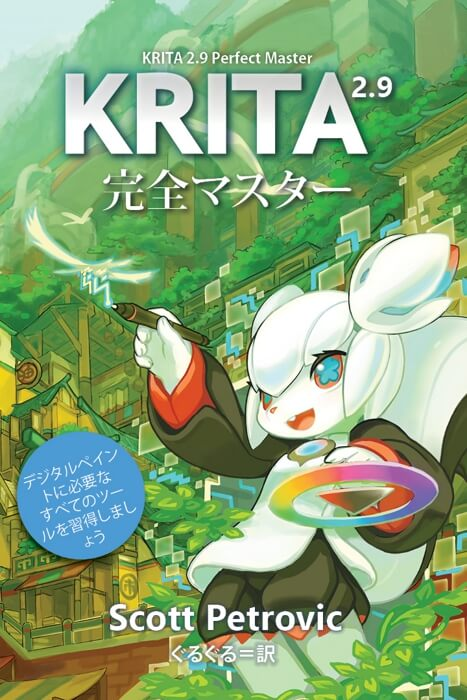

新しい日本語のKritaの本「Krita 2.9 完全マスター」が発売されました！これは昨年発売された英語書籍"Digital Painting with Krita 2.9"の日本語訳になります。

  表紙: Tyson Tan

**本の概要**

Kritaはコンセプトアーティスト、イラストレーター、マッテアーティスト、テクスチャアーティスト、VFX業界のためにデザインされた無料のペイントツールです。10年以上の開発の歴史があり、近年爆発的に進化をしています。アマチュア、プロを問わず役に立つ、一般的な機能と革新的な機能を豊富に備えています。この本はKritaの豊富な機能をわかりやすく説明するものです。

- 補助線アシスタント機能で作画をスピードアップしましょう
- 強力なブラシエンジンの使い方を理解しましょう
- ユーザインタフェースに習熟して、好みにカスタマイズしましょう
- 選択と変形を使って作品の修正を行う方法を学びましょう
- 画像での色管理について学びましょう
- ワークフローを高速化する様々なtipsを紹介
- コンセプトをわかりやすく図解
- バージョン2.9.11までの最新の情報を含んでいます

 オリジナルの著者はKritaについて深く理解しているKritaの開発チームの一人です。訳者もKrita.orgの日本語サイトの管理者の一人で、Kritaに関係しています。

[目次と最初の2章を含むサンプルダウンロードはこちらです](https://krita.org/wp-content/uploads/2016/06/Krita-2.9-Perfect-Master-sample.pdf)！

Kritaの機能を学んで使いこなしていきたい人にぴったりの資料です！Kritaを使い始めたばかりで使い方がわからない人にとっても役立つ内容です。

Amazon.co.jpから、Kindle向け[電子書籍版($9.99、7/10時点価格1069円)](https://www.amazon.co.jp/dp/B01H0Z91CA)として販売中です。(注意：定価設定はドルのため、ドル円レートによって表示される日本円価格が変動する可能性があります)

(7/10追記)印刷された書籍版($46.58 - ISBN-10: 0996851720 ISBN-13: 978-0996851725、7/10時点の値段5070円) が[Amazon.co.jp](https://www.amazon.co.jp/Krita-2-9-Perfect-Master-Masterpiece/dp/0996851720)から注文可能になりました。内容はKindle版と同じなのですが、フルカラー印刷なのと、日本サイトでの取り扱いをするための手数料のためにこの値段になってしまいました。Kindle版はKindle以外にスマートフォン、ブラウザ、PC、Macでも読むことが可能ですので、どうしても印刷したものが欲しいというのではなければ電子書籍版を訳者としてはおすすめしたいと思っています。
