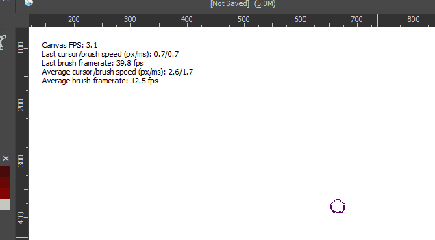
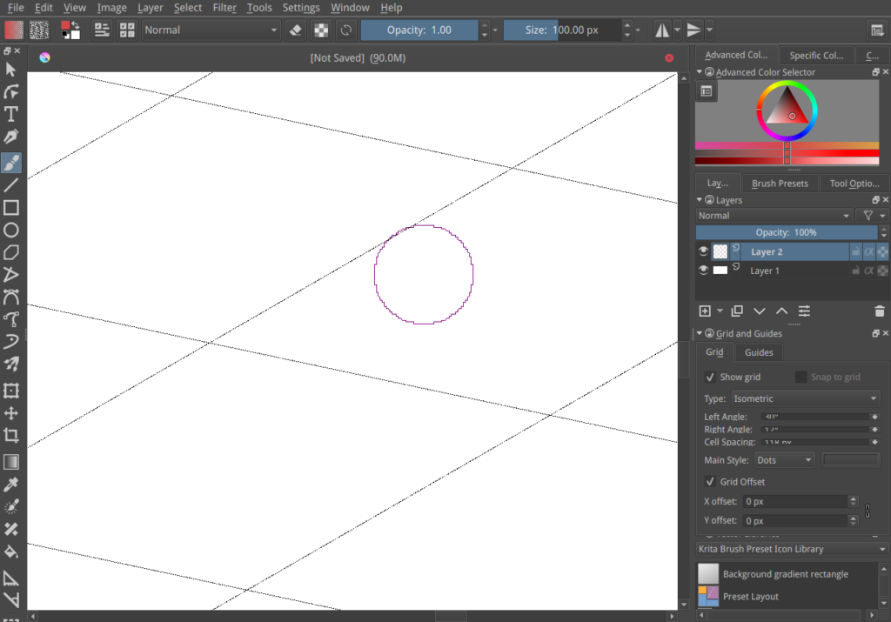

Kritaの開発の進行状況についてしばらくニュースを投稿していなかったことに気が付きました。その主な原因は、そうです、開発が本当に忙しかったからです。それ以外の理由としては、OSXとLinuxでのフル機能のプレビュービルド製作で詰まってしまった、ということもあります。それについては後述します…

進行しているのは何でしょうか？Windows8 ポインタAPIサポート、Angle Direct3Dディスプレイレンダラサポート、新しいgmic-qt G'Micプラグイン、新しいコマンドラインオプション、タッチペイントサポート、新しいスマートパッチツール、新しいブラシプリセットとブレンドモードといったKrita3.2と3.3にバックポートされたものもあります。ですが、3.Xにバックポートできないような機能も数多くあります。

前回のKrita4.0の開発版アップデートは2017年6月でした: [Krita 4.0最初の開発版](https://krita.org/jp/item/first-development-builds-for-krita-4-0-jp/) にも既に数多くの新機能がありました:

- SVGベースのベクターレイヤーと改良されたベクターツール
- Allan Marshallによる新しいエアブラシシステム
- Eugene Ingermanのヒーリング(スマートパッチ)ブラシ
- 指定したファイルフォーマットで保存できない情報をレポートする新しいエクスポートシステム。そして保存がバックグラウンドで処理されるように改善されました。保存ボタンをクリックしてもそのままペイントを続けられます。自動保存もペイントの邪魔にはなりません。
- Woltheraの新しく改善されたパレットドッキングパネル
- SVGシンボルコレクションを読み込める新しいドッキングパネル。**ブラシプリセットアイコンの新しいシンボルライブラリ**も同梱しています。新しいブラシ編集にぴったりです
- Pythonスクリプト機能を追加しました(今はWindowsのみ、他のプラットホームではプラットホームメンテナが必要です)EliakinとWoltheraはこの夏にスクリプトAPIを改良しつつ素晴らしいPythonベースのプラグインを作成して追加しました :
    - Ten brushes: 10個のお気に入りブラシをホットキーに割り当てるスクリプト
    - Quick settings docker: ブラシサイズ、透明度、流量を簡単に変更するドッキングパネル
    - Comic Projects Management tools(コミックプロジェクト管理ツール)
    - 他にも色々

## Krita 4.0に最近追加されたもの

### 大きなパフォーマンス改善

最初の開発ビルドリリースの後にユーザ調査を行いました。以下がその結果の概要です。

一番多かった不満がラグです。ラグというのは様々なものがあり、ブラシや操作の中には即座に終わることがないものもあります。ただ、ここ数か月外部のプロジェクトでKritaのパフォーマンス改善を助ける作業を行うことができました。この作業によってKrita4.0のリリースは遅れる可能性はありましたが、アーティストには喜ばれると思いました。以下のようなパフォーマンス改善があります:

- ピクセルブラシエンジン (全ブラシの80%が使用しているエンジン)でのすべてのCPUを使用するマルチスレッドパフォーマンス改善
- すべてのブラシでの描点グルーピングによる高速化
- キャッシュを使うことですべてのブラシでのレンダリングを高速化

Woltheraがマルチスレッドブラシを使用している実演ビデオはこちらです:

https://www.youtube.com/watch?v=wnPUtYo2Y9Y

### パフォーマンスベンチマーク

またパフォーマンスベンチマーク機能も追加しました。ブラシのパフォーマンスをより正確にみることができるので、これからの最適化でも役立ちます:

 

 

### ピクセルグリッド

ズームインした時にピクセルの周りにグリッドを描画するオプションをAndrey Kamakinが追加しました:

### ライブブラシプレビュー

Scott Petrovicは様々なアーティストと共にブラシエディタを作り直しています。ブラシの名前変更や保存オプションの変更なども行われています。またパラメータ変更で更新されるライブストロークプレビューも追加されました。小さいモニタに合わせてエディタの一部を隠すこともできるようになりました。

### Isometric Grid(等角グリッド)

グリッドに等角オプションが追加されました。グリッドドッキングパネルでコントロールできます:

## フィルタ

- 新しいエッジ検出フィルタ
- ハイトマップからノーマルマップへの変換フィルタ
- 改善されたグラデーションマップフィルタ
- スロープ、オフセット、パワーパラメータ付きの新しいASC-CDLカラーバランスフィルタ

### レイヤー

- ファイルレイヤーのリファレンス場所を変更できるようになりました
- レイヤーをファイルレイヤーに変換できるようになりました。レイヤーを保存してファイルレイヤーでのリファレンスに置き換えます

### ドッキングパネル

- タッチスクリーン向けの新しいドッキングパネル。Wacomタブレットのボタン列に似た大きいボタンを配置したレイアウト

### その他

もちろん様々なバグ修正、UI調整、パフォーマンス改善、機能改善もあります。ここに書くには長すぎるので、別に[リリースノートページ(英語)](https://krita.org/en/krita-4-0-release-notes/)を作っています。Krita4.0同様、このリリースノートも作成中です！

### 作成中の機能

Krita 4.0のリリース前に完成させなければならない機能がまだいくつかあります:

- 新しいテキストツール(基盤を作っていますが、まだまだ作業が必要です)
- より高速な色塗り分けマスクツール(今のものは遅すぎるのでかなり高速化する必要があります)
- 他のアプリケーションのように複数のブラシ先端形状を重ねることができるスタックブラシ

またSVGベクターレイヤーやPythonスクリプト機能といった大きな機能については修正すべきバグもあるでしょう。ダウンロードしてテストしてほしいのでパッケージを作成しましたが、注意になりますが、バグは存在します。そうです:

_**これはプレアルファのコードです。クラッシュも起きるはずです。奇妙な動作もするでしょう。保存時に画像が破壊されることもありえます！**_

_**そして 一度Krita 4.0でベクターレイヤー付きで保存してしまったファイルに関しては、バージョン3台では読み込みが出来なくなることにご注意ください。!**_

Krita 3とKrita 4は同じPCに共存してインストールすることができます。同じ設定を共有する(今のところは、将来的には変わるかもしれません)ので、Krita 3かKrita 4のどちらかが混乱してしまうこともあるかもしれません。同じリソースフォルダを使うので、ブラシプリセットなども共有されます。

### ダウンロード

現在は、すべてのリリースとビルドは、Lime PPAを除いてプロジェクトメンテナのBoudewijn Remptによって作成されています。この体制を続けるのは難しいです！Windowsビルドについては、別の人がKritaのビルドとパッケージに必要なスクリプトのメンテナンスを助けています。立ち上がり、LinuxとmacOS/OSXのメンテナンス を手伝う人を本当に必要としています。状況は以下です:

- **Linux AppImage** には**Pythonスクリプト機能**と**サウンド再生機能**が欠けています。QMLベースのタッチドッキングパネルも含まれていないかもしれません。これらをappimageに追加する方法を見つけられていません。またappimageのビルドスクリプトも深刻に時代遅れのものになっているのですが、Boudewijnには改善する時間がありません。いろいろとすべきこと、管理すべきこと、そして特にコーディングのためです。私たちは**Linuxのプラットホームメンテナを必要としています！**
- **OSX/macOS DM****G** にはPythonスクリプト機能とPDFインポートとG'Micインテグレーションがありません。これらを正しくOSX/macOSに追加するためのOSX/macOSの深い知識がBoudewijnにはないのです。Bernhard LieblのおかげでOSXの開発は追いついてきていますが、私たちは**OSX/macOSのプラットホームメンテナを必要としています!**

#### Windowsダウンロード

Windowsユーザーの皆さんへ：もしクラッシュする事案に遭遇した場合は、[この案内（英語）](https://docs.krita.org/Dr._Mingw_debugger)に従いデバッグシンボルをKritaに追加してください。これによってKritaがクラッシュした原因をログから解析できるようになります。

32 bits Windowsビルドはまだありません。インストーラもありません。

- 64ビットWindowsポータブル版: [krita-4.0.0-prealpha.2c.zip](https://download.kde.org/unstable/krita/4.0.0-prealpha.2/krita-4.0.0-prealpha.2c.zip)
- [64ビット版向けデバッグシンボル (Kritaをインストールしたフォルダに展開して使用)](https://download.kde.org/unstable/krita/4.0.0-prealpha.2/krita-4.0.0-prealpha.2c-dbg.zip)

#### Linuxダウンロード

- 64ビットLinux用AppImage版: [krita-4.0.0-pre-alpha-x86\_64.appimage](https://download.kde.org/unstable/krita/4.0.0-prealpha.2/krita-4.0.0-pre-alpha-x86_64.appimage)

(なぜかFirefoxはテキストとして読み込もうとするようです。ダウンロードするにはリンクの右クリックから保存してください)

#### OSXダウンロード

- OSXディスクイメージ版: [krita-4.0.0-prealpha.2b.dmg](https://download.kde.org/unstable/krita/4.0.0-prealpha.2/krita-4.0.0-prealpha.2b.dmg)

注意: gmic-qtとpdfプラグインはOSXでは利用できません

### ソースコード

- ソースコード: [krita-4.0.0-prealpha.2.tar.gz](https://download.kde.org/unstable/krita/4.0.0-prealpha.2/krita-4.0.0-prealpha.2.tar.gz)

#### md5sums

すべてのダウンロード向け:

- [md5sums.txt](https://download.kde.org/unstable/krita/4.0.0-prealpha.2/md5sums.txt)

#### Key

Linux appimageとソースのtarボールは署名されています。パブリックキーをhttps経由で取得できます: [0x58b9596c722ea3bd.asc](https://share.kde.org/index.php/s/fJ99V5mZvuyD0z8). 署名は[こちら](http://download.kde.org/unstable/krita/4.0.0-prealpha.2/)

#### Kritaを支援してください

Kritaは自由なオープンソースのプロジェクトです。[寄付](https://krita.org/jp/support-us-jp/donations-jp/)や[トレーニングビデオやアートブックの購入](https://krita.org/jp/support-us-jp/shop-jp/)で、プロジェクトを支援することを検討してみてください！皆様の支援によって、コアチームがフルタイムでKritaの開発作業を続けることが可能になります。
