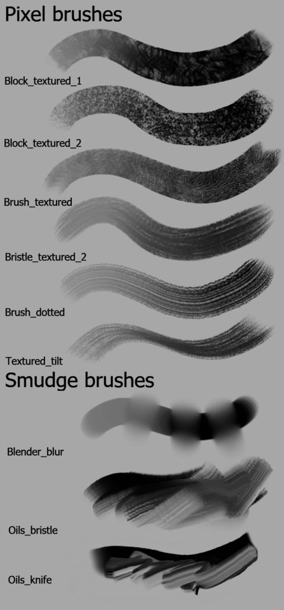

Krita 3.2.0の最初のベータをリリースしました! 5月26日にリリースされたKrita 3.1.4と比較して、数多くのバグ修正と、いくつかのとてもクールな新機能があります。最終リリース前にバグ修正をするために、このリリースをテストしてみてください！

### 既知の不具合

ベータ版なのでバグは存在します。サイズと流量スライダーが使えないというバグが存在しています。これを修正せずに正式リリースを行うことはありませんが、この件については報告の必要はありません。

### 新機能

- Krita 3.2は[G'Micの作者](http://gmic.eu/) によって作成されメンテナンスされているgmic-qtプラグインを使用します。Windows、OSX、多くのLinuxで動作するバイナリビルドはまだ作業中です。このプラグインは古いgmicプラグインを完全に置き換えるものです。
- RadianのブラシセットをKritaのデフォルトブラシに追加しました。

これらのブラシは絵画的なタッチのある表現に適しています:

- レイヤーの可視状態やロック状態といった状態を変更する新しいショートカットが追加されました。
- クローンブラシに様々な修正が行われました
- バグ報告のために関連するシステム情報をコピーできる新しいダイアログが追加されました
- 4.0プレアルファビルドのみに存在していたスマートパッチツールを統合しました！

https://youtu.be/jI87VzDtkPY

- ガウシアンブラーフィルタで1000ピクセル以上のカーネルを使用できるようになりました

## バグ修正

大きめなバグ修正には以下のものが含まれます:

- タッチスクリーンに指でペイントする機能が復活しました。設定ダイアログでオンオフが可能です。
- 「緑のブラシアウトライン」の症状が出ていた場合、これも修正されているはずです。ただすべてのOpenGLシステムで修正が機能するかは保証できません。
- いくつかのパフォーマンス向上も含まれています
- ファイルダイアログでのインタラクションも改善されています。開くフォルダの予想、ファイル名の提案、拡張子の使用が改善されているはずです。

もちろん数多くの小さなバグ修正も含まれています。

 

#### ダウンロード

KDEダウンロードサイトはアップデートされてhttpsをサポートするようになりました。

#### Windows

Windowsユーザーの皆さんへ：もしクラッシュする事案に遭遇した場合は、[この案内（英語）](https://docs.krita.org/Dr._Mingw_debugger)に従いデバッグシンボルをKritaに追加してください。これによってKritaがクラッシュした原因をログから解析できるようになります。

- 32ビットWindows版: [krita-3.2.0-beta.1-x86-setup.exe](https://download.kde.org/unstable/krita/3.2.0-beta.1/krita-3.2.0-beta.1-x86-setup.exe)
- 32ビットWindows用ポータブル版: [krita-3.2.0-beta.1-x86.zip](https://download.kde.org/unstable/krita/3.2.0-beta.1/krita-3.2.0-beta.1-x86.zip)
- [32ビット版向けデバッグシンボル (Kritaをインストールしたフォルダに展開して使用)](https://download.kde.org/unstable/krita/3.2.0-beta.1/krita-3.2.0-beta.1-x86-dbg.zip)

- 64ビットWindows版: [krita-3.2.0-beta.1-x64-setup.exe](https://download.kde.org/unstable/krita/3.2.0-beta.1/krita-3.2.0-beta.1-x64-setup.exe)
- 64ビットWindows用ポータブル版: [krita-3.2.0-beta.1-x64.zip](https://download.kde.org/unstable/krita/3.2.0-beta.1/krita-3.2.0-beta.1-x64.zip)
- [64ビット版向けデバッグシンボル (Kritaをインストールしたフォルダに展開して使用)](https://download.kde.org/unstable/krita/3.2.0-beta.1/krita-3.2.0-beta.1-x64-dbg.zip)

- ファイルエクスプローラシェル拡張: [kritashellex-1.2.3.0-setup.exe](https://download.kde.org/unstable/krita/kritashellex-1.2.3.0-setup.exe)

#### Linux

- - 64ビットLinux用AppImage版: [krita-3.2.0-beta.1-x86\_64.appimage](https://download.kde.org/unstable/krita/3.2.0-beta.1/krita-3.2.0-beta.1-x86_64.appimage)

 

(なぜかFirefoxはテキストとして読み込もうとするようです。ダウンロードするにはリンクの右クリックから保存してください)

Ubuntu App Store向けのsnapイメージは近日中に利用可能になります。 Ubuntuと派生ディストリビューションでは[Krita Lime PPA](https://launchpad.net/~kritalime/+archive/ubuntu/ppa)を使ってKrita 3.2.0-beta.1をインストールすることも可能になります。

#### OSX

- OSXディスクイメージ版: [krita-3.2.0-beta.1.dmg](https://download.kde.org/unstable/krita/3.2.0-beta.1/krita-3.2.0-beta.1.dmg)

### ソースコード

- ソースコード: [krita-3.2.0-beta.1.tar.gz](https://download.kde.org/unstable/krita/3.2.0-beta.1/krita-3.2.0-beta.1.tar.gz)

#### md5sums

すべてのダウンロード向け:

- [md5sums.txt](https://download.kde.org/unstable/krita/3.2.0-beta.1/md5sums.txt)

#### Key

Linux appimageとソースのtarボールは署名されています。パブリックキーをhttps経由で取得できます:

[0x58b9596c722ea3bd.asc](https://share.kde.org/index.php/s/fJ99V5mZvuyD0z8) 署名は [こちら](http://download.kde.org/unstable/krita/3.2.0-beta.1/)。

#### Kritaを支援してください

Kritaは自由なオープンソースのプロジェクトです。[寄付](https://krita.org/jp/support-us-jp/donations-jp/)や[トレーニングビデオやアートブックの購入](https://krita.org/jp/support-us-jp/shop-jp/)で、プロジェクトを支援することを検討してみてください！皆様の支援によって、コアチームがフルタイムでKritaの開発作業を続けることが可能になります。
