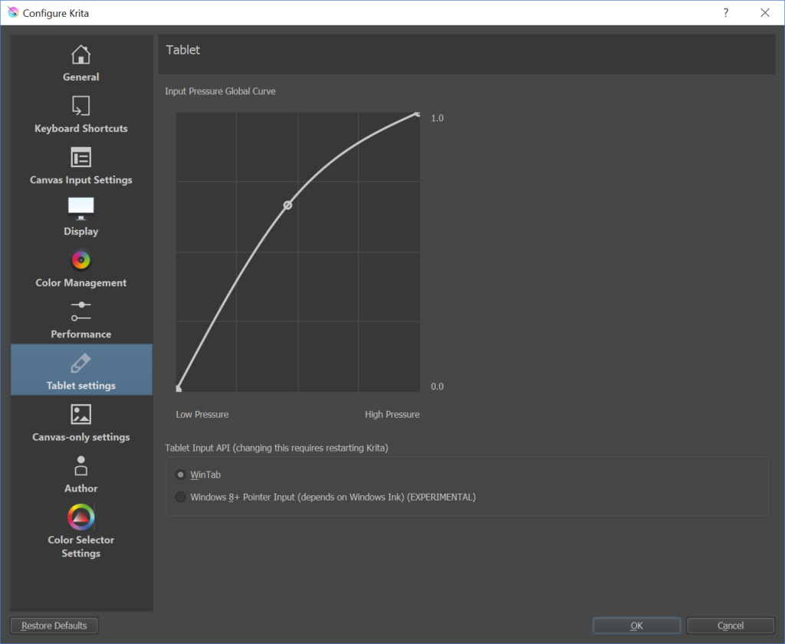
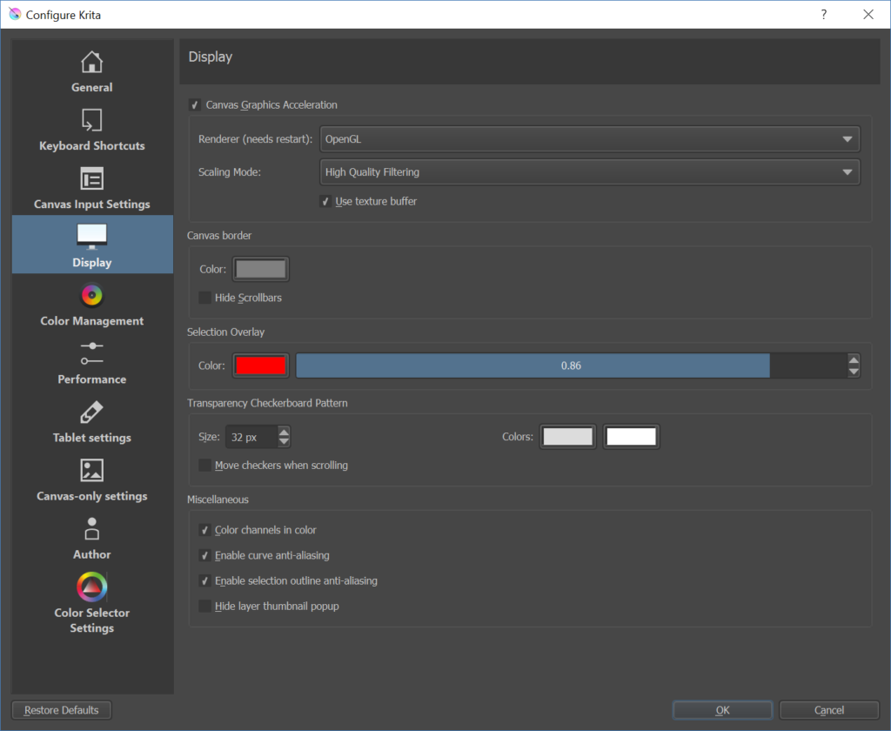

Krita 3.2.1から一月も経っていませんが、我々はKrita 3.3.0をリリースします。今回のバージョンではWindowsユーザーにとって重要な変更が行われたためマイナーバージョンを一つ上げることにしました！

Alvin WongがWindows 8 event APIへの対応を追加しました。これにはつまりKritaがSurfaceシリーズ（及びDell社、HP社、Acer社のノートPC）のn-trigペンにネイティブ対応するようになったということです。この機能はまだ新しいため、利用するためにはタブレットの設定から有効にする必要があります:

また彼によってKritaの表示機構のハードウェアアクセラレーションがリファクタリングされ、WindowsではネイティブOpenGLエンジンの代わりにオプションとしてANGLEを使用できるようになりました。これはIntelのグラフィックカードとドライバで発生していた様々な問題をこれからはKritaが間接的にDirect3Dを使うことで回避することができるようになることを意味します。

もちろんこのリリースにはそれ以外の変更点もあります:

- Hi-dpiスクリーン使用時に表示に乱れが生じることのある問題を修正（注：Windows及びLinuxではこの機能を利用するには設定ダイアログから有効にする必要があります）
- クリップボードから新規画像作成時にその画像が名前を持つようになりました
- スタート時にお気に入りブレンドモードとお気に入りブラシプリセットが正しく読み込まれるようになりました
- GMIC
    - Windows及びLinuxでプラグインを最新版にアップデートしました
    - プラグインのパス設定を削除しました。Krita実行ファイルのあるフォルダとそのフォルダの隣にあって「gmic」から始まる名前のフォルダからG'micプラグインを探すようになります
    - レイヤーの扱いとKritaとG'micプラグインの間のコミュニケーションに関していくつか修正を行いました
- jpeg画像を.png拡張子で保存しているサイトが存在します：このようなファイルをKritaが読み込む時混乱が生じていましたが、このバージョンからKritaはまずファイルの中を覗いてそのファイルの種類が本当は何なのか確認するようになりました
- PNG:
    - 16ビット及び32ビット浮動小数点画像はPNGに保存する際は16ビット整数に変換されるようになりました
    - 画像に（半）透明なピクセルが存在しない場合でもPNG画像にアルファチャンネルを保存できるようになりました
- 表示のハードウェアアクセラレーションが無効になっている時、ブラシツールの色採取モードでカーソルの表示がおかしくなっていた問題を修正
- 参照画像ドッキングパネルは起動時ではなく表示されている時のみ画像の読み込みを開始するようになりました。 **注意:** 参照画像ドッキングパネルは画像の読み込みにQtのimageioプラグインを利用しています。もしLinux環境でDeepinデスクトップコンポーネントを利用している場合、これらを全て削除してください。Deepinのqimageioプラグインには画像を表示しようとする全てのQtアプリケーションをクラッシュさせる深刻なバグが存在しています
- ファイルレイヤーは変更が行われた際に正しく読み込みを行うようになりました
- 新たなコマンドラインオプションが追加されました:
    - \--nosplash Kritaを起動時にスプラッシュの表示を行わないようにします
    - \--canvasonly Kritaをキャンバスのみ表示モードで起動します
    - \--fullscreen Kritaをフルスクリーンで起動します
    - \--workspace Kritaを任意のワークスペースで起動します
- 選択
    - 全てを選択アクションは画像全体を選択する前にまず全ての選択をクリアするようになりました
    - キャンバス外まで選択範囲を拡張できるようになりました
- パフォーマンスの改善：いくつかの箇所での設定からの余分な読み込みを除去しました。これによってレイヤーのサムネイル生成が早くなり、表示のハードウェアアクセラレーションが無効になっている時の描画が改善されます
- 数値入力欄は数値にデスクトップ設定に従う現在のロケールを使用するようになりました
- バグ報告の際のシステム情報ダイアログを改善しまし
- macOS/OSX固有の変更:
    - Bernhard Lieblがペンタブレットの精度を向上させました。曲線を描いた時不自然な直線と角が発生する問題が、まだ完ぺきではありませんが大きく改善されました
    - AMDのGPUを持つmacOS/OSXシステムにおいて表示のハードウェアアクセラレーションへの対応を無効にするようにしました。これはそうしないとPNGおよびJPGへの保存時にKritaがフリーズするためです

### ダウンロード

#### Windows

Windowsユーザーの皆さんへ：もしクラッシュする事案に遭遇した場合は、[この案内（英語）](https://docs.krita.org/Dr._Mingw_debugger)に従いデバッグシンボルをKritaに追加してください。これによってKritaがクラッシュした原因をログから解析できるようになります。

- 64ビットWindows版: [krita-3.3.0-x64-setup.exe](https://download.kde.org/stable/krita/3.3.0/krita-3.3.0-x64-setup.exe)
- 64ビットWindowsポータブル版: [krita-3.3.0-x64.zip](https://download.kde.org/stable/krita/3.3.0/krita-3.3.0-x64.zip)
- [64ビット版向けデバッグシンボル (Kritaをインストールしたフォルダに展開して使用)](https://download.kde.org/stable/krita/3.3.0/krita-3.3.0-x64-dbg.zip)

- 32ビットWindows版: [krita-3.3.0-x86-setup.exe](https://download.kde.org/stable/krita/3.3.0/krita-3.3.0-x86-setup.exe)
- 32ビットWindowsポータブル版: [krita-3.3.0-x86.zip](https://download.kde.org/stable/krita/3.3.0/krita-3.3.0-x86.zip)
- [32ビット版向けデバッグシンボル (Kritaをインストールしたフォルダに展開して使用)](https://download.kde.org/stable/krita/3.3.0/krita-3.3.0-x86-dbg.zip)

- ファイルエクスプローラシェル拡張: [kritashellex-1.2.4.0-setup.exe](https://download.kde.org/stable/krita/KritaShellExtension-v1.2.4-setup.exe)

#### Linux

- 64ビットLinux用AppImage版: [krita-3.3.0-x86\_64.appimage](https://download.kde.org/stable/krita/3.3.0/krita-3.3.0-x86_64.appimage)

(なぜかFirefoxはテキストとして読み込もうとするようです。ダウンロードするにはリンクの右クリックから保存してください)

Ubuntuと派生ディストリビューションでは[Krita Lime PPA](https://launchpad.net/~kritalime/+archive/ubuntu/ppa)を使ってKrita 3.3.0をインストールすることも可能になります。

#### OSX

- OSXディスクイメージ版: [krita-3.3.0.dmg](https://download.kde.org/stable/krita/3.3.0/krita-3.3.0.dmg)

注意: gmic-qtとpdfプラグインはOSXでは利用できません。

### ソースコード

- ソースコード: [krita-3.3.0.tar.gz](https://download.kde.org/stable/krita/3.3.0/krita-3.3.0.tar.gz)

#### md5sums

すべてのダウンロード向け:

- [md5sums.txt](https://download.kde.org/stable/krita/3.3.0/md5sums.txt)

#### Key

Linux appimageとソースのtarボールは署名されています。パブリックキーをhttps経由で取得できます: [0x58b9596c722ea3bd.asc](https://share.kde.org/index.php/s/fJ99V5mZvuyD0z8). 署名は [こちら](http://download.kde.org/stable/krita/3.3.0/).

#### Kritaを支援してください

Kritaは自由なオープンソースのプロジェクトです。[寄付](https://krita.org/jp/support-us-jp/donations-jp/)や[トレーニングビデオやアートブックの購入](https://krita.org/jp/support-us-jp/shop-jp/)で、プロジェクトを支援することを検討してみてください！皆様の支援によって、コアチームがフルタイムでKritaの開発作業を続けることが可能になります。
