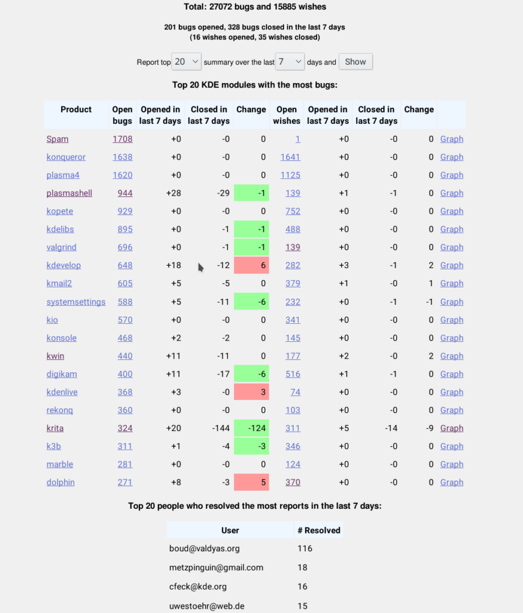

2017年のプロジェクトの大混乱のため、今年は顔を合わせたミーティングができないような様子でした。でもそれは4つ目のメジャーリリースを控えたプロジェクトにはよいことではありません！同じ場所で話し合う必要があると感じて、とうとう、いつもよりは小規模ではあるものの、とても生産的な開発スプリントを11月23日から26日までオランダのデーフェンテルで行いました。

[2016年の8月](https://krita.org/jp/item/2016-krita-sprint-day-1-jp/)からひさしぶりだったため、話し合う内容のバックログは膨大でした。また新しいコードを長期間作業していたため、[バグトラッカー](https://bugs.kde.org/buglist.cgi?bug_status=UNCONFIRMED&bug_status=CONFIRMED&bug_status=ASSIGNED&bug_status=REOPENED&list_id=1478186&product=krita&query_format=advanced)もデータベースが巨大化してゆっくりと死にかけている状態でした。

まずバグトラッカーからです。120ものバグをクローズしました！すべてのバグが修正済みとしてクローズされたわけではありません。多くのバグ報告は実際はユーザからのヘルプ要請であり、残りの多くは重複や、Kritaとは関係ない機能のリクエストであったりしました。それでも、オープン状態と未確認状態のバグレポートをトリアージで取り分ける過程で、実際のバグも1ダース以上修正することができました。

これがその証拠です:

では他の[議論された](https://docs.google.com/document/d/1TnrwAqLPfjPO-0VES2FaJQTgxgQNYSX4UiPPNjAE0aE/edit#heading=h.qum3twq1ypdv)トピックに移ります...

### Krita 4.0

4.0で完成させたい機能のリストを決定し、スケジュールを設定しました。元々は4.0を今年リリースしたいと思っていたのですが、まったく不可能です...

まだ以下を追加したいと思っています:

- 簡単に線画の塗分けをするレイジーブラシ(ほぼ機能しますが、テストとバグ修正が必要です)
- スタックブラシ、バージョン2。最初の実装は2016年にあったのですが、それは破棄して別の方法で作り直すことにしました。
- 新しいテキストツール。元々の計画からはかなり単純化したものになりそうです... BoudewijnはQtで縦書きテキストが動くよう作業を続けていますが、まだ準備が整いません。ツール自体は、Kritaでの主な使用ケースについては、単純で使いやすいものになるでしょう。
- ほぼ完成した機能にもまだ少し足りていない部分があります。Pythonプラグインマネージャ、ブラシエディタの再デザインの仕上げなどです。

またプラットホームでの問題もあります。LinuxではPythonとGStreamerをAppimageにパッケージする動作するスクリプトがまだありません。G'Micのパッケージ方法も間違っています。OSXでは、G'Micがまったく動作していない状態で、PDFインポートもサポートされていません。助けを必要としています！

現在のリリーススケジュールは以下です:

- 12月31日: フリーズ。文字列、機能追加はこの時点からは受け入れません
- 1月3日: 最初のベータ1テストビルド
- 1月10日: Krita 4.0 ベータ1
- 自動化ができればこの時点から毎週開発ビルドをリリースします
- バグ修正、バグ修正、バグ修正
- 3月7日: Krita 4.0の最初のリリース候補版
- 3月14日: Krita 4.0

今はKrita4.0のリリースに集中しています。そのためKrita3.3.xバグ修正リリースは今のところ計画がありません。ただ、バックポート可能な修正はいろいろ存在しています。

### HDRサポート

KritaでのHDRスクリーンサポートについてコンタクトを受けました。これは既にKritaが一部システムでサポートしている10 bits/チャンネル画面サポートとは異なるものです。ただハードウェアにアクセスすることができても、作業をする時間がありません。またそのAPIもWindowsのみのようです。

### 新しいリソースの入手

これは2017年のGoogle Summer of Codeプロジェクトでした。ほぼ動作する実装があったのですが、サーバ側で変更があったため、今は何も機能していません。何が起こっているのかを解明するのは難しいことがわかっていて、このshare.krita.orgからリソースをダウンロードするダイアログはKrita 4.0には含まれない可能性が高いです。

### Python API

夏の間に、我々自身のPython APIについての経験を大いに得ることができました。これはGoogle Summer of Codeの学生のEliakinのおかげでもあります。現在のAPIで拡張が必要な部分が見つかり、拡張を実行しようと思っています...

### Google Summer of Code

Kritaはこれまで毎回 Google Summer of Codeに参加し、今の開発者の多くも GSOCでKritaのコードベースにはじめの一歩を踏み出しました。どのように参加を改善し、プロジェクト後にもKritaに学生が残るようにするにはどのようにできるかを話し合いました。一つの問題は、新しいルールです。学生は2回までしか参加できない、というものです。これまでの経験では、学生が大学にいる間引き続き参加できるようにしたほうがよかったからです。

また基準を少し引き上げることにしました。今の必須条件である3個のパッチ、という条件を1行のパッチを3個提出することでクリアする候補者を見てきました。レーティング(1点から3点)がついたタスクのリストを作り、6点以上を達成した候補者だけを受け入れます。またコードベースを読む能力を見るために、特定のサブシステムの図解でテストするつもりです。

### テレメトリ

Summer of Codeのテレメトリプロジェクトでは機能するコードと機能するサーバ が作成されましたが、Kritaにマージするには十分ではありません。まだ、Kritaがどのように使用されているのかを知ることには興味はあります。またこの学生も学位論文でこのトピックに取り組みたいと考えている状態です。

### 貢献者ガイド

今のところ、Kritaに貢献するための情報はウェブサイト、マニュアル、KDEコミュニティWiki、ソースコードレポジトリ、外部ウェブサイトなどに散らかっています。Jouniはマニュアルサイトに追加するための[プロジェクトに貢献するためのマニュアル概要](https://docs.google.com/document/d/1xIhmocYvbNf4FsW6k9LuerFi0ojDrTGiYR6UsXYVVFo/edit?ts=5a16ab20)を作成中です。[バグトラッカーHowTo](https://phabricator.kde.org/T7492)などの一部の作業は既にはじまっています!
