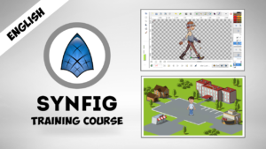
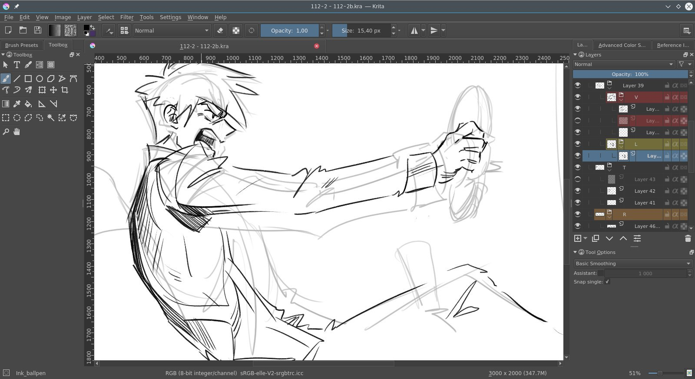
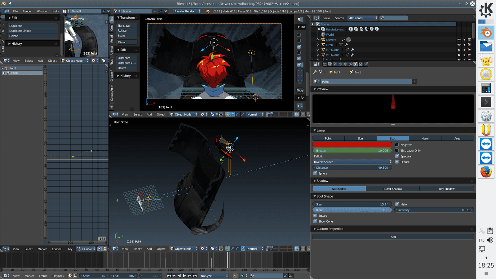

[Pepper & Carrotアニメーション](https://krita.org/jp/item/pepper-carrot-comic-goes-animated-jp/)のNikolai MamashevとチームがオープンソースアニメーションシリーズMorevnaの新エピソードの製作を行っています。以前と同様に、Kritaでアートワーク作成と処理を行い、Blenderとその他のオープンソースツールでアニメーションを作成しています。 すべては **Creative Commons Attribution-ShareAlike** ライセンスでリリースされます。

<iframe src="https://www.youtube.com/embed/9_3NZ6j04Ug?rel=0" width="560" height="315" frameborder="0" allowfullscreen="allowfullscreen"></iframe>

Nikolaiとチームはこのプロジェクトを実現するために[クラウドファンディングキャンペーン](https://morevnaproject.org/crowdfunding/morevna-episode-4/)を行っています。リワードの中には以下のようなものがあります:

– このアニメーションと同じテクニックを学ぶことができるトレーニングビデオ

 

– 自分の画像のアニメーション化！前回のキャンペーンでの例は以下です:

<blockquote class="twitter-tweet" data-lang="en">
Finished the animation with art by <a href="https://twitter.com/TysonTanX?ref_src=twsrc%5Etfw">@TysonTanX</a>. Especial thanks to Anthony Koro! He supported my campaign on Indiegogo and bought this perk. <a href="https://t.co/OK0QwjVwAa">pic.twitter.com/OK0QwjVwAa</a>
- Nikolai Mamashev (@solikap) <a href="https://twitter.com/solikap/status/918761672180891648?ref_src=twsrc%5Etfw">October 13, 2017&lt;/a&gt;</a></blockquote>

他にも様々な独占リワードがあります！リワードを手に入れることで、Nikolaiとチームがオープンソース技術に支えられたアニメーションを製作することを助けることになります。プロジェクトの成功はあなたにかかっています!

このシリーズはロシアのおとぎ話「マリヤ・モレヴナ」(別名「不死身のカシチェイの死」)を未来に置き換えたものです。遠い未来が舞台で、馬の代わりにはバイクと車、主人公のイヴァン・ツァレヴィチは才能豊かなメカニックに、マリヤ・モレヴナは刀を持ったバイカーの女王に、そしてカシチェイはより不死に邪悪になっています…そう戦闘ロボットになっています！

### [Morevnaの新エピソードを支援！](https://morevnaproject.org/crowdfunding/morevna-episode-4/)
