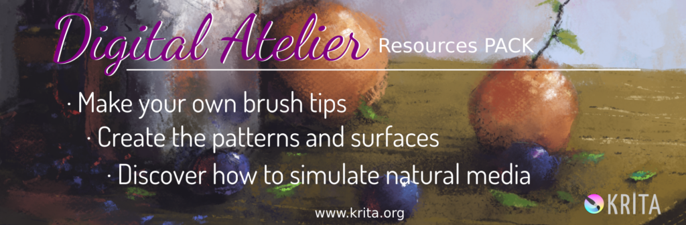
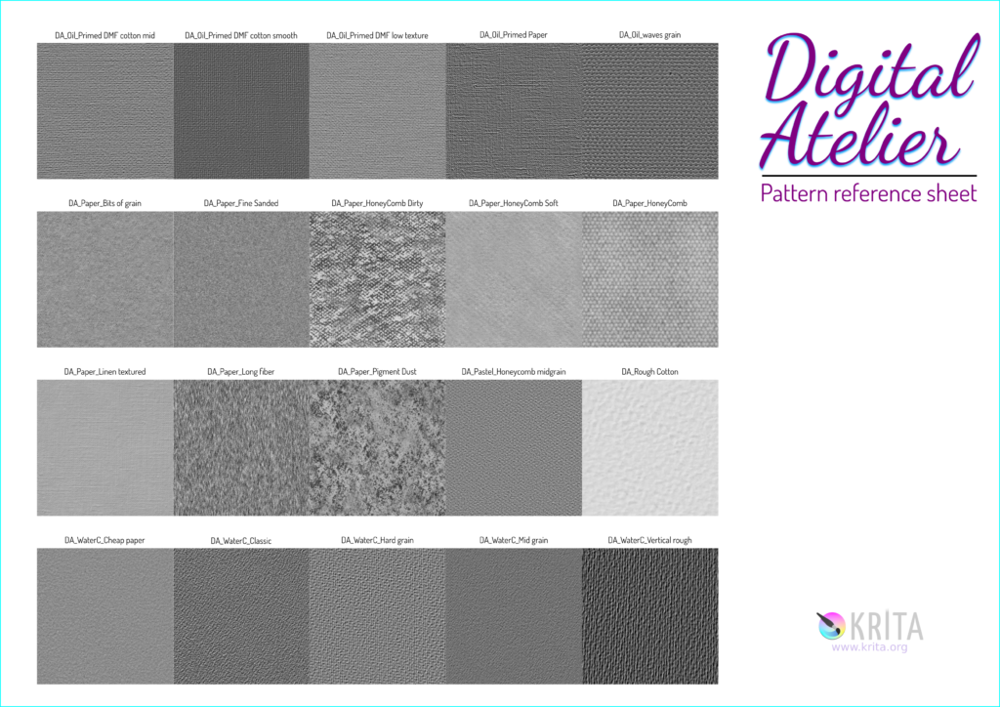
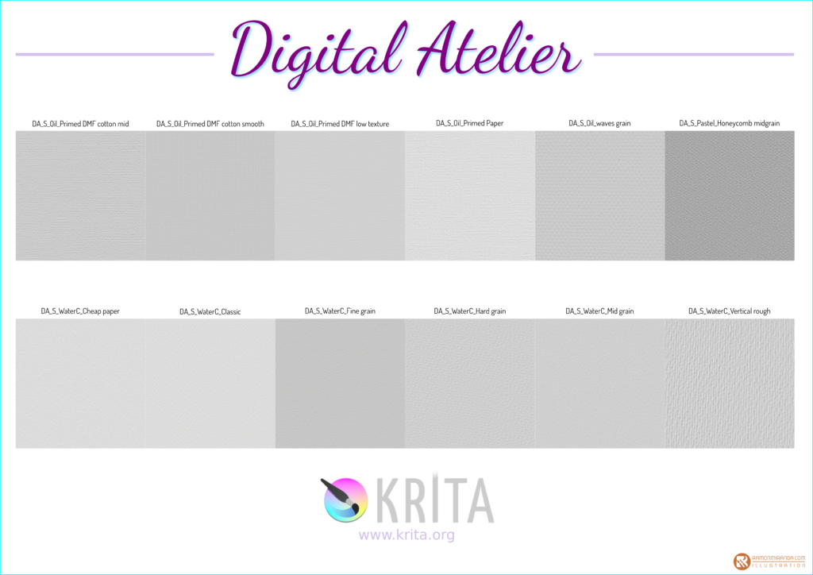

Digital Atelier、Ramon Mirandaによる絵画的ブラシプリセットパックとチュートリアルビデオが登場！

この数か月、[素晴らしいデジタルペイント入門チュートリアルの Muses](https://gum.co/SZZDI?wanted=true)でも知られるRamon Mirandaは新しいブラシプリセットバンドルの開発を行いました。Digital Atelier（デジタルアトリエ）です。**50** 以上のブラシプリセットに加えて、**30**以上のブラシ先端に**20**のパターンとテクスチャが含まれています。

そして**2** **時間**を越える、ブラシプリセット作成プロセスの詳細なビデオチュートリアルも含まれています。

Ramonは題材を深く掘り下げています！油彩、パステル、水彩といった絵画的なブラシセットを作ることを目指しました。Ramonのリサーチと実験は実を結びました。

https://youtu.be/oMyorAEgBfE

全体のダウンロードサイズは**8ギガバイト**です！

### いつ入手できますか？

土曜にKritaの2018年の **バグを潰そう**資金集めキャンペーンがはじまります。50ユーロ以上の支援者はこれを無料ダウンロードとして入手できます！10月16日からは、Digital AtelierをKritaショップに追加して、39.95ユーロで販売する予定です。

### 中身は？

ブラシパック:

- 51の新しいブラシプリセット -- [リファレンスシートはこちら](https://files.kde.org/krita/marketing/digital_atelier_reference_sheet.pdf)！
- 24の油彩ブラシプリセット、そのうち4個は_非常に_実験的なものです。
- 13のパステルブラシプリセット。
- 14の水彩ブラシプリセット。
- 34の新しいPNGブラシ先端、5のSVGブラシ先端。
- 20の512x512紙テクスチャとパターン。 

チュートリアルビデオ内容:

- Introduction: Knowing our tools（イントロ、ツールの理解）
- Oil painting（油彩）
- Pastel painting（パステル）
- Water Color painting（水彩）
- Creating your own Patterns（パターンの作成）
- Creating your own Brush tips（ブラシ先端の作成）

音楽はKevin MacLeodによるもの。ビデオ言語は英語です。
