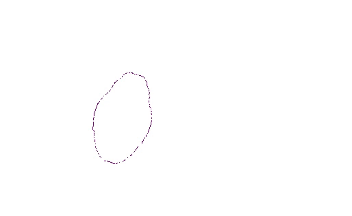
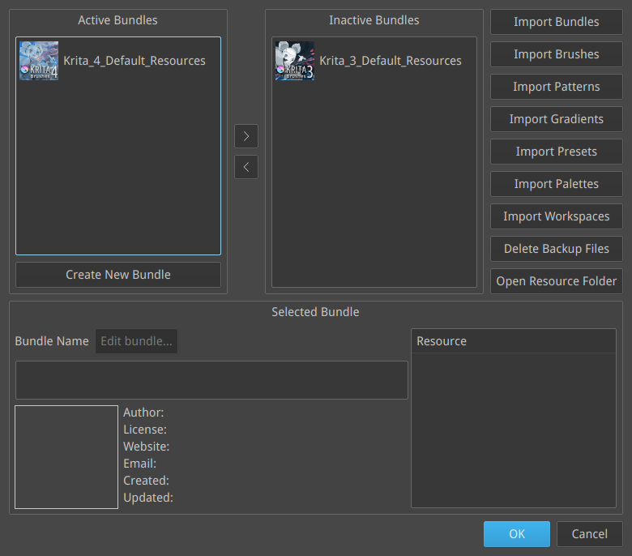

今日Krita 4.0をリリースしました!これは大きな新機能と機能改善を含む大きなリリースです。ベクターツールの改良、SVGサポート、新しいテキストツール、Pythonスクリプト機能に、それ以外にも本当に様々な追加と改良がされています!

https://youtu.be/a-CY4hmkg\_I

Tyson TanによるKrita4.0の新しいスプラッシュスクリーンは、Kikiと梅の開花を描いたものです。Krita 4を昨年中にリリースしたいと思っていましたが、[試練と苦難](https://krita.org/en/item/krita-foundation-update/)に見舞われて、大幅に遅れてしまいました。ですが、一番寒いときに花を咲かせる梅のように、 私たちは苦難を乗り越え、Krita 4はようやくリリース準備ができました!

### ハイライト

いつものように、Krita 4でのすべての新機能と機能向上について説明した長い長いページを作成しました。

[完全版のリリースノートはこちらです!](https://krita.org/jp/krita-4-0-release-notes-jp/)

SVGサポート、新しいテキストツール、Pythonスクリプト機能については既に紹介したので、それ以外のハイライトを説明します:

- 新しい自動塗り分けマスクツールで簡単に線画の塗り分けが行えます。[詳しくはマニュアルを参照してください](https://docs.krita.org/Colorize_Mask)!

- Masked brushes: ブラシ先端にマスクを適用して、より生き生きとした描画効果を得ることができます。これでとてもクールなことができるようになります!

- 新しいブラシプリセット!Krita 4ではブラシセット全体を見直しました。また、ブラシプリセットはバンドルとしてパッケージされるようになりました。Krita 3のブラシセットも用意されていますが、デフォルトでは無効になっています。

### 既知の問題

Krita 4は、3.0リリースほど大きくないとしても、Kritaプロジェクトでの大きな一歩です。 そのためいくつか既知の問題と注意事項があります:

- Krita 4はベクターレイヤーでSVGを使用しています。つまり、Krita 3のファイルでベクターレイヤーを使用しているものは完全に正しく読み込まれない可能性があります。バックアップを消さないでください!
- Krita 4の新しいテキストツールはもともと実装したかったツールに比べると限定されています。今回はコミックのセリフを作る、という一つの簡単な使用ケースに特化して、ベースとなるシステムを作りました。これからさらにテキストツールを改良して拡張していくつもりです。
- WindowsとLinux向けに新しいバイナリビルドファクトリーを用意しました。残念ながら、現時点ではWindows向けの32ビット版のビルドがありません。
- macOSでは共有メモリセグメントの制限が非常に厳しいため、G'Micは現時点でmacOSでは機能しません。
- 参照画像ドッキングパネルは削除されました。不正な画像があると簡単にクラッシュする原因になっていました。Krita 4.1で新しい参照画像ツールを追加して置き換える予定です。

### ダウンロード

#### Windows

Windowsユーザーの皆さんへ：もしクラッシュする事案に遭遇した場合は、[この案内（英語）](https://docs.krita.org/Dr._Mingw_debugger) に従いデバッグシンボルをKritaに追加してください。これによってKritaがクラッシュした原因をログから解析できるようになります。

- 64ビットWindows版: [krita-x64-4.0.0-setup.exe](https://download.kde.org/stable/krita/4.0.0/krita-x64-4.0.0-setup.exe)
- 64ビットWindowsポータブル版: [krita-x64-4.0.0.zip](https://download.kde.org/stable/krita/4.0.0/krita-x64-4.0.0.zip)
- [64ビット版向けデバッグシンボル(Kritaをインストールしたフォルダに展開して使用)](https://download.kde.org/stable/krita/4.0.0/krita-x64-4.0.0-dbg.zip)

現時点ではWindows向けの32ビット版のビルドがありません。注意：Windows 7と8ではPythonスクリプト機能を有効にするには、別にUniversal C Runtimeをインストールする必要があります。[マニュアル](https://docs.krita.org/Introduction_to_Python_Scripting#Technical_Details)を参照してください。

#### Linux

- - 64ビットLinux用AppImage版: [krita-4.0.0-x86\_64.appimage](https://download.kde.org/stable/krita/4.0.0/krita-4.0.0-x86_64.appimage)

現時点ではappimageには機能する翻訳が含まれていません。(なぜかFirefoxはテキストとして読み込もうとするようです。ダウンロードするにはリンクの右クリックから保存してください) またUbuntuと派生ディストリビューションでは[Krita Lime PPA](https://launchpad.net/%7Ekritalime/+archive/ubuntu/ppa)からKrita 4.0.0をインストールすることもできます。snapの更新については作業中です。

#### OSX

- macOS ディスクイメージ版: [krita-4.0.0.dmg](https://download.kde.org/stable/krita/4.0.0/krita-4.0.0.dmg)

注意: gmic-qtとPythonプラグインはmacOSで利用できません。

### ソースコード

- ソースコード: [krita-4.0.0.tar.gz](https://download.kde.org/stable/krita/4.0.0/krita-4.0.0.tar.gz)

#### md5sums

すべてのダウンロード向け:

- [md5sums.txt](https://download.kde.org/stable/krita/4.0.0/md5sums.txt)

#### キー

Linux appimageとソースのtarボールは署名されています。パブリックキーをhttps経由で取得できます: [0x58b9596c722ea3bd.asc](https://share.kde.org/index.php/s/fJ99V5mZvuyD0z8) 署名は [こちら](http://download.kde.org/stable/krita/4.0.0/)

### Kritaを支援してください

Kritaは自由なオープンソースのプロジェクトです。[寄付](https://krita.org/jp/support-us-jp/donations-jp/)や[トレーニングビデオやアートブックの購入](https://krita.org/jp/support-us-jp/shop-jp/)で、プロジェクトを支援することを検討してみてください！皆様の支援によって、コアチームがフルタイムでKritaの開発作業を続けることが可能になります。

\[caption id="attachment\_6455" align="aligncenter" width="1024"\] Artwork by Ramon Miranda\[/caption\]
