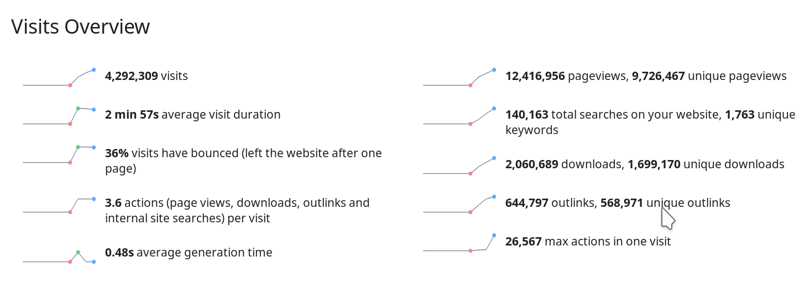

去年の最後には[2017年を振り返り、2018の展望](https://krita.org/jp/item/looking-back-looking-forward-jp/)を行いました。今年も振り返りと展望の時です！全体として、2018年は2017年よりKritaにとってよい一年でした。いくつかのマイルストーンを達成しました！

私たちは **[Krita 4.0](https://krita.org/jp/item/krita-4-0-0-released-jp/)**をリリースしました。Pythonスクリプティング機能に、新しい、ただ悲しいことにまだ力不足なテキストツールに、ベクターグラフィックのODGからSVGへの切り替えに加えて様々な新機能が追加されました

https://youtu.be/a-CY4hmkg\_I

そして、 [4.0.1](https://krita.org/jp/item/krita-4-0-1-released-jp/)、[4.0.2](https://krita.org/jp/item/krita-4-0-2-released-jp/)、[4.0.3](https://krita.org/jp/item/krita-4-0-3-released-jp/)、[4.0.4](https://krita.org/jp/item/krita-4-0-4-released-jp/)、 [4.1.0](https://krita.org/jp/item/krita-4-1-0-released-jp/) ([新しい参照画像ツール、セッション管理など](https://krita.org/jp/krita-4-1-release-notes-jp/))、[4.1.1](https://krita.org/jp/item/krita-4-1-1-released-jp/)、[4.1.3](https://krita.org/jp/item/krita-4-1-3-released-jp/)、[4.1.5](https://krita.org/jp/item/krita-4-1-5-released-jp/)そして[4.1.7](https://krita.org/jp/item/krita-4-1-7-released-jp/)をリリースしました。つまり、1年に10リリースをしました。大体毎月のリリースというゴールに近づいています。チームはこの状態に満足しているか？というと…そうでもないのです…Google Summer of Codeの学生の成果をすべて含んだ4.2.0を今年中にリリースしたいと思っていました。残念ながら、まだ必須な一部分が未完成で、大きな画像で不安定になっています。その一方で、Gitのマスターブランチには新しいコードがたまってきています。何が入っているのか忘れる危険があるので[リリースノートの準備をはじめました](https://krita.org/jp/krita-4-2-release-notes-jp/)！

[**Google Summer of Code**](https://summerofcode.withgoogle.com/archive/)といえば... 2018年は[KDE](https://www.kde.org)を親グループとして参加しました。3人の学生が参加し、全員プロジェクトを達成しました。コードはすべてマージ済みです。修正はまだ必要ですが。とにかくよい一年でした。

2019年にもGoogle Summer of Codeがあります。KDEが来年も参加するか不確定要素もありますが、既に[学生が作業するプロジェクトのアイデアを出しています。挑戦的なものです。ご覧ください](https://community.kde.org/GSoC/2019/Ideas)！学生で興味のある方は、開発コミュニティに顔を出して見てください！また今年も[**資金集めキャンペーン**](https://krita.org/en/fundraising-2018-campaign/)が成功しました。今回はKickstarterを使用しなかったので[キャンペーンへのトラフィックを集めるのが大変でした](https://mail.kde.org/pipermail/kde-community/2018q4/004976.html)。その一方で、Kickstarterの取り分がないので、実際の額は2016年のキャンペーンと同程度になりました。およそ7-8か月分の開発資金が集まりました！

コミュニティも大きく成長しました。Kritaは一年に約**200万**ダウンロードされています。これは公式サイトからのダウンロードの記録です。Windowsストアも、復活したSteamスコアも、コミュニティ主導のflatpakも、WindowsのダウンロードサイトもLinuxディストリビューションもより最新のものが配信されるようになっています。

Kritaのコアチームは、ユーザーとの触れ合いを愛していますが、そうすることが正直にいうと難しくなってきています。半ダースの人数ですし、コードの作業もしたいのです！だから新しい[質問](https://ask.krita.org)サイトを作りました。Kritaのコミュニティのユーザー同士の助け合いが起きてほしいと願っていますが、まだそこまでにはなっていません。

というわけで、2018年はKritaにとってよい一年でした！2019年はどうなるでしょう？

もちろん、新しいリリースがあります。Krita 4.2に向けて作業を熱心に続けています。また、デイリービルドには新しい機能も既に入っています。2つのスペシャルなプロジェクトも進行中です。

Intelと共同で[**HDR**](https://phabricator.kde.org/T9256)ペイントのサポートを準備中です。先駆けとなる仕事です。技術は最新で、サポートするハードウェアも珍しく、OSはWindows 10だけがサポートしています。（Linux/X11のグラフィックドライバー開発も進んでいますが）ひとまずコンセプトとして動くようにしたのですが、ワイドガマットの1000nitモニタでのペイント感触は魔法のようです！またHDRビジュアルのサポートをQt自体の一部になるようにしたいと思っています。他のアプリケーションでも使用できるようにしたいのです。そうすれば、ハードウェアの普及も進み、OSサポートも改善するでしょう。

もう一つのプロジェクトは、2018年にも長い時間を投入しつつ未完成の**リソースシステム**のリライトです。リソースは、ブラシ先端、プリセット、パターン、グラデーションといったものです。KImageShopが開発を開始した20年前には、ディスクは小さく、メモリは制限され、1024x768画像すら巨大に思える時でした。パターンやブラシも小さいもので、数も少なかったのです。

今ではリソースは巨大化し、数も増え続けています。リソースを扱うコードは絡まってチューインガムで固められた糸のようになってしまいました。新しいシステムデザインを2017年に開始し、2018年に実装を開始しました。まだ実装作業は続いています。新しいシステムはよりメモリにやさしく、起動時間を短縮し、信頼できるものになるはずです。少なくとも、それが狙いです。

そして、バグ修正も行い、パフォーマンスを改善しリリースを行っていきます！

また、2019年は[Kritaの20周年](https://phabricator.kde.org/R511:3e91e954652b9db5c715b71c717b2a58cfe49bcd)になります！
