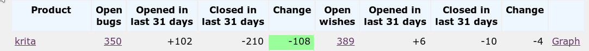

Krita 4.2.0の今月リリースに向けて予定通り進行しています。今日はアルファをリリースします！つまりまだバグを狂ったように直している最中ということです。今月していることを見てください。

もちろんそれだけではありません。昨年の6月のKrita4.1のリリースから長く作業をしてきました。その間に1500個のバグを修正し、いくつかの新機能とワークフロー改善を実装し、少し他にも改善を行っています。

新機能については [リリースノート](https://krita.org/en/krita-4-2-release-notes/)を参照してください。機能ハイライトは、全プラットフォームでのタブレットサポートの改善、WindowsでのHDRペイント、ペイントパフォーマンス改善、カラーパレットドッキングパネルの改善、スクリプト向けのアニメーションAPI、ガマットマスク、絵画的色選択の改善、Kritaの最新ニュースも表示される起動スクリーンの改善、流量と不透明度の挙動の改善などなど…他にも様々です。

また、[マニュアル](https://docs.krita.org)についても最新にするよう作業を熱心に行いました。 Krita 4.1.7のマニュアルは[epub形式でダウンロード](https://download.kde.org/stable/krita/manual/4.1/)できます

**注意**: Linuxユーザーはディストリビューションパッケージに気を付けてください。私たちは [Qt向けのパッチをまとめています](https://phabricator.kde.org/T10838)パッチが新しいバージョンのQtにマージされるまで、これらをディストリビューションがホストすることが重要です。

## ダウンロード

### Windows

Windowsユーザーの皆さんへ：もしクラッシュする事案に遭遇した場合は、[この案内（英語）](https://docs.krita.org/en/reference_manual/dr_minw_debugger.html#dr-minw) に従いデバッグシンボルをKritaに追加してください。これによってKritaがクラッシュした原因をログから解析できるようになります。

- 64 bits Windows: [krita-x64-4.2.0-alpha-setup.exe](https://download.kde.org/unstable/krita/4.2.0-alpha/krita-x64-4.2.0-alpha-setup.exe)
- Portable 64 bits Windows: [krita-x64-4.2.0-alpha.zip](https://download.kde.org/unstable/krita/4.2.0-alpha/krita-x64-4.2.0-alpha.zip)
- [デバッグシンボル(Kritaをインストールしたフォルダに展開して使用)](https://download.kde.org/unstable/krita/4.2.0-alpha/krita-x64-4.2.0-alpha-dbg.zip)

- 32 bits Windows: [krita-x86-4.2.0-alpha-setup.exe](https://download.kde.org/unstable/krita/4.2.0-alpha/krita-x86-4.2.0-alpha-setup.exe)
- Portable 32 bits Windows: [krita-x86-4.2.0-alpha.zip](https://download.kde.org/unstable/krita/4.2.0-alpha/krita-x86-4.2.0-alpha.zip)
- [デバッグシンボル(Kritaをインストールしたフォルダに展開して使用)](https://download.kde.org/unstable/krita/4.2.0-alpha/krita-x86-4.2.0-alpha-dbg.zip)

### Linux

- 64 bits Linux: [krita-4.2.0-alpha-x86\_64.appimage](https://download.kde.org/unstable/krita/4.2.0-alpha/krita-4.2.0-alpha-x86_64.appimage)
- 64ビットLinux [G'Mic-Qt plugin appimage](https://download.kde.org/unstable/krita/4.2.0-alpha/gmic_krita_qt-x86_64.appimage)

(なぜかFirefoxはテキストとして読み込もうとするようです。ダウンロードするにはリンクの右クリックから保存してください)

### OSX

- OSX disk image: [krita-4.2.0-alpha.dmg](https://download.kde.org/unstable/krita/4.2.0-alpha/krita-4.2.0-alpha.dmg)

注意: タッチドッキングパネル、gmic-qtとPythonプラグインはmacOSで利用できません。

### ソースコード

- Source code: [krita-4.2.0-alpha.101.tar.gz](https://download.kde.org/unstable/krita/4.2.0-alpha/krita-4.2.0-alpha.101.tar.gz)

### md5sum

すべてのダウンロード向け:

- [md5sum.txt](https://download.kde.org/unstable/krita/4.2.0-alpha/md5sum.txt)

### キー

Linux appimageとソースのtarボールは署名されています。パブリックキーをhttps経由で取得できます: [0x58b9596c722ea3bd.asc](https://share.kde.org/index.php/s/fJ99V5mZvuyD0z8) 署名は [こちら](http://download.kde.org/unstable/krita/4.2.0-alpha/)です (.sigのファイルです)

## Kritaを支援してください

Kritaは自由なオープンソースのプロジェクトです。[寄付](https://krita.org/jp/support-us-jp/donations-jp/)や[トレーニングビデオやアートブックの購入](https://krita.org/jp/support-us-jp/shop-jp/)で、プロジェクトを支援することを検討してみてください！皆様の支援によって、コアチームがフルタイムでKritaの開発作業を続けることが可能になります。
