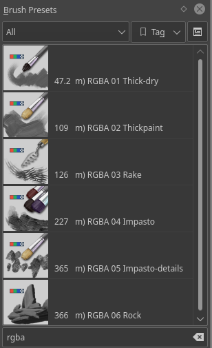

Krita 開發團隊依家推出咗 Krita 4.4.2 嘅第二個測試版本。Ramon Miranda 啱啱亦都發佈咗一段介紹依個版本嘅新功能⸺網狀變形⸺嘅影片（只提供英文）：

https://www.youtube.com/watch?v=DLXWynZT\_8s&feature=youtu.be

同[第一個測試版本](https://krita.org/zh-hk/item/krita-4-4-2-beta-1_zh-hk/)相比，依個版本修正咗以下嘅 bug：

- 修正喺套用網狀變形時向量圖層顯示出錯嘅問題
- 修正等角網格顯示更新同繪製出錯嘅問題 ([BUG:427833](https://bugs.kde.org/show_bug.cgi?id=427833))
- 修正三角形色彩選擇器喺高解像度縮放顯示之下滑鼠輸入失效嘅問題
- 改善 MyPaint 光影選擇器嘅效能同外觀
- 修正喺動畫影格入面分組圖層嘅變形預覽 ([BUG:413968](https://bugs.kde.org/show_bug.cgi?id=413968))
- 加入支援連續變形⸺喺完成一次變形之後，㩒住 Shift 並㩒一下圖層就可以做下一次變形
- 加入切換網格控制柄對稱模式嘅選項
- 當 Krita 喺 Wayland 平台上執行嘅時候，Krita 會顯示一項警告訊息，指出 Krita 依家唔支援 Wayland 平台 ([BUG:430426](https://bugs.kde.org/show_bug.cgi?id=430426), [BUG:429079](https://bugs.kde.org/show_bug.cgi?id=429079))
- 修正喺使用選取區域工具時輔助尺嘅顯示問題 ([BUG:427658](https://bugs.kde.org/show_bug.cgi?id=427658))
- 修正喺修改向量圖形貝茲曲線線段時嘅問題 ([BUG:430377](https://bugs.kde.org/show_bug.cgi?id=430377))
- 修正載入產生器圖層嘅問題 ([BUG:430246](https://bugs.kde.org/show_bug.cgi?id=430246), [BUG:430244](https://bugs.kde.org/show_bug.cgi?id=430244))
- 修正喺拖放空白圖層時嘅 crash ([BUG:429049](https://bugs.kde.org/show_bug.cgi?id=429049))
- 停用 macOS 嘅 QuickLook 整合外掛程式（縮圖產生外掛），因為佢可能會導致 Finder crash ([BUG:430553](https://bugs.kde.org/show_bug.cgi?id=430553))
- 修正歡迎畫面上檔案縮圖嘅大細 ([BUG:430359](https://bugs.kde.org/show_bug.cgi?id=430359))

依個版本亦都加入咗六個 Ramon Miranda 新整嘅筆刷：

## 下載

### Windows

如果你使用免安裝版：請注意，免安裝版仍然會同安裝版本共用設定檔同埋資源。如果想用免安裝版測試並回報 crash 嘅問題，請同時下載 debug symbols。

- 64 位元安裝程式：[krita-x64-4.4.2-beta2-setup.exe](https://download.kde.org/unstable/krita/4.4.2-beta2/krita-x64-4.4.2-beta2-setup.exe)
- 64 位元免安裝版：[krita-x64-4.4.2-beta2.zip](https://download.kde.org/unstable/krita/4.4.2-beta2/krita-x64-4.4.2-beta2.zip)
- [Debug symbols（請解壓到 Krita 程式資料夾入面）](https://download.kde.org/unstable/krita/4.4.2-beta2/krita-x64-4.4.2-beta2-dbg.zip)

- 32 位元安裝程式：[krita-x86-4.4.2-beta2-setup.exe](https://download.kde.org/unstable/krita/4.4.2-beta2/krita-x86-4.4.2-beta2-setup.exe)
- 32 位元免安裝版：[krita-x86-4.4.2-beta2.zip](https://download.kde.org/unstable/krita/4.4.2-beta2/krita-x86-4.4.2-beta2.zip)
- [Debug symbols（請解壓到 Krita 程式資料夾入面）](https://download.kde.org/unstable/krita/4.4.2-beta2/krita-x86-4.4.2-beta2-dbg.zip)

### Linux

- 64 位元 Linux AppImage：[krita-4.4.2-beta2-x86\_64.appimage](https://download.kde.org/unstable/krita/4.4.2-beta2/krita-4.4.2-beta2-x86_64.appimage)
- 64 位元 Linux [G'Mic-Qt 外掛程式 AppImage](https://download.kde.org/unstable/krita/4.4.2-beta2/gmic_krita_qt-x86_64.appimage)

### macOS

- macOS 套件：[krita-4.4.2-beta2.dmg](https://download.kde.org/unstable/krita/4.4.2-beta2/krita-4.4.2-beta2.dmg)

備註：gmic-qt 未支援 macOS。

### Android

我哋提供嘅 ChomeOS 同 Android 版本仲係**測試版本**。依個版本或可能含有大量嘅 bug，而且仲有部份功能未能正常運作。由於使用者介面仲未改進好，軟件或者須要配合實體鍵盤先可以用到全部功能。

- [64 位元 Intel CPU APK](https://download.kde.org/unstable/krita/4.4.2-beta2/krita-x86_64-4.4.2-beta2.apk)
- [32 位元 Intel CPU APK](https://download.kde.org/unstable/krita/4.4.2-beta2/krita-x86-4.4.2-beta2.apk)
- [64 位元 Arm CPU APK](https://download.kde.org/unstable/krita/4.4.2-beta2/krita-arm64-4.4.2-beta2.apk)
- [32 位元 Arm CPU APK](https://download.kde.org/unstable/krita/4.4.2-beta2/krita-arm32-4.4.2-beta2.apk)

### 原始碼

- [krita-4.4.2-beta2.tar.gz](https://download.kde.org/unstable/krita/4.4.2-beta2/krita-4.4.2-beta2.tar.gz)
- [krita-4.4.2-beta2.tar.xz](https://download.kde.org/unstable/krita/4.4.2-beta2/krita-4.4.2-beta2.tar.xz)

### md5sum

下載檔案嘅 MD5 校對碼可以喺依個檔案入面搵到：

- [md5sum.txt](https://download.kde.org/unstable/krita/4.4.2-beta2/md5sum.txt)

## 支持 Krita

Krita 係免費及開放原始碼嘅項目。請考慮[捐款](https://krita.org/en/support-us/donations/)或者[購買教學影片](https://krita.org/en/shop/)支持我哋啦！有你嘅支持我哋先可以聘請開發人員全職進行 Krita 嘅開發工作。
