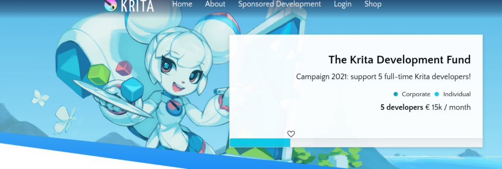

雖然比我哋本來預期遲咗啲，但係我哋依家終於可以推出 Krita 5.0 嘅第二個 Beta 測試版本喇！[**注意事項同上一個測試版本一樣！**](https://krita.org/zh-hk/item/first-beta-for-krita-5-0-released_zh-hk/)（除咗 G’Mic 濾鏡嘅問題已經修正咗。）今次嘅測試版本仲有[一啲比較大嘅問題有待修正](https://bugs.kde.org/buglist.cgi?bug_severity=critical&bug_severity=grave&bug_severity=major&bug_severity=crash&bug_severity=normal&bug_severity=minor&bug_status=UNCONFIRMED&bug_status=CONFIRMED&bug_status=ASSIGNED&bug_status=REOPENED&keywords=regression%2C%20release_blocker%2C%20&keywords_type=anywords&list_id=1918546&product=krita&query_format=advanced)，不過比起上一個測試版本，今個測試版本已經多咗七百幾項修正事項喇。

今次測試版本亦包含咗對硬件圖形加速畫布嘅改進，尤其係喺 macOS 上或者係使用高解析度 (High-DPI) 螢幕時嘅畫布效能應該比以前有好大提升。

\[caption id="attachment\_12343" align="aligncenter" width="1024"\] 由 Tyson Tan 繪畫創作嘅新版啟動畫面圖片\[/caption\]

以下列出咗繼推出 Beta 1 之後所作出嘅大小修正同改進： （譯者按：由於內容太多而人力資源有限，因此依段唔做完整嘅翻譯，保留返英文原文。）

- Dmitry Kazakov and Ivan Yossi implemented a new way of uploading image textures to the GPU, improving performance when painting especially on macOS.
- Michał Chojnowski fixed a crash in the gamut mask toolbar ([BUG:441122](https://bugs.kde.org/show_bug.cgi?id=441122))
- Alvin Wong improved the translatability of Krita a lot, and worked really hard on the traditional Chinese translation.
- Tyson Tan also improved the translatability of Krita a lot, and worked really hard on the simplified Chinese translation.
- Amyspark fixed a problem with Krita resetting its settings after using the G'Mic-Qt plugin. G'Mic has also been updated to the latest version.
- Deif Lou fixed several issues in the filter brush engine
- Amyspark reworked the layer metadata framework ([BUG:410341](https://bugs.kde.org/show_bug.cgi?id=410341))
- Agata Cacko fixed the color history button layout ([BUG:434915](https://bugs.kde.org/show_bug.cgi?id=434915))
- Alan North fixed working with shared curves in the brush editor
- Agata Cacko made it possible to load Adobe Style Library files that have styles with conflicting unique id's
- Alvin Wong fixed the zoom level in the floating canvas message ([BUG:429569](https://bugs.kde.org/show_bug.cgi?id=429569))
- Tom Tom Tom fixed a bug in the calligraphy tool
- Eoin O'Neill fixed a crash in the storyboard docker ([BUG:441592](https://bugs.kde.org/show_bug.cgi?id=441592))
- Emmet O'Neill improved the usability of the storyboard docker ([BUG:441593](https://bugs.kde.org/show_bug.cgi?id=441593))
- Sharaf Zaman fixed the welcome page on Android/ChromeOS
- Matthias Wein fixed several issues with the docker titlebars
- Alvin Wong fixed issues with placing popup windows ([BUG:441935](https://bugs.kde.org/show_bug.cgi?id=441935))
- Alvin Wong fixed the touch pan gesture breaking when moving too quickly ([BUG:441706](https://bugs.kde.org/show_bug.cgi?id=441706))
- Wolthera van Hövell tot Westerflier fixed loaduing KPL palettes defined using the Lab colorspace ([BUG:441139](https://bugs.kde.org/show_bug.cgi?id=441139))
- Alvin Wong fixed a performance issue in the overview docker ([BUG:442075](https://bugs.kde.org/show_bug.cgi?id=442075))
- Wolthera van Hövell tot Westerflier fixed a crash in the channels docker ([BUG:442117](https://bugs.kde.org/show_bug.cgi?id=442117))
- Matthias Wein fixed a performance issue in the channels docker
- Alvin Wong improved the usability of Krita in MDI mode ([BUG:441644](https://bugs.kde.org/show_bug.cgi?id=441644))
- Halla Rempt fixed a crash in the task set docker if disabled actions were executed ([BUG:441638](https://bugs.kde.org/show_bug.cgi?id=441638))
- Halla Rempt fixed a bug in Qt's font database where having a space betwen angular brackets in a font name would break the parser ([BUG:430220](https://bugs.kde.org/show_bug.cgi?id=430220))
- Agata Cacko fixed the previews of several assistant shapes ([BUG:441212](https://bugs.kde.org/show_bug.cgi?id=441212))
- Alvin Wong fixed an issue using Windows Ink or Wintab, where double tablet events might be sent by broken drivers, and where the second event then would activate a mouse event ([BUG:441687](https://bugs.kde.org/show_bug.cgi?id=441687))
- Matthias Weind fixed an issue where the dimensions for a new image were calculated wrongly ([BUG:442124](https://bugs.kde.org/show_bug.cgi?id=442124))
- Sharaf Zaman fixed incremental back saving on Android ([BUG:427042](https://bugs.kde.org/show_bug.cgi?id=427042))
- Halla Rempt fixed rotating the system log
- Halla Rempt changed the default setting for undo steps from 30 to 200
- Agata Cacko fixed updating the preview for a gradient after editing
- Amyspark fixed 32 bit floating point RGB in LittleCMS ([BUG:442004](https://bugs.kde.org/show_bug.cgi?id=442004), [BUG:439947](https://bugs.kde.org/show_bug.cgi?id=439947), [BUG:437429](https://bugs.kde.org/show_bug.cgi?id=437429))
- Wolthera van Hövell tot Westerflier fixed creating separations from the alpha channel ([BUG:434288](https://bugs.kde.org/show_bug.cgi?id=434288))
- Halla Rempt added a default shortcut for creating a vector layer: CTRL-Insert ([BUG:442585](https://bugs.kde.org/show_bug.cgi?id=442585))
- Wolthera van Hövell tot Westerflier implemented loading a gimp brush or gimp imagehose brush as a color image when editing the brush as a Krita image and fixed saving these brushes ([BUG:442316](https://bugs.kde.org/show_bug.cgi?id=442316))
- Wolthera van Hövell tot Westerflier added a reset option to the autobrush widget ([BUG:437006](https://bugs.kde.org/show_bug.cgi?id=437006))
- Halla Rempt fixed an issue where when a shortcuts definition file was missing, menu entries would turn out blank ([BUG:428453](https://bugs.kde.org/show_bug.cgi?id=428453))
- Eoin O'Neill implemented a new export user interface for the storyboard docker
- Eoin O'Neill fixed using the move tool on animated masks ([BUG:441974](https://bugs.kde.org/show_bug.cgi?id=441974))
- Eoin O'Neill fixed the crop tool not working properly on cloned animation frames. ([BUG:441369](https://bugs.kde.org/show_bug.cgi?id=441369))
- Wolthera van Hövell tot Westerflier made it possible to add color labels and pin to the timeline for masks ([BUG:438124](https://bugs.kde.org/show_bug.cgi?id=438124))
- Wolthera van Hövell tot Westerflier fixed the task set docker's appearance ([BUG:442185](https://bugs.kde.org/show_bug.cgi?id=442185))
- Alvin Wong fixed issues when using fractional display scaling
- Sharaf Zaman fixed issues with changing the cursor icon on Android ([BUG:431859](https://bugs.kde.org/show_bug.cgi?id=431859))
- Reinold Rojas enabled color sample preview for the color sampler tool ([BUG:396490](https://bugs.kde.org/show_bug.cgi?id=396490))
- Reinold Rojas fixed a problem with Krita's fullscreen mode in canvas-only mode ([BUG:437932](https://bugs.kde.org/show_bug.cgi?id=437932))
- Halla Rempt added a tool preview option combobox to the transform tool so users can switch between fast and in-stack preview
- Black Cat fixed applying font styles in the text tool ([BUG:392343](https://bugs.kde.org/show_bug.cgi?id=392343))
- Agata Cacko fixed the preview of local assistants ([BUG:442619](https://bugs.kde.org/show_bug.cgi?id=442619))
- Wolthera van Hövell tot Westerflier fixed several issues in the crop tool ([BUG:442827](https://bugs.kde.org/show_bug.cgi?id=442827), [BUG:442959](https://bugs.kde.org/show_bug.cgi?id=442959))
- Wolthera van Hövell tot Westerflier fixed flattening a clone array: the flattened layer now is in the correct position ([BUG:437431](https://bugs.kde.org/show_bug.cgi?id=437431))
- Wolthera van Hövell tot Westerflier fixed a possible crash with color adjustment filter masks ([BUG:428349](https://bugs.kde.org/show_bug.cgi?id=428349))
- Agata Cacko fixed thumbnails for gradients when creating a resource bundle
- Agata Cacko fixed several issues with resource tagging
- Dmitry Kazakov improved the performance of masking brushes
- Halla Rempt implemented saving user-defined tags
- Dmitry Kazakov improved the performance of starting a new stroke when the current brush tip is very big ([BUG:436731](https://bugs.kde.org/show_bug.cgi?id=436731))
- Sharaf Zaman improved the usability of the text tool when using Android or ChromeOS
- Dmitry Kazakov fixed updating shapes that belong to a transformed group ([BUG:443161](https://bugs.kde.org/show_bug.cgi?id=443161))
- Dmitry Kazakov fixed canvas updates in wraparound mode ([BUG:442796](https://bugs.kde.org/show_bug.cgi?id=442796))
- Dmitry Kazakov fixed artefacts in the hue sensor of the color smudge brush engine ([BUG:441755](https://bugs.kde.org/show_bug.cgi?id=441755))
- Matthias Wein fixed a memory leak in the create new image dialog
- Halla Rempt fixed an initialization issue in the Notifier scripting class
- Agata Cacko improved the performance of the perspective assistant

我哋會繼續修正大家喺試用 Beta 同埋 Nightly 測試版本時發現嘅各種問題，以盡力令 Krita 5 正式版發佈嘅時候可以穩定及暢順咁運作。請考慮向 [Krita 發展基金](https://fund.krita.org/)捐款以支持 Krita 嘅開發工作：

## 下載

### Windows

如果你使用免安裝版：請注意，免安裝版仍然會同安裝版本共用設定檔同埋資源。如果想用免安裝版測試並回報 crash 嘅問題，請同時下載 debug symbols。

注意：我哋依家唔再提供為 32 位元 Windows 建置嘅版本。

- 64 位元安裝程式：[krita-x64-5.0.0-beta2-setup.exe](https://download.kde.org/unstable/krita/5.0.0-beta2/krita-x64-5.0.0-beta2-setup.exe)
- 64 位元免安裝版：[krita-x64-5.0.0-beta2.zip](https://download.kde.org/unstable/krita/5.0.0-beta2/krita-x64-5.0.0-beta2.zip)
- [Debug symbols（請解壓到 Krita 程式資料夾入面）](https://download.kde.org/unstable/krita/5.0.0-beta2/krita-x64-5.0.0-beta2-dbg.zip)

### Linux

- 64 位元 Linux AppImage：[krita-5.0.0-beta2-x86\_64.appimage](https://download.kde.org/unstable/krita/5.0.0-beta2/krita-5.0.0-beta2-x86_64.appimage)

Linux 版本唔使再另外下載 G'Mic-Qt 外掛程式 AppImage。

### macOS

注意：如果你用緊 macOS Sierra 或者 High Sierra，請睇下[依段影片](https://www.youtube.com/watch?v=3py0kgq95Hk)了解點樣執行開發者簽署嘅程式。

- macOS 套件：[krita-5.0.0-beta2.dmg](https://download.kde.org/unstable/krita/5.0.0-beta2/krita-5.0.0-beta2.dmg)

### Android

我哋提供嘅 ChomeOS 同 Android 版本仲係**測試版本**。依個版本或可能含有大量嘅 bug，而且仲有部份功能未能正常運作。由於使用者介面仲未改進好，軟件或者須要配合實體鍵盤先可以用到全部功能。

- [64 位元 Intel CPU APK](https://download.kde.org/unstable/krita/5.0.0-beta2/krita-x86_64-5.0.0-beta2-release-signed.apk)
- [32 位元 Intel CPU APK](https://download.kde.org/unstable/krita/5.0.0-beta2/krita-x86-5.0.0-beta2-release-signed.apk)
- [64 位元 Arm CPU APK](https://download.kde.org/unstable/krita/5.0.0-beta2/krita-arm64-v8a-5.0.0-beta2-release-signed.apk)
- [32 位元 Arm CPU APK](https://download.kde.org/unstable/krita/5.0.0-beta2/krita-armeabi-v7a-5.0.0-beta2-release-signed.apk)

### 原始碼

- [krita-5.0.0-beta2.tar.gz](https://download.kde.org/unstable/krita/5.0.0-beta2/krita-5.0.0-beta2.tar.gz)
- [krita-5.0.0-beta2.tar.xz](https://download.kde.org/unstable/krita/5.0.0-beta2/krita-5.0.0-beta2.tar.xz)

### md5sum

下載檔案嘅 MD5 校對碼可以喺依個檔案入面搵到：

- [md5sum.txt](https://download.kde.org/unstable/krita/5.0.0-beta2/md5sum.txt)

### 數碼簽署

Linux AppImage 以及原始碼嘅 .tar.gz 同 .tar.xz 壓縮檔已使用數碼簽署簽名。你可以由[依度](https://files.kde.org/krita/4DA79EDA231C852B)取得 public key。簽名檔可以喺[依度](https://download.kde.org/unstable/krita/5.0.0-beta2/)搵到（副檔名為 .sig）。

## 支持 Krita

Krita 係免費及開放原始碼嘅項目。請考慮[捐款](https://fund.krita.org)或者[購買教學影片](https://krita.org/en/shop/)支持我哋啦！有你嘅支持我哋先可以聘請開發人員全職進行 Krita 嘅開發工作。
