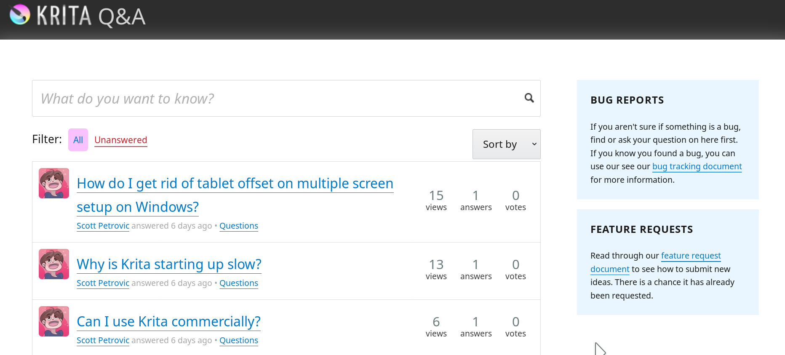

在 KDE 系统管理员团队的协助下，Scott Petrovic 创建了 [https://ask.krita.org](https://ask.krita.org) —— Krita 问答网站。

在过去的几年里越来越多的人开始使用 Krita，软件的年下载量已经突破百万。我们庞大的用户群也意味着开发人员无法回答用户提出的每个问题，而许多这些问题我们曾经在[论坛](https://forum.kde.org/krita)、 [bugzilla](https://bugs.kde.org/buglist.cgi?quicksearch=krita&list_id=1567676)、[reddit](http://www.reddit.com/r/krita)、[twitter](https://twitter.com/Krita_Painting) 等处进行过回答。我们也发现现在人们不太喜欢在 [FAQ](https://docs.krita.org/en/KritaFAQ.html) 上面寻找答案。

通过使用 Ask.krita.org 网站你可以简单地找到你想要问的问题有没有现成答案，你也可以提问和回答其他人的问题。我们希望把它打造成一个 Krita 用户可以进行互助的中心平台，就像是 stackoverflow 网站或 [ask.libreoffice.org](https://ask.libreoffice.org/en/) 那样。

简而言之：

- 如果你是新用户，或者不了解 Krita 的使用方式，或者是数字绘画的新手，[请阅读 Krita 使用手册](https://docs.krita.org)。
- 如果你想要问一个关于 Krita 的问题，请使用 [ask.krita.org](https://ask.krita.org) 网站。
- 如果你想要对 Krita 的开发提出建议，想要分享作品或者教程，需要讨论或者分享插件或者脚本，请使用[论坛](https://forum.kde.org/krita)或者 [reddit](https://www.reddit.com/r/krita)。
- 如果你在使用 Krita 时遇到了程序问题，[请阅读问题报告指南](https://docs.krita.org/en/untranslatable_pages/reporting_bugs.html)并提交问题报告。

请理解我们的用户成千上万，但我们的开发人员却屈指可数，所以请各位用户尽可能相互帮助！
