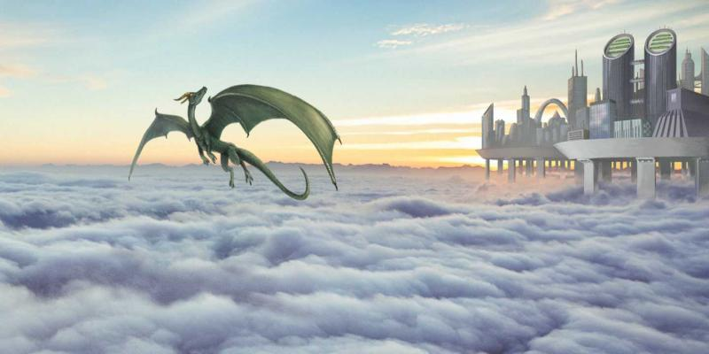
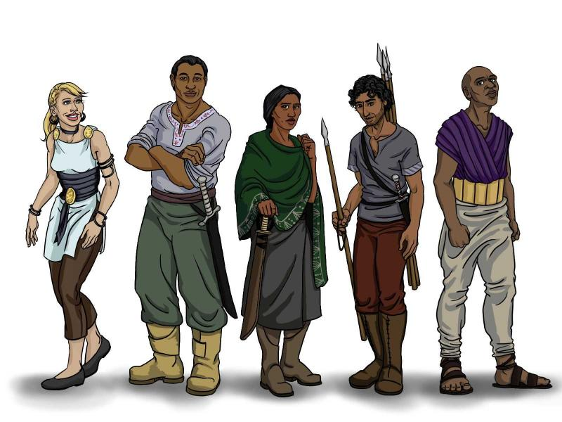
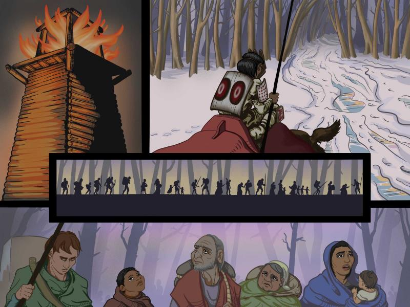

### 

### 可以介绍一下你自己吗？

我是一位住在美国新墨西哥州的全职主妇。作为一位孩子的母亲，我一直对讲故事很感兴趣。我认为视觉艺术是最有趣的讲述方式。

### 你的绘画是专业性质，还是兴趣爱好，还是两者都有？

我是一名美术爱好者，还没有出版过任何专业的作品。当然我希望可以有所改变，我正在挤出时间和精力来绘制更多作品！

### 你的绘画风格属于哪些流派？

我一直对奇幻感兴趣，但我的大多数作品都是好玩的卡通形象。无论我怎么画，画出来的东西总是哪里觉得有点搞笑。我打算在下一个十年通过卡通风格创作一系列具有系统设定的奇幻世界。

### 哪位作者的作品对你启发最大？你把哪位作者作为你的榜样？

我从小到大都受到传统迪士尼手绘动画电影的深刻影响。例如动画师 Bill Tytla 的工作。诸如 Bill Watterson、Maurice Sendak、Hal Foster 等动画师和插画师对我的影响也很大。奇幻插画师 Frank Frazetta 等人的作品让我颇有共鸣。

### 你是在什么时候，通过什么方式第一次接触到数字绘画的？

我大概是在几年前的一次美术练习里面第一次使用数字美术工具的。那是一次非常轻松的经历，我只是在给自己常看的一个叫做“Wa Hate Movies”的播客里头的一个烂梗画同人。我当时没有打算认真发展数字绘画方面的能力，但后来我发现自己画得越来越多了。

### 为什么你选择了数字绘画而不是传统绘画？

传统绘画的效果当然非常漂亮，但是它也麻烦得要死。传统绘画对创作时间和创作空间的要求更高，画材又特别昂贵，比起数字绘画来手太浪费了。虽然我并不喜欢数字绘画的那种“数码感”，但我会努力训练来消除它。我相信好的作者不应该把画得不好的责任推到工具身上。

我以前只用过铅笔作画，而数字绘画让我可以更加容易的描线和上色。因为重新绘制也很方便，这也让我可以进行许多不同的风格实验。最难的部分是适应数位板和压感笔的工作方式。

### 你是怎样知道 Krita 的？

我的老公是一位工程师，对于 Linux 和开源的领域非常熟悉。有一天我问他除了 Photoshop 之外还有没有什么其他的数字绘画软件时，他给我推荐了 Krita。

### 你对 Krita 的第一印象如何？

Krita 是我用过的最专业的 Photoshop 替代方案。它和我的数位板的配合也比其他软件来的更好。不过 Krita 的问题和崩溃还是多了点。

### 你喜欢 Krita 的哪些方面？

它不花钱！开源社区没有富爸爸当后盾，但还是编写出了如此棒的软件。看看 Adobe 为 Photoshop 制定的那令人发指的定价，你会以为它这样的软件就此一家了。其实 Krita 是一个更好的选择。

### 你觉得 Krita 还有哪些地方需要改进？它有没有什么特别烦人的地方？

软件问题的崩溃都是开源项目的家常便饭了，不过这些应该都会慢慢改进的。然而真正的问题是 Krita 对外行人而言实在是难以理解了。还记得我第一次下载它的时候面对那一整页不知所云的连接：猫也看得懂的 AppImages 教学？Gentoo 又是什么鬼？这都是些什么鬼？像我这样的白痴只想要一个“点击下载最新版 Krita”的按钮而已啊！按照现在的样子，很多人还没来得及下载 Krita 就已经放弃了。

### Krita 和其他你正在使用的工具相比有什么独特之处？

Krita 的社区支持非常棒，这会为软件的持续改进提供动力。他们为不同功能的开发安排了合适的优先顺序，例如先做好笔刷之后再管那些偏门的功能等。除了偶尔崩溃几次外，我用起它来是得心应手的。

### 你可以挑出一幅你最喜欢的使用 Krita 创作的作品吗？原因是什么？

我画了这张图来验证用 Krita 绘制网络漫画的可行性。这个实验挺成功的，证明了我可以用 Krita 来讲述我想要的故事。我相信我假以时日，我的画技也会越来越好。

### 你在这幅作品里使用了什么笔刷和技巧？

我主要使用了基本的原形笔刷，按照需要适当调整它的大小。直线笔刷绘制漫画线框也很方便。我认为技巧比工具更重要，因此我在训练自己尽可能使用简单的工具进行创作。

### 我们可以在哪里看到更多你的作品呢？

我对于发表作品这事情还是挺害羞的，不过我认识到我必需改变自己。等我积累起一定规模的作品后，大概在明年吧，我就会开始定期发表一系列名为 _The Unknown Engine_ 的网络漫画作品。

### 你还有其他的事情想要分享吗？

我非常感激互联网和开源软件运动，它们让像我这样的作者有机会用全新的方式创作和发表自己的作品。我常常思考 Bill Watterson 与他连载作品的报纸之间的漫长斗争。如果他能够在今天的互联网上连载 _Calvin and Hobbes_，事情的结局会不会有所不同？我还远没有达到他的水准，但为了实现这个目标我会不断的磨练自己的绘画技巧。
