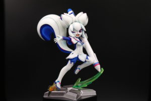
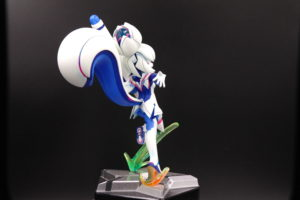
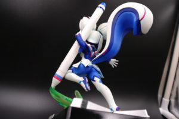
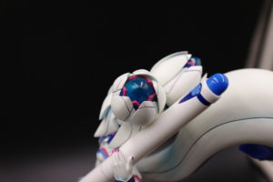
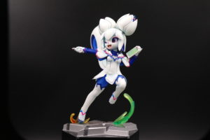
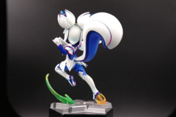
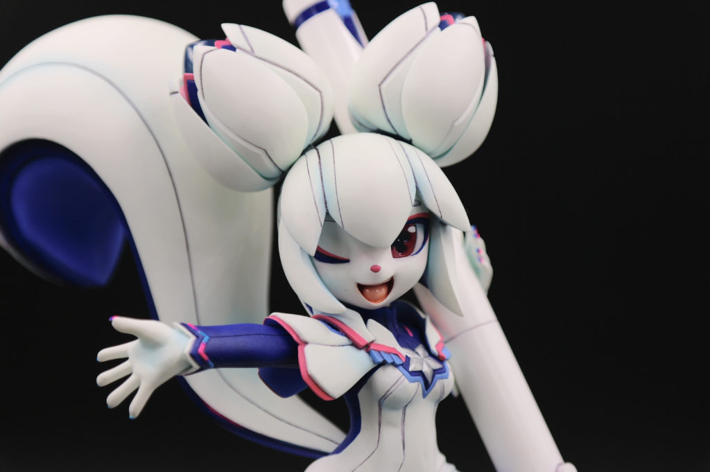

Ryou 是为 Krita 项目的吉祥物 Kiki 制作了精美手办的模型师，他来自日本。在此感谢 Kiki 的设计师 Tyson Tan 促成了此次访谈。

### 可以介绍一下你自己吗？

我叫伊藤灵一 (以下称 Ryou)，是一位专业的模型师和手办原形师。我是一位日本人。我在模型杂志《月刊模型画报 (月刊モデルグラフィックス)》上撰写专栏和制作范例。

### 你从什么时候开始制作模型？

制作塑料模型是儿时以来的爱好，主要喜欢高达等机器人动画的模型。作为职业开始制作手办原形大概在 30 岁前后吧。在那之前我也曾经做过漫画家，但是最后走进了死胡同，为了糊口就转职成为了原形师。不过我现在还是很喜欢绘制插画和漫画。

### 你是如何设计手办的造型的呢？

我以前当过漫画家，人物设计是我喜欢的一项工作。我首先会在脑里把握好手办的大致感觉，然后收集服装等相关资料，再反复起草直到满意为止。这应该是比较常见的设计手法吧。

虽然我也喜欢人类角色和机器人，但我还是特别喜欢兽人系的角色，我就是所谓兽控啦！这个风格算是相当小众，尤其是没什么会去做这个方向的手办。我觉得如果自己有本事的话说不定还能在这个方向上作出点小成绩来，所以会一直挑战下去。

### 你是如何制作原形的？从原形到成品要经历多少工序？

制作原形的方法是多种多样的，我是环氧树脂腻子这一派的。我会用环氧树脂腻子捏制出大致的形状，通过添加和削除慢慢地一步步将造型加工得接近设定图的形象。这便是传统的手工工艺了。不过我现在也想要挑战一下通过数字方式制作原形，我最近在学习试用ZBrushCore，大概能用它作出一个头来了！

手办的产品则是用模铸树脂的组装套件，一般叫做 GK 模型套件。用硅胶制作出原形的模具，然后把树脂注入硅胶模具里进行复制。这种工艺在家里就可以进行，不过做起来却相当繁琐，我现在越来越多地把这项工作委托给专业的成形公司进行了。虽然价格很贵，但他们能够作出漂亮的成品，而且产量也大，非常方便。

### 你是怎样知道 Krita 的？

很久之前我就在 Pixiv 等地方见过 Tyson Tan 的设计作品，非常喜欢。在他展示的作品里头就有 Kiki，我简单调查了一下，就发现了 Krita 了。可惜的是我还没用过 Krita，有机会我会尝试一下的。

### 你为什么决定要制作 Kiki 的手办呢？

**Ryou**：我因为对自己的设计能力不是特别满意，最近已经有好几次跟其他设计师进行合作，制作他们绘制的角色的手办。Tyson 设计的角色将生物的美艳和未来的机械感结合得非常好，我觉得我一定无法设计出那样的角色，所以就通过 Twitter 联系到了他。一开始我提议在他设计的几个原创角色里面挑选一个，两人交谈之后就决定制作 Kiki 了。其实我现在觉得要是做个更加性感的角色可能也挺不错的吧！

**Tyson**：我们就很多我设计的原创角色进行了讨论。虽然商业上感觉“一定好卖”的角色并不少，我也绘制了一些全新的设计方案。但是总觉得想要做一个比“某位设计师自己的角色”内涵更丰富的的作品。Kiki 是自由开源绘画软件 Krita 的吉祥物，我觉得以她为题材含义上会更丰富一些。

### 人们可以在哪里买到这个手办呢？

Kiki的手办可以在我的个人网站上买到，全球发货：[http://bmwweb3.nobody.jp/mail2.html](http://bmwweb3.nobody.jp/mail2.html)

### 你还有什么想要与我们分享吗？

我计划继续和其他设计师合作，制作兽人系角色的手办。原则上是我主动提出要约，不过我也接受原形制作的委托。有兴趣的话可以联系我。

我希望通过制作 Kiki 能够与更多的人建立起联系！

Ryou 的个人网站：[http://bmwweb3.nobody.jp/](http://bmwweb3.nobody.jp/)

 

