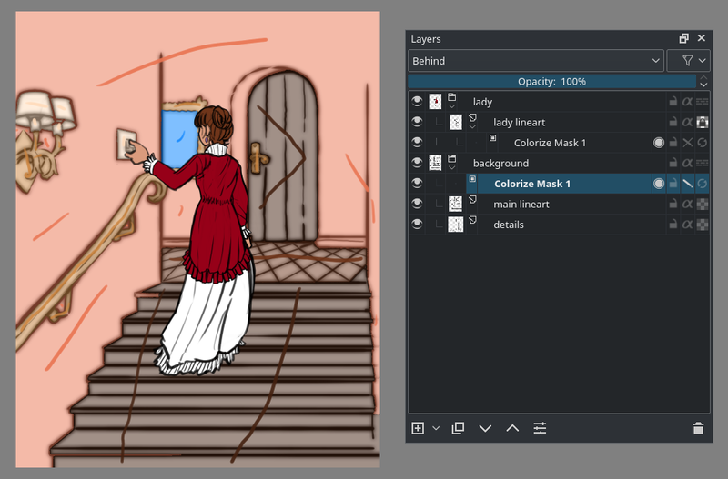
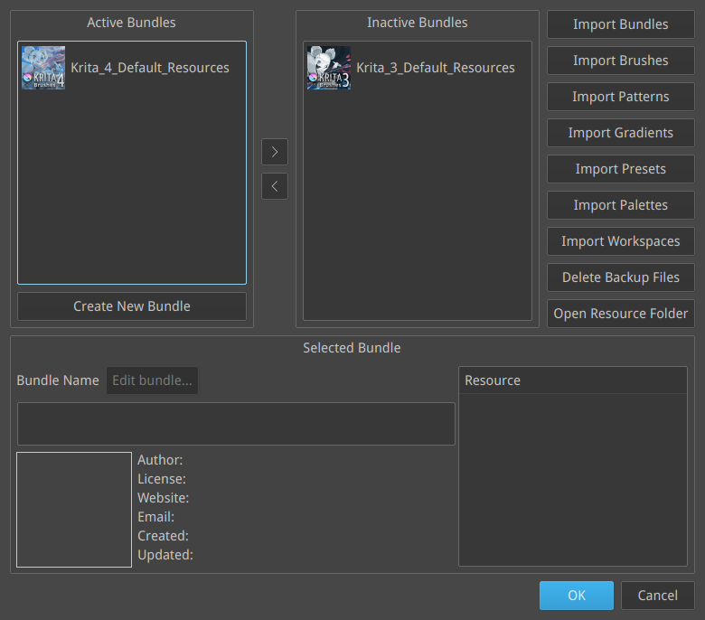

Krita 开发小组在今天发布了 Krita 4.0.0 版。这是一个重大版本，包含了多个全新的重要功能和大量其他改进：增强的矢量图形工具、SVG 支持、重写的文本工具、Python 脚本编程扩展以及更多！

https://youtu.be/a-CY4hmkg\_I

Krita 4.0 的全新启动画面由谭代山 (Tyson Tan/钛山)绘制，主题是我们的吉祥物 Kiki、冬雪和梅花。Krita 4.0 原定于去年发布，[然而接二连三的意外情况](https://krita.org/en/item/krita-foundation-update/)严重拖慢了项目的开发工作。但是正如在凛冽的寒风中傲然盛开的梅花一样，Krita 项目挺过来了，今天它的 4.0 版本也终于与世人见面了！

## 功能亮点

跟以往的重大版本发布一样，我们准备了一个涵盖了 Krita 4.0.0 每一处更新的列表：

[Krita 4.0.0 完整更新日志](https://krita.org/en/krita-4-0-release-notes/)

除了开篇已经提到过的 SVG 支持、全新文本工具还有 Python 编程外，这次更新还有许多其他亮点：

- 使用着色蒙版给线稿轻松上色。[阅读使用手册以了解详情](https://docs.krita.org/en/reference_manual/tools/colorize_mask.html)！

- 蒙版笔刷：将蒙版添加到笔尖来制造更为生动的效果。这将为作者提供更多的可能性！

- 全新的笔刷预设！我们对整个笔刷预设库进行了彻底的修订。还将它们制作成了资源包形式。Krita 3.x 的笔刷预设也已内置，只是默认设为禁用状态。

## 已知问题

Krita 4.0.0 是项目的一次重大飞跃，软件改动的规模甚至超过了 3.0.0 发布时的水平。这也带来了下列的一些问题：

- Krita 4.0.0 开始使用 SVG 标准的矢量图层，这意味着 3.x 版保存的矢量图层将无法完全正确地在新版里加载，注意保留备份！
- Krita 4.0.0 的文本工具经历了完全重写，它的现有状态极其受限，尚未达到我们计划当初的水准。目前我们全力保障了一项文本应用能够正常可靠地进行：制作漫画的对白文字。我们接下来还会持续对文本工具进行改良。
- 我们搭建了全新的自动编译系统来准备 Windows 和 Linux 的可执行文件，但目前我们尚不能提供 32 位的编译版本 (此问题已随 4.0.3 版的发布得到解决)。
- 由于 Mac OSX 的共享内存限制过小，我们尚未在 OSX 上面实现 G'MIC支持。
- 一碰到无效图像就会崩溃得突破天际的参考图像工具被暂时移除了。我们正在对其进行重写，它将随 4.1.0 版发布。

## 下载

### Windows 版本

Windows 用户请注意：如果你遇到了崩溃，请遵循[此处的说明](https://docs.krita.org/Dr._Mingw_debugger)来使用软件调试符号包，这样可以帮助我们找到崩溃的原因。

- 64 位 Windows 安装程序：[krita-x64-4.0.0-setup.exe](https://download.kde.org/stable/krita/4.0.0/krita-x64-4.0.0-setup.exe)
- 64 位 Windows 压缩包：[krita-x64-4.0.0.zip](https://download.kde.org/stable/krita/4.0.0/krita-x64-4.0.0.zip)
- [64 位软件调试符号包](https://download.kde.org/stable/krita/4.0.0/krita-x64-4.0.0-dbg.zip) (解压到 Krita 的安装目录)

当前我们尚未准备 32 位版本的软件。

如需在 Windows 7/8 下面启用 Python 脚本编程支持，你需要单独安装通用 C 语言运行时组件，详情[请阅读使用手册](https://docs.krita.org/en/user_manual/python_scripting/introduction_to_python_scripting.html)。

### Linux 版本

- - 64 位 AppImage：[krita-4.0.0-x86\_64.appimage](https://download.kde.org/stable/krita/4.0.0/krita-4.0.0-x86_64.appimage)

当前 AppImage 版本的 Krita 软件尚未内建多语言翻译。

(如果 Firefox 把下载文件当作文本打开，请在连接上点击右键/另存为)

你也可以在 [Krita Lime PPA](https://launchpad.net/%7Ekritalime/+archive/ubuntu/ppa) 更新之后用它在 Ubuntu 以及它的派生版本上面安装最新版本的 Krita。我们也在准备 Snap 形式的更新版本。

### OSX

- OSX 镜像：[krita-4.0.0.dmg](https://download.kde.org/stable/krita/4.0.0/krita-4.0.0.dmg)

Note: the gmic-qt and python plugins are not available on macOS.

### Source code

- 源代码：[krita-4.0.0.tar.gz](https://download.kde.org/stable/krita/4.0.0/krita-4.0.0.tar.gz)

### md5sum

所有下载文件的 md5sum：

- [md5sums.txt](https://download.kde.org/stable/krita/4.0.0/md5sums.txt)

### 密钥和签名

Linux 的 AppImage 软件包和源代码 Tar 压缩包都已签名。你可以在此通过 https 连接下载公共密钥： [0x58b9596c722ea3bd.asc](https://share.kde.org/index.php/s/fJ99V5mZvuyD0z8) 和[下载签名文件](http://download.kde.org/stable/krita/4.0.0/) (文件名后缀为.sig)。

### 资助 Krita 项目

Krita 是一个自由、免费、开源的软件项目。请通过[捐款](https://krita.org/en/support-us/donations/)、[购买教学材料和画册](https://krita.org/en/support-us/shop)等方式资助我们。有了你的资助，我们才能保持核心开发团队为项目全职工作。

\[caption id="attachment\_6455" align="aligncenter" width="1024"\]作者 Ramon Miranda\[/caption\]
