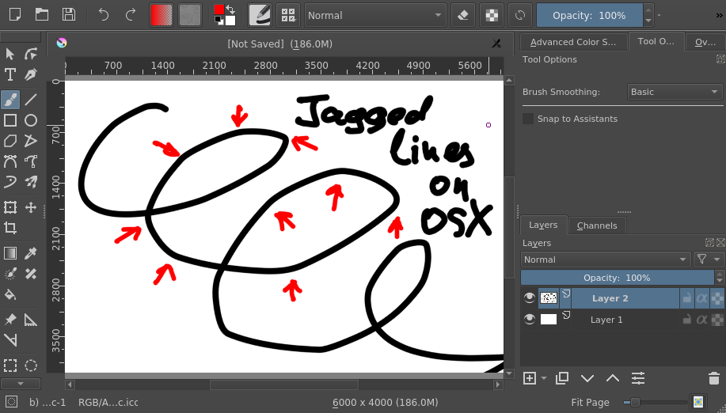

Dmitry 按：两周前，我们在代芬特尔举办了一场振奋人心的开发冲刺聚会，来自世界各地的 Krita 开发人员齐聚一堂交流协作。Boud 已经为此撰写了[一篇通讯](https://krita.org/en/item/krita-2018-sprint-report-zh)，所以我就不再赘述了。下面我将谈谈我在这次聚会上的主要任务：OSX 数位板问题的修复，以及这个问题的来龙去脉。

\[caption id="attachment\_7338" align="aligncenter" width="917"\] OSX 会对输入事件进行压缩，造成线条绘制不流畅，禁用 OpenGL 问题消失\[/caption\]

### 数位板事件压缩

我们从 Krita 的第一个 OSX 版本开始就留意到了一个奇怪的问题。用户画画的动作一快，笔画就会变得不流畅，看上去它们被“掰弯”了。这个问题的成因是：数位板的压感笔输入事件在从驱动程序传输到 Krita 的过程中发生了损失。

这个问题其实不是 OSX 的专利，Linux 和 Windows 平台也遇到过一些同类问题。它往往跟 Qt 的一个叫做“输入事件压缩”的功能有关。这个功能会在应用程序变慢时自动激活，然后抛弃数位板和鼠标过剩的移动事件。这个功能对常规的非绘画应用程序来说是必要的，这些程序对于输入的精确性也不敏感。如果禁用 OpenGL 画布之后线条就变得流畅，那么十有八九就是这个功能在作怪。接到这个问题在 OSX 上的报告后，我心想“老子在别的平台上都解决过多少次了，这还能难得倒我？”我自鸣得意地走在通往聚会的路上，完全没有预料到事情接下来会如何发展。

到了聚会现场我就没那么得意了：我检查了 Qt 的源代码，发现它在 OSX 上面压根就没有输入事件压缩这个功能！什么鬼？测试表明 Qt 收到的输入事件都会原封不动地传输给 Krita。这可是万万没想到。既然不是 Qt，那么就只有一个可能：在程序执行周期提取队列中的输入事件之前，OSX 自己就迫不及待地把事件给抛弃掉了。我现在依然是这样理解的。

如果压缩发生在操作系统和驱动程序内部，我们就无法彻底关掉它了。但我们可以设法加快 Krita 主图形界面线程的响应速度，在输入事件被系统抛弃之前将它们提取出来。但这里却有一个问题：OpenGL！

### OpenGL 和 Krita 的图形界面线程

那么为什么 OpenGL 会跟输入事件压缩有关呢？这还要从 Krita 的渲染流程说起。我们的标准渲染流程如下，它非常简洁：

1. 笔刷对图像进行了更改
2. 图形界面线程将材质通过 glTexImage2D 或者 glTexSubImage2D 上传到 GPU
3. 图形界面线程呼叫 QOpenGLWidget::update()，开始新的渲染周期
4. Qt 呼叫 QOpenGLWidget::paintGL()，它为已更新的材质生成贴图并把它们渲染到屏幕。

这个流程在其他平台上都工作得很好，除了 OSX。在 OSX 下面它的环节会被打乱执行，导致 Krita 渲染材质的时候发生**贴图损坏**。几年前我们第一次遇到这个问题的时候，抓破头皮也没搞懂到底是什么原因。到了最后只好用一个恶心的小把戏来变通：我们把 glFinish()插入到上传材质环节和渲染环节之间，然后 OSX 特有的渲染流程就变成了这样：

1. 图像更新
2. 上传材质
3. **呼叫 glFinish()/\* 慢——————得要死 \*/**
4. 呼叫 QOpenGLWidget::update()
5. 生成贴图并渲染材质

OpenGL 有时需要较长时间来上传已更新的材质并渲染画布，因此我们的小把戏虽然解决了贴图损坏的问题，却拖慢了渲染流程的速度。我们用 [apitrace](https://github.com/apitrace/apitrace) 分析过 Krita，发现这个 glFinish()的把戏会长时间挡在输入事件周期的前面，OSX 等不及了就开始抛弃队列里面的输入事件，因此我们必需移除它。

可是话说回来，我们为什么会需要 glFinish()呢？OpenGL 的 GPU 呼叫应该会按照时间顺序执行，可为什么偏偏在这里会被重新排序？我在开发冲刺聚会上花了差不多两天时间研究这个问题，回到家之后又继续鼓捣了两天。我甚至想过会不会是 OSX 的 OpenGL 实现方式有问题。但事情实际上比这简单得多。

我们在 Krita 里面使用了两个不同的 OpenGL 语境来渲染图像：一个是 Qt 用来上传材质的，另一个是 QOpenGLWidget 的。这两个 OpenGL 语境共享资源，所以我们之前也理所当然地把它们当作同一语境。然而事实并非如此，两者虽然共享了全部资源，但是它们处理 CPU 指令队列的方式却另有文章：在 Linux 和 Windows 下面它们共享指令队列并按序执行；在 OSX 下面它们的队列相互独立。这样在 OSX 下面同时含有两者的流程就会被打乱，贴图也因此损坏。

发生上述问题时，我们的流程是这样的：

1. **\[OpenGL 语境 1\]** 更新图像
2. **\[OpenGL 语境 1\]** 上传材质
3. **\[OpenGL 语境 2\]** 呼叫 QOpenGLWidget::update()
4. **\[OpenGL 语境 2\]** 生成贴图并渲染材质 /\* 这时语境 1 中的材质还没完成上传，因此发生贴图损坏 \*/

因此，我们只需要把上传材质的环节放到正确的 OpenGL 语境里，问题也就迎刃而解了。[相关补丁](https://phabricator.kde.org/R37:fb43d4e5be6112c7d9df2ee3f33697d07a614ca6)已经进入主分支，它会随 Krita 4.0.4 发布！

### 经验教训

我们要当心用于访问 GPU 的 OpenGL 语境。除非是在 QOpenGLWidget::paintGL()里面，否则语境很可能是随机分配的！

附： 这个补丁并没有从根本上解决数位板的问题。输入事件压缩依然会在 OSX 内部发生，但它的影响已经可以忽略了！:)

再附： 2018 年度的 Krita 开发冲刺聚会由 KDE e.V. 赞助差旅费用，由 Krita 基金会赞助住宿和餐饮费用。

一附再附： Apple [准备弃用](https://developer.apple.com/macos/whats-new/) OpenGL 了……
