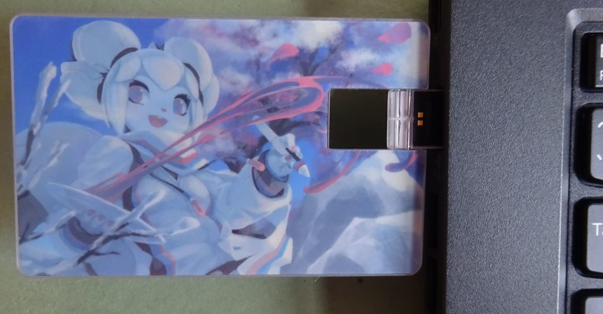

我们在筹款活动成功结束后曾经提到过作为捐款回报的数字画室资源包 (Digital Atelier Resource Pack) 将会在 Krita 商店上架。虽然这花了比我们想象的更长的时间，但我们终于在 [Krita 商店](https://krita.org/en/support-us/shop/)中上架了该资源包。

数字画室资源包 (Digital Atelier Resource Pack) 的内容包括： 笔刷 51 组、图案 20 组、表面纹理 12 组、笔尖 39 组，还附有近 2 小时的高清教程视频。

https://youtu.be/oMyorAEgBfE

数字画室资源包 (Digital Atelier Resource Pack) 的售价为 39.95 欧元 (不含增值税)。

* * *

我们还制作了新版的[卡片式 U 盘](https://gumroad.com/products/qQmZf)，里面预装了每个操作系统下面最新的稳定版本、《Comics with Krita (Krita 漫画创作教程)》、《Muses (Krita 综合教程)》、《Secrets of Krita and Animate (Krita 绘画与动画教程)》和《Krita tutorial packs (Krita 教程包合集)》。

新版的 U 盘依然采用信用卡尺寸，携带方便，这也让我们可以使用 Tyson Tan 为 Krita 4 绘制的启动图。

新版卡片式 U 盘有两个版本：[出厂版本售价 29.95 欧元](https://gumroad.com/products/thwPJ)；[更新到购买时 Krita 的最新版本 (由我们亲自进行人工更新) 售价 34.95欧元](https://gumroad.com/products/qQmZf/)。
