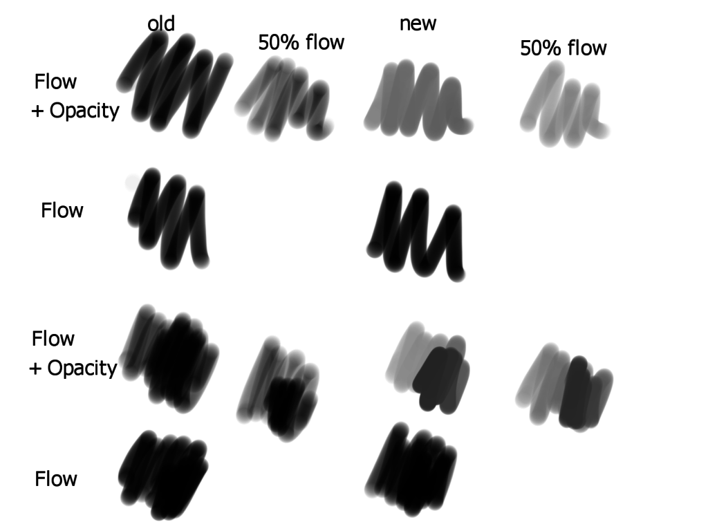
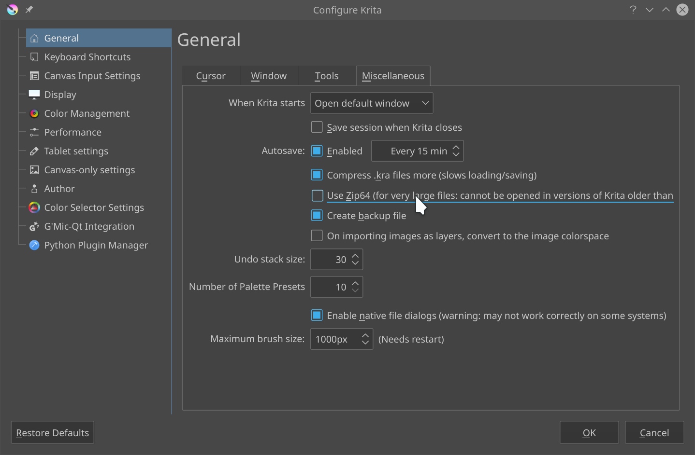

我们准备了新的 Krita 测试版本，诚邀大家协助测试 4.2 版将要带来的两处关键功能变更：新的笔刷流量和不透明度的联动效果、保存/载入功能的大文件支持。由于这两处变化涉及 Krita 的核心功能，事关重大，我们非常希望大家能够帮助我们进行测试！

**测试版本仅供测试使用，会有丢失作品的风险，切勿将其用于工作****！**

首先请在论坛上了解相关讨论：[其一](https://forum.kde.org/viewtopic.php?f=139&t=152017)、[其二](https://forum.kde.org/viewtopic.php?f=288&t=136165)。根据这两则讨论，William Brown 为 Krita 准备了[他的首个补丁](https://phabricator.kde.org/D18467)。这个补丁改变了流量和不透明度的联动效果：

\[caption id="attachment\_8897" align="aligncenter" width="1024"\] 上图：新 (new) 旧 (old) 流量 (flow) 和 Opacity (不透明度) 的联动效果对比。\[/caption\]

由于上述改动触及了 Krita 的核心功能，我们非常希望大家都能下载测试版检验其效果。

如果上面的第一处改动没有吓到你，那么下面即将介绍的第二处肯定会：我们更换了用于编码/解码 Krita 文档的软件引擎！

Krita 的 .kra 文件实际上是一个简单 zip 压缩文件。简单 zip 文件有一个限制：文件大小上限不能超过 4 GiB。这听起来貌似没什么问题——直到 Krita 具备了动画绘制功能。我们发现原来人们在绘制动画时往往会生成更大的文件……

所以我们把相关的软件库换成了 [quazip](https://stachenov.github.io/quazip/)，它支持 Zip64 标准。这个软件库不单会被用于保存和载入 .kra 文件，还被用来处理 [OpenRaster](https://www.openraster.org/) 文件和资源包等——只要是 zip 格式的东西都由它接管了。在默认状态下 Zip64 处于禁用状态。如果你要制作动画，你需要手动启用 Zip64 功能：

请注意：启用 Zip64 功能后保存的文件在旧版 Krita 中将不能打开！如果你不打算启用它，也可以帮助我们测试在禁用 Zip64 时的表现。

### 提供反馈

[请点此连接为我们提供反馈！](https://docs.google.com/forms/d/1TsmYcfM6Gp9FOAl9ybSPRM5sOdaztwaTvjoboaIq4Ec)

## 下载

### Windows

- 64 位 Windows 安装包：[krita-x64-4.2.0-preview2-setup.exe](https://download.kde.org/unstable/krita/4.2.0-preview2/krita-4.2.0-preview2-setup.exe)
- 64 位 Windows 压缩包：[krita-4.2.0-preview2.zip](https://download.kde.org/unstable/krita/4.2.0-preview2/krita-4.2.0-preview2.zip)

### Linux

- 64 位 Linux AppImage：[krita-4.2.0-preview2-x86\_64.appimage](https://download.kde.org/unstable/krita/4.2.0-preview2/krita-4.2.0-preview2.appimage)

（如果 Firefox 将此作为文本打开，请点击鼠标右键——另存为）

### OSX

- OSX 磁盘映像：[krita-4.2.0-preview2.dmg](https://download.kde.org/unstable/krita/4.2.0-preview2/krita-4.2.0-preview2.dmg)

## 支持 Krita

Krita 是一个自由、免费、开源的软件项目。请通过[捐助](https://krita.org/en/support-us/donations/)、[购买教学材料和画册](https://krita.org/en/support-us/shop)等方式资助我们。有了你的资助，我们才能保持核心开发团队为项目全职工作。
