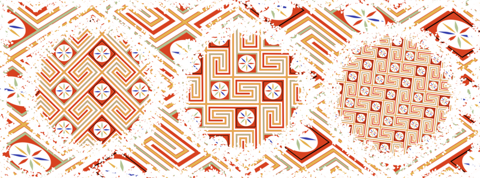
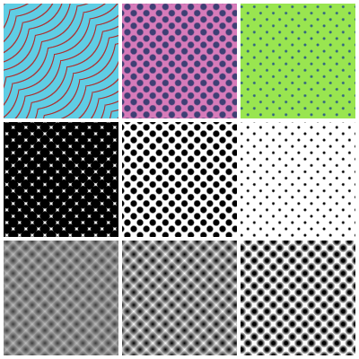
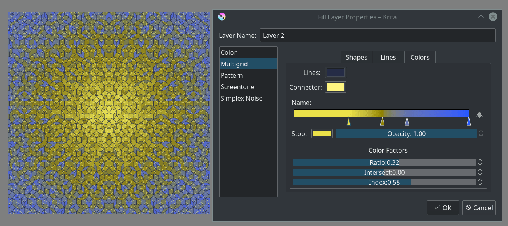
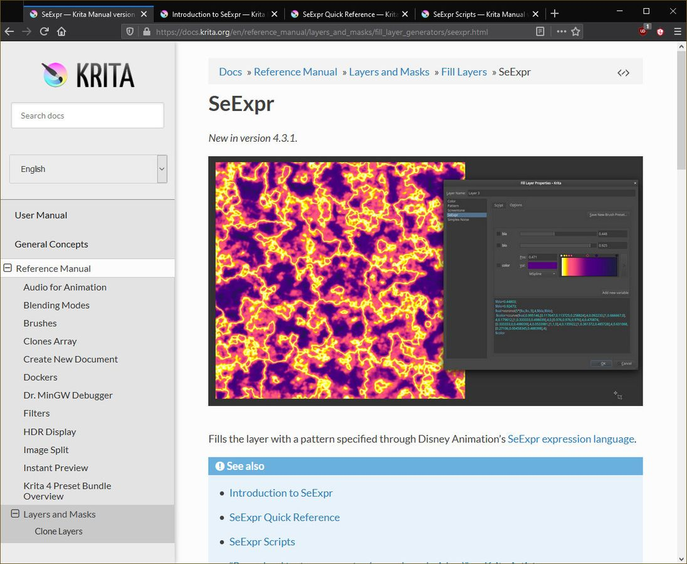
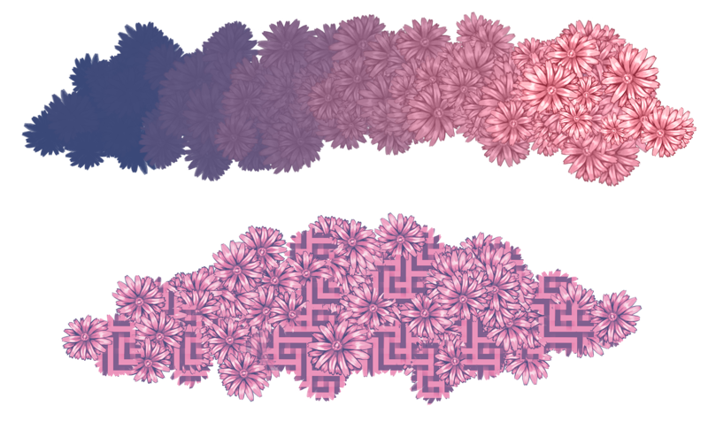
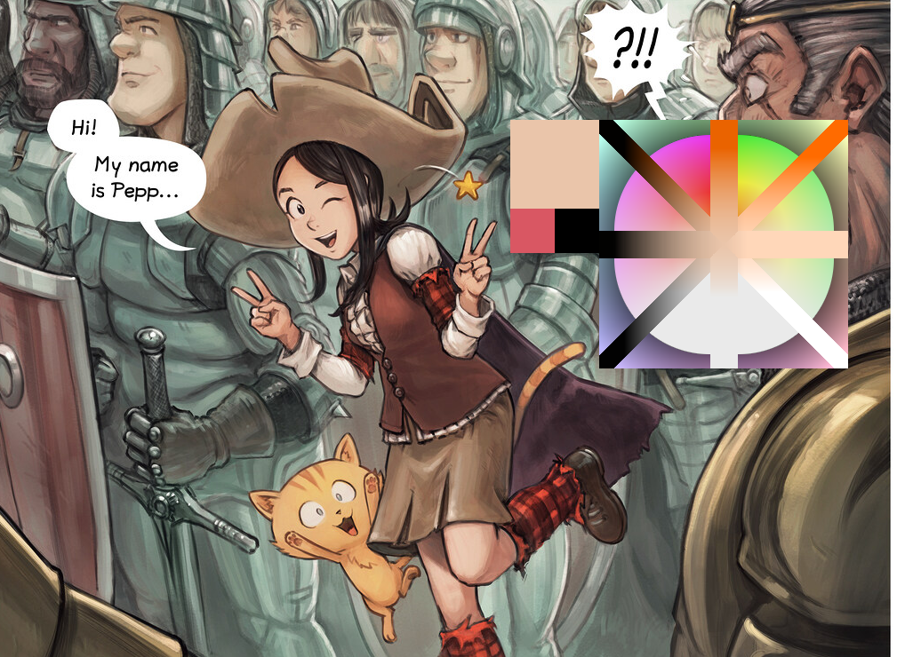

虽然比原定时间晚了几天，但 Krita 4.4.0 正式版终于在今天推出了！

Krita 4.4.0 版带来了诸多全新功能，包括但不限于：一系列新型填充图层，包括基于迪士尼 Seexpr 语言的可编程填充图层；配合彩色笔尖图像、纹理使用的全新亮度、渐变映射模式；渐变支持直接使用前景色、背景色；导出 webm 格式动画；新的 Python 编程接口功能；修复了数百个程序缺陷，包括针对安卓版文件读写缺陷的一系列关键修复等。

下面就一般用户比较关注的新功能展开介绍，更多更新细节，请查看 [Krita 4.4 版完整新版说明页面](https://krita.org/zh/krita-4-4-0-release-notes-zh/)。

## 填充图层

此版本的 Krita 对填充图层功能进行了大量改进。

### 填充图层的多线程支持

Krita 的填充图层现在已经支持多线程，将填充操作拆分成多个部分交由不同的 CPU 进程进行处理，在多核心 CPU 环境下可以带来显著的处理速度提升。

### 图案填充的变形功能

[填充图层在填充图案时](https://docs.krita.org/zh_CN/reference_manual/layers_and_masks/fill_layer_generators/pattern_fill.html) 可以对填充的图案进行变形操作，包括缩放、旋转等。几何形状绘制工具、填充工具中的图案功能也得到了相同的改进。

### 网点填充

填充图层新增了 [网点填充](https://docs.krita.org/zh_CN/reference_manual/layers_and_masks/fill_layer_generators/screentone.html) 模式，它可以向图层填充圆点、方点、直线、波浪线等简单的图案，如同黑白漫画中的网点纸一样，也可以用来模拟半调等印刷效果。

### 多维网格填充

填充图层新增了 [多维网格填充](https://docs.krita.org/zh_CN/reference_manual/layers_and_masks/fill_layer_generators/multigrid.html) 模式，可以生成包括 [彭罗斯镶嵌图案](https://en.wikipedia.org/wiki/Penrose_tiling) 在内的各种准晶体结构图案。这种填充图案是非周期性的，且在旋转方向上对称，图案中的每个晶格都不会发生重复。本模式的灵感来自后面即将介绍的 SeExpr 填充模式。

### SeExpr 填充图层

迪士尼动画工作室开发的 [SeExpr 表达式语言库](https://docs.krita.org/zh_CN/reference_manual/layers_and_masks/fill_layer_generators/seexpr.html) 已经通过 Amyspark 所负责的谷歌编程之夏工程整合到了 Krita。SeExpr 是一种小型着色器语言，迪士尼动画工作室用它来生成图案等素材。Krita 可以用它来生成填充图层，并且已经内建了一些效果不错的示例预设。

## 笔刷引擎

继 Krita 4.3 版新增的笔尖亮度模式之后，我们又为 4.4 版的笔刷引擎开发了更多的新功能。

上图笔画效果：搭配使用新亮度参数和混合参数 下图笔画效果：使用纹理的效果强度参数来混合渐变映射模式下的笔尖图像和纹理

### 笔尖图像的渐变映射模式

如果笔尖图像的亮度模式效果不够细腻，你可以使用全新的笔尖图像全局 [渐变映射模式](https://docs.krita.org/zh_CN/reference_manual/brushes/brush_settings/brush_tips.html)，它在绘制重复的物体，如花草树叶等时特别有用。

### 笔刷纹理参数的亮度和渐变映射模式

笔刷的纹理参数也可以使用 [亮度和渐变映射模式](https://docs.krita.org/zh_CN/reference_manual/brushes/brush_settings/texture.html)。

### MyPaint 拾色器的对角线拾色条 (Shift+M)

对角线拾色条可以同时对当前颜色的亮度和饱和度进行改变。

## 在 GIMP 渐变和图层样式中实时调用当前颜色

GIMP 渐变格式和图层样式中的[渐变](https://docs.krita.org/zh_CN/reference_manual/resource_management/resource_gradients.html)现在可以实时调用当前的前景色和背景色。相关的几个自带渐变预设已经对此作出调整，可以更轻松地配合前景色和背景色生成光斑等特效。

上图为通过 GPS glare 渐变的默认值绘制的径向渐变光斑，不同颜色的光斑反映了绘制时的活动前景色。

## 下载

### 中文版信息

- 中文支持：Krita 的正式版本、通过官方新闻发布的公开测试版本 (beta) 均已内建中文支持。
- 自动检测：Krita 在首次安装时会自动设置为操作系统的语言。
- 手动设置：菜单栏 --> Settings 菜单 --> Switch Application Language (倒数第二项) --> 下拉选单 --> 中文 (底部)，重启程序生效。
- 插件翻译：部分内置，G'MIC 插件[需要下载翻译包](https://share.weiyun.com/SBopNjOn)
- 网盘下载：请在官网下载困难时使用。

### Windows 版本

**注意：微软最近更改了 Windows 的数字安全证书信任策略，仅默认信任 Digicert 颁发的证书。Krita 的证书并非由 Digicert 颁发，因此软件包会可能在刚刚发布时遭到系统的 SmartScreen 智能安全筛选功能阻止。如果在下载、运行软件时见到“Windows 已经保护了你的电脑”、“此下载可能危害你的电脑”之类的信息，请点击“更多信息”或者“...”展开，然后点击“保留”或者“仍要运行”按钮。在一定数量的用户通过上述方式允许 Krita 下载运行后，SmartScreen 将不会再阻止它，直到下一个新版发布。**

- **64 位 Windows 安装程序** (推荐) [本站下载](https://download.kde.org/stable/krita/4.4.0/krita-x64-4.4.0-setup.exe) | [网盘下载](https://share.weiyun.com/aVyf2PXQ)
- **64 位 Windows 免安装包** [本站下载](https://download.kde.org/stable/krita/4.4.0/krita-x64-4.4.0.zip) | [网盘下载](https://share.weiyun.com/aVyf2PXQ)
- **64 位程序崩溃调试包** [本站下载](https://download.kde.org/stable/krita/4.4.0/krita-x64-4.4.0-dbg.zip) | [网盘下载](https://share.weiyun.com/aVyf2PXQ)

- **32 位 Windows 安装程序** [本站下载](https://download.kde.org/stable/krita/4.4.0/krita-x86-4.4.0-setup.exe) | [网盘下载](https://share.weiyun.com/wdMnx1WB)
- **32 位 Windows 免安装包** [本站下载](https://download.kde.org/stable/krita/4.4.0/krita-x86-4.4.0.zip) | [网盘下载](https://share.weiyun.com/wdMnx1WB)
- **32 位程序崩溃调试包** [本站下载](https://download.kde.org/stable/krita/4.4.0/krita-x86-4.4.0-dbg.zip) | [网盘下载](https://share.weiyun.com/wdMnx1WB)

- **配套网盘资源 (中文社区维护)** [中文离线文档](https://share.weiyun.com/Dea2uj0M) | [FFmpeg 软件包](https://share.weiyun.com/6tH13bVC) | [G'Mic 滤镜汉化](https://share.weiyun.com/SBopNjOn) |

- 免安装包：解压到任意位置，运行目录中的 Krita 快捷方式。不带文件管理器缩略图插件。与已安装版本共用配置文件和资源，但程序本身相互独立。
- 程序崩溃调试包：解压到 Krita 的安装目录，在报告程序崩溃问题时用于获取回溯追踪数据。日常使用无需下载此包。

### Linux 版本

- **64 位 Linux AppImage 主程序包** [本站下载](https://download.kde.org/stable/krita/4.4.0/krita-4.4.0-x86_64.appimage) | [网盘下载](https://share.weiyun.com/j7Vrjx2m)
- **64 位 Linux AppImage G'Mic-Qt 插件包** [本站下载](https://download.kde.org/stable/krita/4.4.0/gmic_krita_qt-x86_64.appimage) | [网盘下载](https://share.weiyun.com/j7Vrjx2m)
- 如果浏览器把链接作为文本打开，请右键点击链接另存为文件。

### macOS 版本

- **macOS 主程序映像** [本站下载](https://download.kde.org/stable/krita/4.4.0/krita-4.4.0.1.dmg) | [网盘下载](https://share.weiyun.com/jc82ykle)

- G'Mic-qt 软件包、触摸屏辅助面板在 macOS 下不可用。

### 安卓版本

安卓版本目前尚处于早期测试阶段，它的功能和普通版本完全相同，仅为平板设备和 ChromeBook 进行了初步优化，许多功能依然必须搭配键盘使用。由于屏幕比例和大小造成界面显示不全，尽管它能够在一般智能手机上安装，我们依然不建议你在智能手机上使用它。从此版开始，安卓版本已经合并到主源代码分支，且通过统一流程进行构建，因此它包含多语言支持文件，但因为某些原因尚未能显示翻译。

- **64 位 Intel CPU APK 安装包** [本站下载](https://download.kde.org/stable/krita/4.4.0/krita-x86_64-4.4.0-release.apk) | [网盘下载](https://share.weiyun.com/he1kczpd)
- **32 位 Intel CPU APK 安装包** [本站下载](https://download.kde.org/stable/krita/4.4.0/krita-x86-4.4.0-release.apk) | [网盘下载](https://share.weiyun.com/he1kczpd)
- **64 位 ARM CPU APK 安装包** [本站下载](https://download.kde.org/stable/krita/4.4.0/krita-arm64-4.4.0-release.apk) | [网盘下载](https://share.weiyun.com/he1kczpd)
- **32 位 ARM CPU APK 安装包** [本站下载](https://download.kde.org/stable/krita/4.4.0/krita-arm32-4.4.0-release.apk) | [网盘下载](https://share.weiyun.com/he1kczpd)

### 源代码

- [TAR.GZ 格式源代码包](https://download.kde.org/stable/krita/4.4.0/krita-4.4.0.tar.gz)
- [TAR.XZ 格式源代码包](https://download.kde.org/stable/krita/4.4.0/krita-4.4.0.tar.xz)

### md5sum 校验码

适用于上述所有软件包，用于校验下载文件的完整性，不了解文件校验请忽略：

- [ms5sum 校验码文本文件](https://download.kde.org/stable/krita/4.4.0/md5sum.txt)

## 支持 Krita

Krita 是一个自由和开源的软件项目。如果条件允许，请考虑通过 [捐款](https://krita.org/zh/support-us-zh/donation-zh/) 或者 [购买培训教程和画册](https://krita.org/en/support-us/shop) 等方式支持我们的存续和发展，这样我们才能支持开发人员为 Krita 全职工作。
