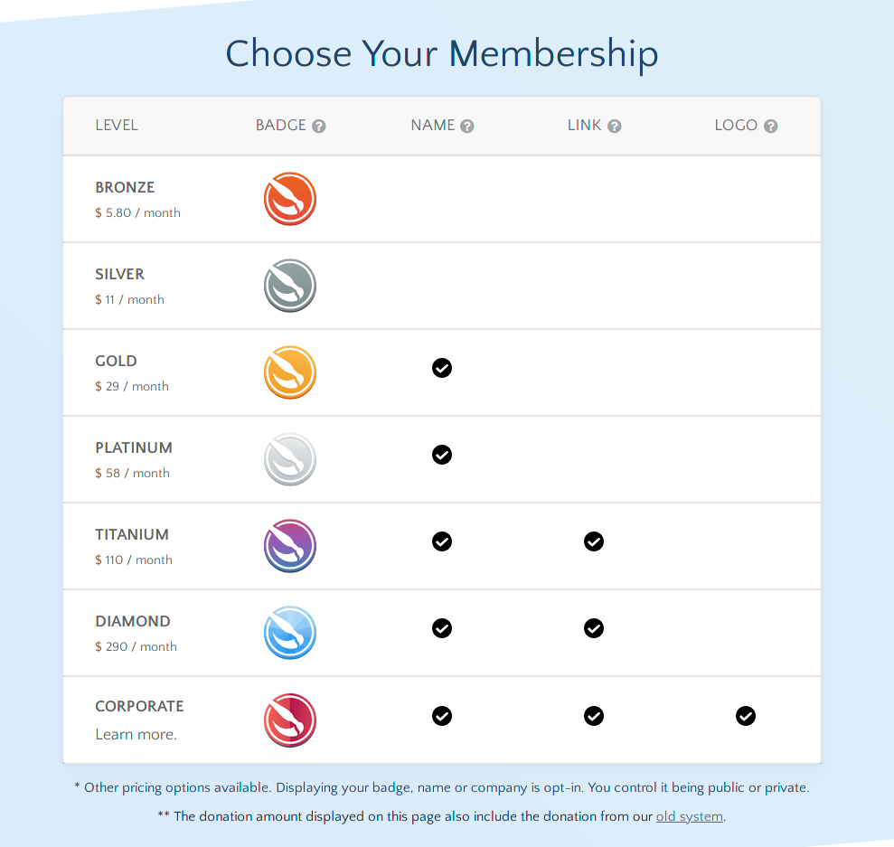

2021 年 5 月，Krita 正式成立了新版的开发基金。Krita 新版开发基金网站基于 Blender 的开发基金网站代码构建，它具备更加现代化的捐款系统，方便捐款者管理自己的定期捐款。

**请前往此网站加入新版 Krita 开发基金：[fund.krita.org](https://fund.krita.org)**

\[caption id="attachment\_11996" align="aligncenter" width="850"\] Krita 新版开发基金需要你的支持\[/caption\]

### 加入步骤

### 

1. 在上图表格中点击一行，选择捐款级别。此金额为每月定期捐款。Gold (黄金) 级别以上的捐款者将被列出在网站底部 (也可以选择不显示)。
2. 点击后网页会跳转到 MyKDE 登录页面。如果你从未使用过 KDE 网络服务，请先点击“Register”按钮注册。已注册 KDE Identity 的成员可以直接登录授权。
3. 选择支付方式，目前仅支持信用卡和 Paypal 国际版。
4. 完成登记后，你的当前捐款级别将在上图表格中突出显示。
5. 要管理当前定期捐款，请在开发基金网站的顶栏点击登录 (Login)，然后选择 My Account (我的账户)。

### Krita：由社区驱动的自由开源软件项目

Krita 从创建之初便是一款自由开源软件。为了打造一款人人可用的优秀数字绘画软件，来自环球五洲的数百位贡献者参加过 Krita 的工作。Krita 基金会为 Krita 项目开发和运营人员提供资金补助，它的经费完全来自用户捐款。Krita 在各大软件平台上的付费版本不经 Krita 基金会收取费用，但这些收入依然会被用作 Krita 的开发经费。Krita 基金会是 Krita 商标的所有者，Krita 的长远目标由开发人员团队决定。

### 新开发基金的目标：为 Krita 的开放式发展提供长远保障

我们之前也有两种进行定期捐款的途径：一种是通过 Paypal，另一种是通过 Mollie。目前共有两百多人使用这两种途径进行定期捐款，这些经费仅能支持一名全职开发人员和一名兼职文档作者。

新版开发经费的目标是为 Krita 的核心开发工作提供完全、稳定的经费支持，让项目不再依赖各大平台应用商店的收入。这包括以下方面：

- 为 Krita 核心代码的开发人员提供经费支持
- 为相关特殊项目提供经费支持
- 为相关工作，如程序缺陷分拣、修复、补丁测评、文档等工作提供经费支持

### Krita 5

当前，我们正在全力以赴地开发 Krita 5。这将是一次巨大的更新，它将包含新版涂抹笔刷引擎、资源管理框架重写、多项动画功能支持扩充等改进，但远远不止这些。我们计划在 8 月发布 Krita 5。在此期间我们将定期为大家带来 Krita 5 的新功能介绍，并借此机会推广新版开发基金。

### 筹款目标

目前，Krita 的开发基金有 200 多位成员，算上单笔捐款的话，我们每月能分配的经费在 4000 欧元左右 (时多时少)。

新版 Krita 开发经费的目标是保障 Krita 项目的长期发展存续。

如果每月能获得 25000 欧元左右的经费，那么我们将能维持当前的所有核心开发人员进行全职工作，并摆脱对软件商店收入的依赖。

非常感谢大家对 Krita 的支持！
