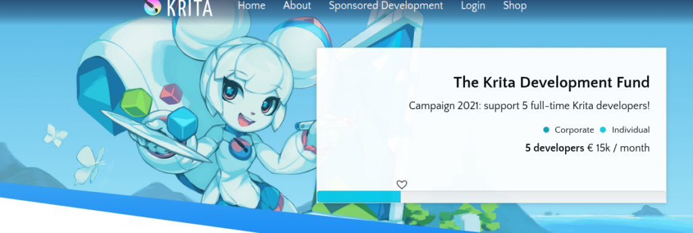

今天我们为大家带来了 Krita 的第三个公开测试版 (beta 3)，它在 beta 2 的基础上修复了大量程序缺陷。当然，每日更新的稳定测试版很快就会带来更多的缺陷修复。

我们计划在圣诞节之前正式发布 Krita 5，就目前的情况来看，我们还是有信心能如期发布的？

\[caption id="attachment\_12343" align="aligncenter" width="1024"\] Krita 5.0 的全新启动图，由 Tyson Tan (钛山) 绘制\[/caption\]

 Krita 是一个自由开源的软件项目，如果条件允许，请考虑通过[捐款](https://fund.krita.org)或[购买视频教程](https://krita.org/en/shop/)等方式为我们提供资金支持，这可以确保 Krita 的核心开发团队成员为项目全职工作。

Krita 5 beta 3 在 beta 2 的基础上的新增了下列程序缺陷修复：

- 不再允许资源被分配到 All (全部项目) 和 All Untagged (全部无标签项目) 这两个特殊标签中。[BUG:446148](https://bugs.kde.org/show_bug.cgi?id=446148)
- 透明度蒙版 PNG 笔尖图像现在能够正常工作。[BUG:445691](https://bugs.kde.org/show_bug.cgi?id=445691)
- 安卓版本：创建 16 位整数图像不再造成程序崩溃。[BUG:445179](https://bugs.kde.org/show_bug.cgi?id=445179)
- 资源包中的 MYB 格式 Mypaint 笔刷缩略图现在可以正常加载。
- 修复了磁性选区工具的一个性能问题。
- 录像工具在选择了不支持的色彩空间时不再发生程序无限循环。
- 修复从 Chrome 中拖放远程图像、复制粘贴图像到 Krita 窗口。[BUG:446029](https://bugs.kde.org/show_bug.cgi?id=446029)
- 修复取消粘贴的功能。[BUG:438426](https://bugs.kde.org/show_bug.cgi?id=438426)
- Tyson Tan 为界面中显示的文字进行了大量的去混淆注释工作，改善了 Krita 的可翻译性。
- 修复了打开右键面板后关闭图像然后创建新图像时的程序崩溃。[BUG:443402](https://bugs.kde.org/show_bug.cgi?id=443402)
- 在光标处粘贴现在可以正确处理粘贴对象的位置。[BUG:446120](https://bugs.kde.org/show_bug.cgi?id=446120)
- 修复了非标准尖峰数量的笔刷轮廓。[BUG:445927](https://bugs.kde.org/show_bug.cgi?id=445927)
- 禁用变形工具的次像素转换功能。[BUG:445714](https://bugs.kde.org/show_bug.cgi?id=445714)
- 修复在退出 Krita 时保存色板。[BUG:444309](https://bugs.kde.org/show_bug.cgi?id=444309)
- 修复导入资源时的去重复检测。[BUG:445367](https://bugs.kde.org/show_bug.cgi?id=445367)
- 修复了使用文字笔刷时的一个程序崩溃。[BUG:443308](https://bugs.kde.org/show_bug.cgi?id=443308)
- 修复了处理 GIMP 图案以外的图案文件类型的处理。[BUG:443151](https://bugs.kde.org/show_bug.cgi?id=443151)
- 资源库在资源包管理器界面中按字母顺序排列。感谢 Reinold Rojas 提供补丁。
- 改进严重损坏的 .kra 文件的处理方式。[BUG:443559](https://bugs.kde.org/show_bug.cgi?id=443559)
- 改进带有纹理的笔刷的性能。
- 修复了重命名笔刷预设和 SeExpr 预设的功能。[BUG:445048](https://bugs.kde.org/show_bug.cgi?id=445048)
- 修复了修改 MyPaint 笔刷预设更改后的保存功能。[BUG:445281](https://bugs.kde.org/show_bug.cgi?id=445281), [BUG:445282](https://bugs.kde.org/show_bug.cgi?id=445282)
- 改善了标签控件的显示风格。[BUG:445625](https://bugs.kde.org/show_bug.cgi?id=445625)
- 修复了新建和移动图层速度过快时引发的一个程序崩溃。[BUG:445831](https://bugs.kde.org/show_bug.cgi?id=445831), [BUG:444516](https://bugs.kde.org/show_bug.cgi?id=444516)
- 修复了变形工具的一个程序崩溃。[BUG:441826](https://bugs.kde.org/show_bug.cgi?id=441826)
- 修复了文字工具不能正常更新字体大小的问题。
- 修复了非笔刷工具的随机数生成器的初始化。[BUG:445775](https://bugs.kde.org/show_bug.cgi?id=445775)
- 修复了在画布旋转且启用了防抖时的笔身倾斜旋转。[BUG:436618](https://bugs.kde.org/show_bug.cgi?id=436618)
- 让曲线网格渐变工具能够响应首次调用。[BUG:445617](https://bugs.kde.org/show_bug.cgi?id=445617)
- 让曲线网格渐变与曲线网格变形工具的使用方式保持一致。[BUG:442201](https://bugs.kde.org/show_bug.cgi?id=442201)
- 修复了取消保存已编辑的渐变的功能。
- 修复了 GPL 和 KPL 以外的色板类型的加载。
- 修复打开 SVG 文档时发生的一处 assert 问题。
- 使在不同资源目录之间更改成为可能。
- 使覆盖已有工作区定义成为可能。[BUG:444975](https://bugs.kde.org/show_bug.cgi?id=444975)
- 修复在保存资源时遇到问题向用户发出警告会导致崩溃的问题。[BUG:445581](https://bugs.kde.org/show_bug.cgi?id=445581)
- 更新 Intel GPU 驱动程序版本检测功能。
- 修复手绘选区工具的多边形选区模式下的显示错误。[BUG:441569](https://bugs.kde.org/show_bug.cgi?id=441565)
- 修复图层样式无法获取图案和渐变等资源。[BUG:443621](https://bugs.kde.org/show_bug.cgi?id=443621)
- 将直线工具加入黑名单，使其在录像工具活动时也能正常工作。
- 加快直线工具的预览速度。[BUG:411768](https://bugs.kde.org/show_bug.cgi?id=411768)
- 修复直线工具预览时的闪烁问题。
- 使保存 Mypaint 笔刷预设到资源包成为可能。
- 修复基于剪贴板图像创建新图像的功能。[BUG:443111](https://bugs.kde.org/show_bug.cgi?id=443111)
- 使用形状编辑工具的矩形选区选项时不要选择控制点。[BUG:434535](https://bugs.kde.org/show_bug.cgi?id=434535)
- 修复撤销多个图层时的更新问题。
- 修复新增文件图层。
- 修复在笔刷选项面板的绘图区中测试速度传感器效果的有关问题。[BUG:425124](https://bugs.kde.org/show_bug.cgi?id=425124)
- 修复获取图案填充图层生成器的图案时的问题。
- 修复颜色涂抹笔刷引擎的亮度模式下的显示错误。
- 改进字体风格选择功能，恢复风格下拉选单的应有功能。[BUG:425312](https://bugs.kde.org/show_bug.cgi?id=425312)
- 资源包保存失败时向用户报告。[BUG:439110](https://bugs.kde.org/show_bug.cgi?id=439110)
- 改进资源包的导入功能。[BUG:445336](https://bugs.kde.org/show_bug.cgi?id=445336)
- 改进图层样式的处理功能。
- 移除按住 Shift 垂直拖动更改笔刷大小的功能。[BUG:442544](https://bugs.kde.org/show_bug.cgi?id=442544)
- 改进色板的的操作和编辑功能。
- 修复了手绘选区工具的一个程序崩溃。
- 修复了嵌入色板和其他资源到 .kra 图像时会发生的问题。
- 修复使用色域蒙版时的一个程序崩溃。
- 动画功能：修复了在拖动播放时从已缓存帧拖到未缓存帧时的一个缓存程序缺陷。[BUG:445265](https://bugs.kde.org/show_bug.cgi?id=445265)
- 修复了在缺少某些可选依赖程序库时构建的 Krita 会发生的一些程序崩溃。[BUG:445276](https://bugs.kde.org/show_bug.cgi?id=445276)
- 在创建数据库时，只在所有存储位置已被添加完毕后才添加标签，确保所有可以分配标签的资源可以在默认状态下全部分配到应有的标签。
- 在调整图像大小对话框中将焦点默认放置到第一个输入框而不是“确定”按钮。[BUG:445250](https://bugs.kde.org/show_bug.cgi?id=445250), [BUG:444806](https://bugs.kde.org/show_bug.cgi?id=444806)
- 安卓版本：在 mdiArea 标题中写入将图像状态信息。
- 修复创建、保存、更新 SeExpr 脚本时的问题。
- 修复创建、保存、更新工作区时的问题。[BUG:444980](https://bugs.kde.org/show_bug.cgi?id=444980)
- 安卓版本：修复 Android 11 下与文件处理有关的崩溃。
- 修复导出带有 exiv 数据的图像时的一个程序崩溃。[BUG:444256](https://bugs.kde.org/show_bug.cgi?id=444256)
- 安卓版本：修复与安卓的后退按钮有关的问题。
- 修复在关闭图像之后拾取新颜色时的一个程序崩溃。[BUG:444308](https://bugs.kde.org/show_bug.cgi?id=444308)
- 安卓版本：修复了使用键盘快捷键关闭右键面板。[BUG:443631](https://bugs.kde.org/show_bug.cgi?id=443631)
- 改进了画布的颜色拖放功能。
- 修复了 KoDualColorButton 的更新问题。[BUG:442861](https://bugs.kde.org/show_bug.cgi?id=442861)
- 修复了关闭图像时的一个可能的程序崩溃。[BUG:444613](https://bugs.kde.org/show_bug.cgi?id=444613)
- 改进了欢迎画面。
- 改进了预设历史面板，确保选择正确的行。感谢 Mike Will 提供补丁。
- 修复录像会话的导出。
- 改进了画布旋转。感谢 Reinold Rojas 提供补丁。[BUG:429637](https://bugs.kde.org/show_bug.cgi?id=429637)
- 动画功能：改善关键帧导航的易用性。[BUG:444310](https://bugs.kde.org/show_bug.cgi?id=444310)
- 动画功能：修复了 Windows 下自动空白关键帧的显示错误。[BUG:441588](https://bugs.kde.org/show_bug.cgi?id=441588)
- 微调数位板右键点击时的右键面板行为。[BUG:441899](https://bugs.kde.org/show_bug.cgi?id=441899)
- 修复保存当前会话到正确位置。[BUG:443652](https://bugs.kde.org/show_bug.cgi?id=443652)
- 修复图层组菜单的翻译语境。[BUG:444238](https://bugs.kde.org/show_bug.cgi?id=444238)
- 使在预设编辑器的笔尖图像选项卡中选择和取消选择 ABR 文件成为可能。
- 修复 jpeg2000 图像支持。
- 修复编辑文字时会导致拾色器拾取错误颜色的问题。[BUG:443793](https://bugs.kde.org/show_bug.cgi?id=443793)
- 安卓版本：修复在使用三星 Air Actions 功能时右键面板的隐藏。[BUG:443600](https://bugs.kde.org/show_bug.cgi?id=443600)
- 使 Krita 5 和 Krita 4 的会话文件相互兼容。
- 安卓版本：修复了安卓窗口管理器中的移除内存泄漏问题。
- 配置工具栏后不要导致工具栏无法移动。[BUG:441808](https://bugs.kde.org/show_bug.cgi?id=441808)
- 移动工具的 LOD 默认改为“true”。
- 裁剪工具的扩大/缩小选项默认勾选。
- 自动保存改为每 7 分钟一次。
- PDF 导入时的默认 DPI 改为 300。
- 缩窄图层面板宽度。
- 更新 SeExpr 的上游补丁。
- OpenGL：在 OpenGL ES 2 下面支持 LoD。
- ANGLE：支持 10 位和 12 位 HDR。
- OpenGL ES：支持浮点和半浮点纹理。
- OpenColorIO：使用 Natron 的临时处理方式在本机模式下解析 LUT。[BUG:407921](https://bugs.kde.org/show_bug.cgi?id=407921)
- OpenColorIO：支持 VFX Platform CY2021 和更新版本。[BUG:435474](https://bugs.kde.org/show_bug.cgi?id=435474)
- 改善 SeExpr 用户界面和解析器。
- 将录像面板的状态栏项目的最小宽度缩窄一半。
- 修复时间轴的默认滚轮行为，确保一致性。[BUG:443852](https://bugs.kde.org/show_bug.cgi?id=443852)
- 分镜头脚本面板：增加更多针对重复名称的保护措施。
- 改善分镜头脚本的导出功能。
- 修复了导出动画时的崩溃。[BUG:442578](https://bugs.kde.org/show_bug.cgi?id=442578)
- 修复了预设发生外部更改后在笔刷编辑器中的更新。[BUG:443579](https://bugs.kde.org/show_bug.cgi?id=443579)
- 修复了带有纹理的涂抹笔刷会在透明度蒙版上造成方块状显示错误的问题。[BUG:](https://bugs.kde.org/show_bug.cgi?id=443422)443422
- 修复了带有纹理的笔刷的性能问题。

我们将继续修复在公开测试版和每日构建版中发现的问题，以确保在发布 Krita 5.0 正式版时程序的可靠性。如果条件允许，请考虑通过 [Krita 开发基金](https://fund.krita.org/)支持我们的工作：

## 下载

### 中文版信息

- 中文支持：Krita 的所有软件包均内建中文支持，首次安装时会自动设置为操作系统的语言。
- 手动设置：菜单栏 --> Settings --> Switch Application Language (倒数第二项) --> 下拉选单 --> 中文 (底部)，重启程序生效。
- 插件翻译：G'MIC 插件[需要下载翻译包](https://share.weiyun.com/SBopNjOn)
- 网盘下载：请在官网下载困难时使用，更新时间可能滞后。

### Windows 版本

- **64 位 Windows 安装程序** [本站下载](https://download.kde.org/unstable/krita/5.0.0-beta3/krita-x64-5.0.0-beta3-setup.exe) | [网盘下载](https://share.weiyun.com/60HLzj6I)
- **64 位 Windows 免安装包** [本站下载](https://download.kde.org/unstable/krita/5.0.0-beta3/krita-x64-5.0.0-beta3.zip) | [网盘下载](https://share.weiyun.com/60HLzj6I)
- **64 位程序崩溃调试包** [本站下载](https://download.kde.org/unstable/krita/5.0.0-beta3/krita-x64-5.0.0-beta3-dbg.zip) | [网盘下载](https://share.weiyun.com/60HLzj6I)

- **配套网盘资源 (中文社区维护)** [中文离线文档](https://share.weiyun.com/Dea2uj0M) | [FFmpeg 软件包](https://share.weiyun.com/6tH13bVC) | [G'Mic 滤镜汉化](https://share.weiyun.com/SBopNjOn) |

- 32 位支持：最后一版支持 32 位 Windows 的 Krita 为 4.4.3，[本站下载](https://download.kde.org/stable/krita/4.4.3/krita-x86-4.4.3-setup.exe) | [网盘下载](https://share.weiyun.com/wdMnx1WB)。
- 免安装包：解压到任意位置，运行目录中的 Krita 快捷方式。不带文件管理器缩略图插件，与已安装版本共用配置文件和资源，但程序本身相互独立。
- 程序崩溃调试包：解压到 Krita 的安装目录，在报告程序崩溃问题时用于获取回溯追踪数据。日常使用无需此软件包。

### Linux 版本

- **64 位 Linux AppImage 程序包** [本站下载](https://download.kde.org/unstable/krita/5.0.0-beta3/krita-5.0.0-beta3-x86_64.appimage) | [网盘下载](https://share.weiyun.com/C0gZ6joR)
- 从此版开始，G'Mic 插件已经整合到主程序包中
- 如果浏览器把链接作为文本打开，请右键点击链接另存为文件。

### macOS 版本

- **macOS 程序映像** 此版的 macOS 程序映像构建失败，我们会很快发布下一版本修复此问题。

### 安卓版本

安卓版本目前尚处于早期测试阶段，整体功能与桌面版本几乎完全相同。它仅为安卓平板和 ChromeBook 类设备进行了初步适配，大部分功能依然需要搭配键盘使用，还有不少功能无法正常工作。

- **64 位 Intel CPU APK 安装包** [本站下载](https://download.kde.org/unstable/krita/5.0.0-beta3/krita-x86_64-5.0.0-beta3-release-signed.apk) | [网盘下载](https://share.weiyun.com/AKSomiNJ)
- **32 位 Intel CPU APK 安装包** [本站下载](https://download.kde.org/unstable/krita/5.0.0-beta3/krita-x86-5.0.0-beta3-release-signed.apk) | [网盘下载](https://share.weiyun.com/AKSomiNJ)
- **64 位 ARM CPU APK 安装包** [本站下载](https://download.kde.org/unstable/krita/5.0.0-beta3/krita-arm64-v8a-5.0.0-beta3-release-signed.apk) | [网盘下载](https://share.weiyun.com/GCKrtN0F)
- **32 位 ARM CPU APK 安装包** [本站下载](https://download.kde.org/unstable/krita/5.0.0-beta3/krita-armeabi-v7a-5.0.0-beta3-release-signed.apk) | [网盘下载](https://share.weiyun.com/GCKrtN0F)

### 源代码

- [TAR.GZ 格式源代码包](https://download.kde.org/unstable/krita/5.0.0-beta3/krita-5.0.0-beta3.tar.gz)
- [TAR.XZ 格式源代码包](https://download.kde.org/unstable/krita/5.0.0-beta3/krita-5.0.0-beta3.tar.xz)

### md5sum 校验码

适用于上述所有软件包，用于校验下载文件的完整性，不了解文件校验请忽略：

- [ms5sum 校验码文本文件](https://download.kde.org/unstable/krita/5.0.0-beta3/md5sum.txt)

### 文件完整性验证密钥

Linux 的 Appimage 可执行文件包和源代码的 .tar.gz 和 .tar.xz tarballs 压缩包已经经过数字签名。您可以[在此下载公钥](https://files.kde.org/krita/4DA79EDA231C852B)，还可以在此下载[数字签名的 SIG 文件](https://download.kde.org/unstable/krita/5.0.0-beta3/)。

## 请支持 Krita

Krita 是一个自由和开源的软件项目。如果条件允许，请考虑通过 [捐款](https://fund.krita.org/) 或者 [购买培训教程和画册](https://krita.org/en/shop/) 等方式支持我们的存续和发展，这样我们才能支持开发人员为 Krita 全职工作。
